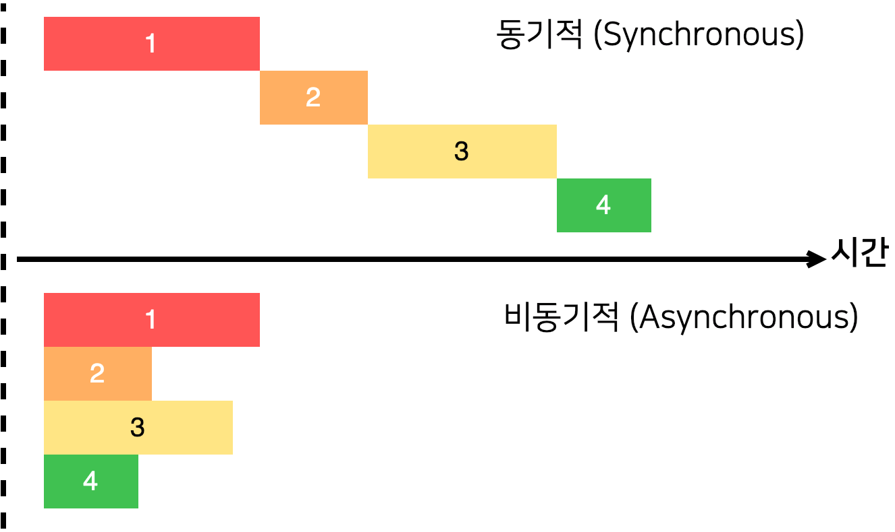

# 3장. 자바스크립트에서 비동기 처리 다루기

만약 작업을 동기적으로 처리한다면 작업이 끝날 때까지 기다리는 동안 중지 상태가 되기 때문에 다른 작업을 할 수 없다. 그리고 작업이 끝나야 비로소 그 다음 예정된 작업을 할 수 있다. 하지만 이를 비동기적으로 처리를 한다면 흐름이 멈추지 않기 때문에 동시에 여러 가지 작업을 처리할 수도 있고, 기다리는 과정에서 다른 함수도 호출할 수 있다.

- 콜백 함수 : 함수 타입의 값을 파라미터로 넘겨줘서, 파라미터로 받은 함수를 특정 작업이 끝나고 호출을 해주는 것을 의미한다.

### [다음과 같은 작업들은 주로 비동기적으로 처리함]

- **Ajax Web API 요청**: 만약 서버 쪽에서 데이터를 받와아야 할 때는, 요청을 하고 서버에서 응답을 할 때까지 대기를 해야 되기 때문에 작업을 비동기적으로 처리한다.
- **파일 읽기**: 주로 서버 쪽에서 파일을 읽어야 하는 상황에는 비동기적으로 처리한다.
- **암호화/복호화**: 암호화/복호화를 할 때에도 바로 처리가 되지 않고, 시간이 어느 정도 걸리는 경우가 있기 때문에 비동기적으로 처리한다.
- **작업 예약**: 단순히 어떤 작업을 몇 초 후에 스케쥴링 해야 하는 상황에는, setTimeout 을 사용하여 비동기적으로 처리한다.

⇒ 비동기 작업을 다룰 때에는 callback 함수 외에도 Promise, 그리고 async/await 라는 문법을 사용하여 처리할 수 있다.

## ✔️ Promise

- 프로미스는 비동기 작업을 조금 더 편하게 처리할 수 있도록 ES6에 도입된 기능이다. 이전에는 비동기 작업을 처리할 때에는 콜백 함수로 처리를 해야 했었다. 콜백 함수로 처리를 하게 된다면 비동기 작업이 많아질 경우 코드가 쉽게 난잡해지게 된다.
- Promise는 성공할 수도 있고, 실패할 수도 있다. 성공할 때에는 resolve를 호출해 주면 되고, 실패할 때에는 reject를 호출해 주면 된다.
- resolve를 호출할 때 특정 값을 파라미터로 넣어주면, 이 값을 작업이 끝나고 나서 사용할 수 있다. 작업이 끝나고 나서 또 다른 작업을 해야 할 때에는 Promise 뒤에 .then(...) 을 붙여서 사용하면 된다.
- 실패하는 상황에서는 reject를 사용하고, .catch 를 통하여 실패했을 시 수행할 작업을 설정할 수 있다.
- Promise의 속성 중에는, 만약 then 내부에 넣은 함수에서 또 Promise를 리턴하게 된다면, 연달아서 사용할 수 있다.
- Promise를 사용하면, 비동기 작업의 개수가 많아져도 코드의 깊이가 깊어지지 않게 된다. 하지만, 이것도 불편한 점이 있다. 에러를 잡을 때 몇 번째에서 발생했는지 알아내기도 어렵고 특정 조건에 따라 분기를 나누는 작업도 어렵고, 특정 값을 공유해가면서 작업을 처리하기도 까다롭다. → 문제점

## ✔️ async/await

- sync/await 문법을 사용할 때에는, 함수를 선언할 때 함수의 앞부분에 `async` 키워드를 붙여줘야 한다. 그리고 Promise의 앞부분에 `await` 을 넣어주면 해당 프로미스가 끝날 때까지 기다렸다가 다음 작업을 수행할 수 있다.
- 함수에서 `async` 를 사용하면, 해당 함수는 결과값으로 Promise를 반환하게 된다.
- async 함수에서 에러를 발생시킬 때에는 throw를 사용하고, 에러를 잡아낼 때에는 try/catch 문을 사용한다.

- **Promise.all** 를 사용할 때에는, 등록한 프로미스 중 하나라도 실패하면, 모든 게 실패한 것으로 간주한다.

- **Promise.race**는 여러개의 프로미스를 등록해서 실행했을 때 가장 빨리 끝난 것 하나만의 결과값을 가져온다.  Promise.race 의 경우엔 가장 다른 Promise 가 먼저 성공하기 전에 가장 먼저 끝난 Promise 가 실패하면 이를 실패로 간주합니다.
