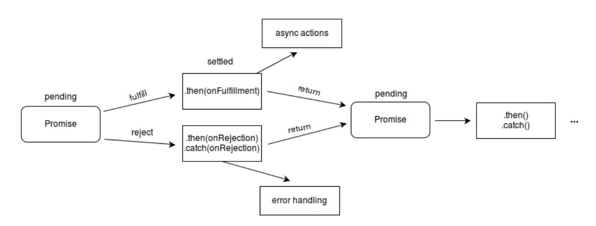

# 2주차 JS 스터디 정리

| 장   | 제목          |
| ---- | ------------- |
| 3장 | 자바스크립트에서 비동기 처리 다루기 |

## 3장

### 3.1 Promise

비동기 작업을 편하게 처리하기 위해 ES6에 도입된 기능

콜백 함수로 비동기 작업을 처리할 때 코드가 난잡해지는 점을 개선 가능


- Callback Hell(콜백지옥) 

  비동기적으로 처리해야하는 일이 많아져, 코드의 깊이가 계속 깊어지는 현상

```javascript
function increaseAndPrint(n, callback) {
  setTimeout(() => {
    const increased = n + 1;
    console.log(increased);
    if (callback) {
      callback(increased);
    }
  }, 1000);
}

increaseAndPrint(0, (n) => {
  increaseAndPrint(n, (n) => {
    increaseAndPrint(n, (n) => {
      increaseAndPrint(n, (n) => {
        increaseAndPrint(n, (n) => {
          console.log("끝!");
        });
      });
    });
  });
});

```

**Promise의 상태(state)**

cf. 상태 = 프로미스의 처리과정

- Pending(대기) : 이행하거나 거부되지 않은 초기 상태
- Fulfilled(이행) : 연산이 성공적으로 완료됨. 프로미스가 결과 값을 반환해준 상태
- Rejected(실패) : 연산이 실패하거나 오류가 발생한 상태



**Promise는 성공할 수도, 실패할 수도 있음**

- 성공 시 resolve 호출하기
- 실패 시 reject 호출하기


구현방법

```javascript
const myPromise = new Promise((resolve, reject)) => {
	//구현..
}
```


**성공시키는 상황**

- resolve 호출 시 특정 값을 파라미터로 넣어주면, 그 값을 작업이 끝난 후 사용 가능

- 작업 종료 후 또 다른 작업 해야할 때 Promise 뒤에 .then(...)을 붙여서 사용

  

EX1) 1초 뒤 성공시키는 상황 구현

```javascript
const myPromise = new Promise((resolve, reject) => {
  setTimeout(() => {
    resolve(1);
  }, 1000);
});

myPromise.then((n) => {
  console.log(n);
});

```


**실패하는 상황**

- reject를 사용

- .catch를 통해 실패 시 수행 할 작업 설정 가능

  

EX2) 1초 뒤 실패하는 상황 구현

```javascript
const myPromise = new Promise((resolve, reject) => {
  setTimeout(() => {
    reject(new Error());
  }, 1000);
});

myPromise
  .then((n) => {
    console.log(n);
  })
  .catch((error) => {
    console.log(error);
  });

```


**Promise로 코드의 깊이 깊어지지 않게 하기**

```javascript
function increaseAndPrint(n) {
  return new Promise((resolve, reject) => {
    setTimeout(() => {
      const value = n + 1;
      if (value === 5) {
        const error = new Error();
        error.name = "ValueIsFiveError";
        reject(error);
        return;
      }
      console.log(value);
      resolve(value);
    }, 1000);
  });
}

increaseAndPrint(0)
  .then((n) => {
    return increaseAndPrint(n);
  })
  .then((n) => {
    return increaseAndPrint(n);
  })
  .then((n) => {
    return increaseAndPrint(n);
  })
  .then((n) => {
    return increaseAndPrint(n);
  })
  .then((n) => {
    return increaseAndPrint(n);
  })
  .catch((e) => {
    console.error(e);
  });

```

```javascript
function increaseAndPrint(n) {
  return new Promise((resolve, reject) => {
    setTimeout(() => {
      const value = n + 1;
      if (value === 5) {
        const error = new Error();
        error.name = "ValueIsFiveError";
        reject(error);
        return;
      }
      console.log(value);
      resolve(value);
    }, 1000);
  });
}

increaseAndPrint(0)
  .then(increaseAndPrint)
  .then(increaseAndPrint)
  .then(increaseAndPrint)
  .then(increaseAndPrint)
  .then(increaseAndPrint)
  .catch((e) => {
    console.error(e);
  });

```


**Promise 사용 시 불편한 점**

- 에러를 잡을 때 몇 번째에서 발생했는지 알아내기 어려움
- 특정 조건에 따라 분기를 나누는 작업이 어려움
- 특정 값을 공유해가며 작업을 처리하기 까다로움


async/await으로 위의 문제점을 해결할 수 있음

### 3.2 async/await

ES8에 해당하는 문법

Promise를 더 쉽게 사용할 수 있게 해 줌


**사용법**

1. 기본 사용 문법

- 함수 선언 시 함수의 앞 부분에 async 키워드 붙이기
- Promise 앞 부분에 await을 넣으면 해당 프로미스가 끝날때까지 기다렸다가 다음 작업 수행 가능


2. async 함수에서 에러 발생시키기

- throw 사용


3. 에러 잡아내기

- try/catch 문 사용


**Promise.all**

- 동시에 작업을 시작하고 싶을 때 사용
- Promise.all사용 시 등록한 프로미스 중 하나라도 실패하면 모든 게 실패한 것으로 간주


**Promise.race**

- 여러 개의 프로미스를 등록해서 실행했을 때 가장 빨리 끝난 것 하나만의 결과값을 가져옴
- 다른 Promise 가 먼저 성공하기 전에 가장 먼저 끝난 Promise 가 실패하면 이를 실패로 간주


