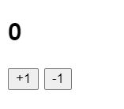
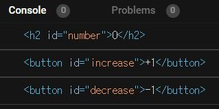
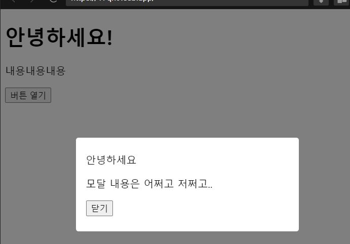
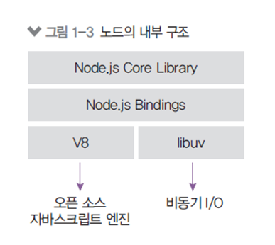
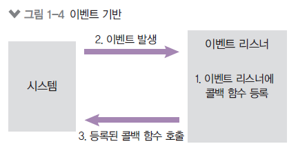
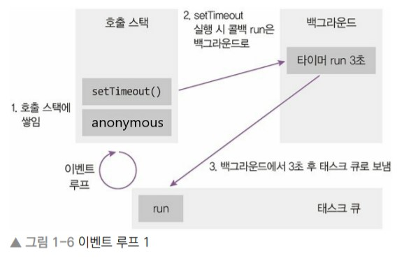
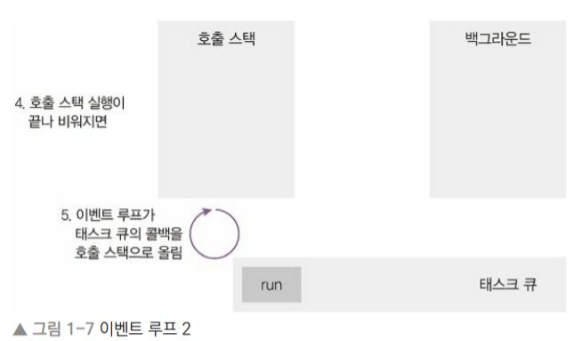
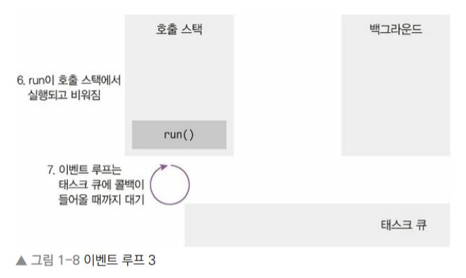

## 4장

---

### 4.1 카운터

  버튼을 클릭하면 숫자가 올라가거나 내려가는 카운터를 만들어보자.

### UI 만들기

```jsx
<!--index.html-->
<html>
  <head>
    <title>Parcel Sandbox</title>
    <meta charset="UTF-8" />
  </head>

  <body>
    <h2 id="number">0</h2>
    <div>
      <button id="increase">+1</button>
      <button id="decrease">-1</button>
    </div>

    <script src="src/index.js"></script>
  </body>
</html>
```

### 결과




### DOM(Document Object Model) 이란?

  * 각 태그에 대한 정보를 지니고 있는 JavaScript 객체
  * HTML 문서의 내용과 구조가 객체 모델로 변화되어 다양한 프로그램에서 사용될 수 있다


### DOM 선택하기

  `id`로 DOM을 선택하고 싶을 땐 `getElementById("[id 값]")` 를 사용한다.

```jsx
//index.js
const number = document.getElementById("number");
const increase = document.getElementById("increase");
const decrease = document.getElementById("decrease");

console.log(number);
console.log(increase);
console.log(decrease);
```

### 결과




### DOM에 내장되어있는 기능들

```jsx
const number = document.getElementById("number");
const increase = document.getElementById("increase");
const decrease = document.getElementById("decrease");

//index.js
console.log(number.innerText); // 내용
console.log(increase.offsetTop); // top 위치
console.log(decrease.id); // id
```


### DOM 이벤트 설정하기

DOM에 이벤트를 설정하려면 `on이벤트이름` 값에 함수를 설정하면 된다. 

```jsx
//index.js
const number = document.getElementById("number");
const increase = document.getElementById("increase");
const decrease = document.getElementById("decrease");

increase.onclick = () => {
  console.log("increase 가 클릭됨");
};

decrease.onclick = () => {
  console.log("decrease 가 클릭됨");
};
```

```jsx
increase.onclick = () => {
  const current = parseInt(number.innerText, 10);
  number.innerText = current + 1;
};

decrease.onclick = () => {
  const current = parseInt(number.innerText, 10);
  number.innerText = current - 1;
};
```

`parseInt` - 문자열을 숫자로 변환해주는 함수


### 자주 쓰이는 이벤트 목록

`ondblclick`(더블클릭할 때), `onerror`(에러가 발생했을 때), `onkeydown`(키를 눌렀을 때), `onkeypress`(키를 누르고 있을 때), `onkeyup`(키를 눌렀다 뗐을 때), `onload`(문서나 객체가 로딩되었을 때), `onmouseover`(마우스가 객체 위에 올라왔을 때), `onmouseout`(마우스가 객체 바깥으로 나갔을 때), `onreset`(Reset 버튼을 눌렀을 때), `onresize`(객체의 크기가 바뀌었을 때), `onscroll` (스크롤바를 조작할 때), `onsubmit`(폼이 전송될 때)


### 4.2 모달

**기존의 내용을 가리고 나타나는 메시지박스 같은 형태의 UI** 

```jsx
<!--index.html-->
    <div class="modal-wrapper">
      <div class="modal">
        <div class="modal-title">안녕하세요</div>
        <p>모달 내용은 어쩌고 저쩌고..</p>
        <div class="close-wrapper">
          <button>닫기</button>
        </div>
      </div>
    </div>
```

```jsx
/*styles.css*/
.modal-wrapper {
  position: fixed;
  top: 0;
  left: 0;
  width: 100%;
  height: 100%;
  background: rgba(0, 0, 0, 0.5);
  display: flex;
  align-items: center;
  justify-content: center;
}

.modal {
  background: white;
  padding: 24px 16px;
  border-radius: 4px;
  width: 320px;
}
```

---

### 결과




### display 스타일을 사용하여 모달 열고 닫기

`display: none;`  스타일 사용 시 해당 엘리먼트는 화면에서 숨겨진다. 

```jsx
<button id="open">버튼 열기</button>
    <div class="modal-wrapper" style="display: none;">
      <div class="modal">
        <div class="modal-title">안녕하세요</div>
        <p>모달 내용은 어쩌고 저쩌고..</p>
        <div class="close-wrapper">
          <button id="close">닫기</button>
        </div>
      </div>
    </div>
```

```jsx
//index.js
import "./styles.css";

const open = document.getElementById("open"); // 모달 열기 버튼
const close = document.getElementById("close"); // 모달 닫기 버튼
const modal = document.querySelector(".modal-wrapper");

open.onclick = () => {
  modal.style.display = "flex";
};
close.onclick = () => {
  modal.style.display = "none";
};
```

`class` 값으로 DOM을 선택하려면 `document.getElementsByClassName` 또는`document.querySelector` 를 사용한다.


## 1장

---

### 1.1 핵심 개념 이해하기

### 노드란?

> Node.js는 Chrome V8 Javascript 엔진으로 빌드된 Javascript 런타임이다.
> 


**노드가 서버라는 말이 없는 이유**

- 노드는 서버만 실행할 수 있는 것이 아니다.
- 자바스크립트로 서버 수행 코드를 작성하면 노드가 이것을 실행시켜서 서버의 역할을 수행할 수 있도록 해주는 것이다.


### 1.1.1 서버

**서버 :** 네트워크를 통해 클라이언트의 요청에 따라 정보나 서비스를 제공하는 컴퓨터 또는 프로그램

**클라이언트 :**  요청을 보내는 주체

- 브라우저, 데스크톱 프로그램, 모바일 앱, 다른 서버에 요청을 보내는 서버


### 1.1.2 자바스크립트 런타임

- **런타임** : 특정 언어로 만든 프로그램들을 실행할 수 있게 해주는 환경
- **노드** : 자바스크립트 실행기
- 기존에는 Javascript를 웹브라우저 위에서만 실행할 수 있었음
- 노드 이전에도 자바스크립트 런타임을 만들기 위한 많은 시도가 있었지만, `엔진 속도 문제`로 실패


**노드 내부 구조**


- libuv : 노드의 특성인 `이벤트 기반`, `논 블로킹 I/O` 모델을 구현하고 있다.

### 1.1.3 이벤트 기반

이벤트가 발생할 때 미리 지정해둔 작업을 수행하는 방식이다. 

- **이벤트** : 클릭, 네트워크 요청, 타이머 등
- **이벤트 리스너** : 이벤트를 등록하는 함수
- **콜백 함수** : 이벤트 발생 시 실행될 함수


**이벤트 기반 시스템**




**이벤트 루프**

여러 이벤트가 동시에 발생했을 때 어떤 순서로 콜백 함수를 호출할지 판단한다.

- **이벤트 루프**
    - 이벤트 발생 시 호출할 콜백 함수들을 관리
    - 호출된 콜백 함수의 실행 순서를 결정하는 역할 담당
    - 노드가 종료될 때까지 이벤트 처리를 위한 작업 반복
- **백그라운드** :
    - setTimeout 같은 타이머나 이벤트 리스너들이 대기하는 곳
    - 자바스크립트가 아닌 다른 언어로 작성된 프로그램이라고 봐도 됨
    - 여러 작업이 동시에 실행될 수 있음
- **태스크 큐**
    - 이벤트 발생 후, 백그라운드에서 태스크 큐로 타이머나 이벤트 리스너의 콜백함수를 보냄
    - 정해진 순서대로 콜백들이 줄을 서 있으므로 콜백 큐라고도 부름
    - 콜백들은 보통 완료된 순서대로 줄을 서있지만, 특정한 경우에는 순서가 바뀌기도 함


**setTimeout 함수의 콜백 run이 호출 스택에 언제들어가는지**





이벤트 루프는 호출 스택이 비어 있을 때만 태스크 큐에 있는 run 함수를 호출하는 것이기때문에, 호출 스택에 함수들이 너무 많이 들어있으면 3초가 지난 후에도 이 run 콜백은 실행되지 않을 수도 있다.

⇒ setTimeout의 시간이 정확하지 않을 수도 있는 이유이다.


### 1.1.4 논블로킹 I/O

> 노드는 대부분 `동기` 이면서 `블로킹` ,  `비동기` 이면서 `논블로킹` 이다.
> 
- **블로킹**
    
    : 이전 작업이 끝나야만 다음 작업을 수행하는 것을 의미한다. 즉, 코드가 순서대로 실행된다.
    
- **논블로킹**
    
    : 이전 작업이 완료될 때까지 대기하지 않고 다음 작업을 수행함을 뜻한다. 다시 말해, 코드가 순서대로 실행되지 않을 수도 있다. 무조건 랜덤하게 실행되는게 아니라 어떤 규칙(뒤에 나오는 실행 context & 이벤트 루프)에 따라 실행된다는 의미이다. **동시에 돌아가지 않는다.**
    

주의!

⇒ 논 블로킹과 동시가 같은 의미가 아니다. 동시성은 동시 처리가 가능한 작업을 논 블로킹 처리해야 얻을 수 있다는 점 알아두자!
