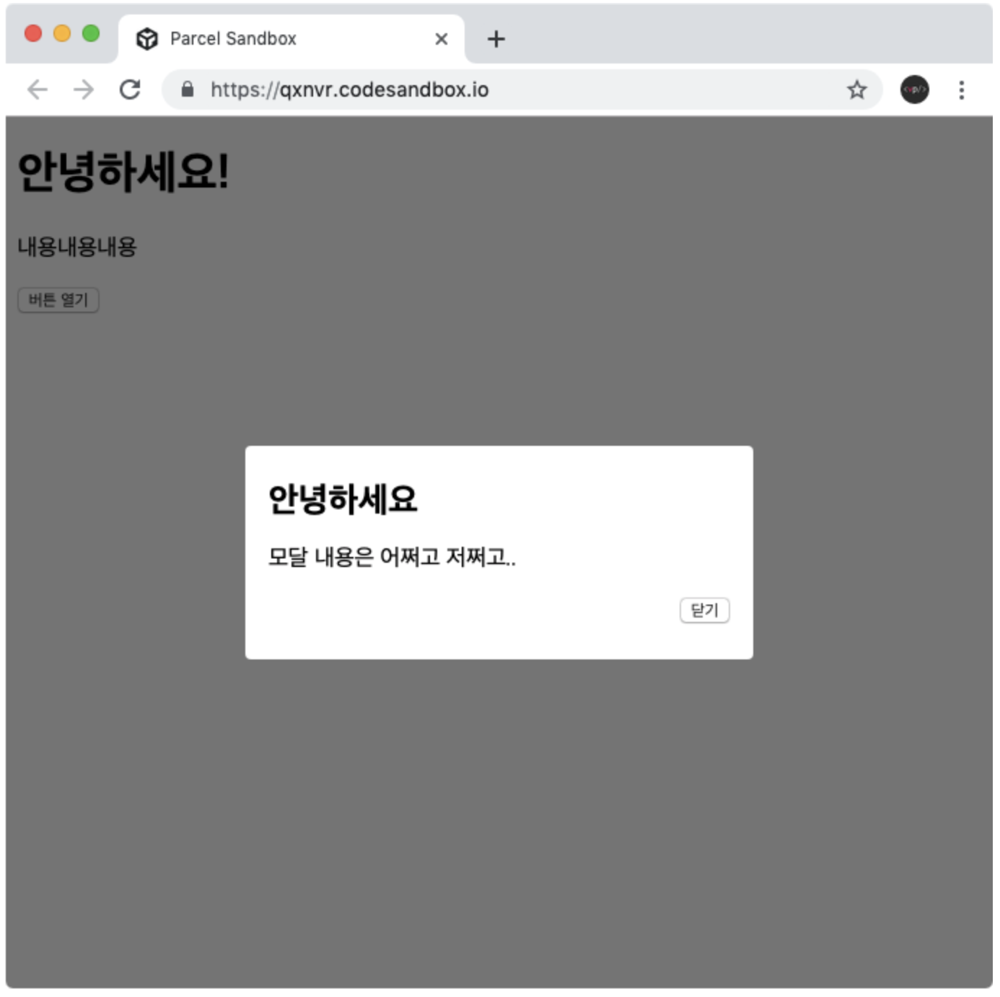

# 3주차 JS 스터디 정리

| 장   | 제목          |
| ---- | ------------- |
| 4장 | HTML과 JavaScript 연동하기 |
| 책 1장 | 노드 시작하기 |
| 책 3장 | 노드 기능 |

## 4장

HTML을 사용하여 보여주고 싶은 UI를 보여준다.<br>
이 때 동적으로 UI를 업데이트하고 싶다면 JS를 연동한다.

### 4.1 카운터

버튼을 클릭하면 숫자가 올라가거나 내려가는 카운터
```javascript
<태그 id = "이름">사용자</태그>
// 태그에 id 값을 설정해주면 JS에서 해당 DOM에 접근이 가능
```

DOM 선택하기
```javascript
const name = document.getElementById("이름");
console.log(name.innerText) // 이름의 내용

이름.offsetTop // Top의 위치
```

이벤트 설정하기
```javascript
const a = documet.getElementById("aaa");

a.onclick = () => {
	console.log("a가 클릭됨");
};

```
### 4.2 모달


기존 페이지의 내용 위로 올라오는 메세지 박스 같은 형태의 UI<br>

```javascript
const open = document.getElementById("open");
const close = document.getElementById("close");
const modal = document.querySelector(".modal-wrapper");
// id가 아니라 class를 DOM으로 선택하고 싶을 떄 quertSelector를 사용

open.onclick = () = {
	modal.style.display = "flex";
};

close.onclick = () = {
	modal.style.display = "none";
};
```

## 1장

### 1.1 핵심 개념 이해하기

내용 placeholder

### 1.2 서버로서의 노드

내용 placeholder

### 1.3 서버 외의 노드

내용 placeholder

### 1.4 개발 환경 설정하기

내용 placeholder

### 1.5 함께 보면 좋은 자료

내용 placeholder

## 3장

### 3.1 REPL 사용하기

내용 placeholder

### 3.2 JS 파일 실행하기

내용 placeholder

### 3.3 모듈로 만들기

내용 placeholder

------
