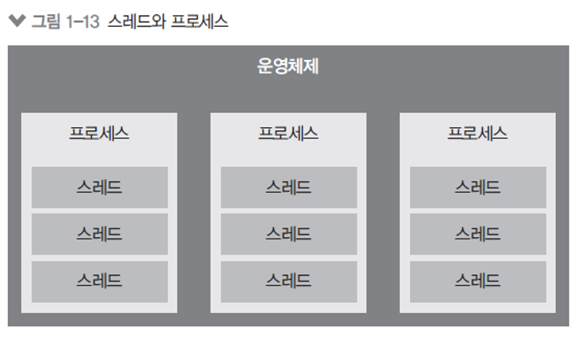

# 3주차 JS 스터디 정리

| 장   | 제목          |
| ---- | ------------- |
| 4장 | HTML과 JavaScript 연동하기 |
| 책 1장 | 노드 시작하기 |
| 책 3장 | 노드 기능 |

## 4장

HTML을 사용하여 보여주고 싶은 UI를 보여준다.
이 때 동적으로 UI를 업데이트하고 싶다면 JS를 연동한다.

### 4.1 카운터

버튼을 클릭하면 숫자가 올라가거나 내려가는 카운터
```javascript
<태그 id = "이름">사용자</태그>
// 태그에 id 값을 설정해주면 JS에서 해당 DOM에 접근이 가능
```

DOM 선택하기
```javascript
const name = document.getElementById("이름");
console.log(name.innerText) // 이름의 내용

이름.offsetTop // Top의 위치
```

이벤트 설정하기
```javascript
const a = documet.getElementById("aaa");

a.onclick = () => {
	console.log("a가 클릭됨");
};

```
### 4.2 모달


기존 페이지의 내용 위로 올라오는 메세지 박스 같은 형태의 UI<br>

```javascript
const open = document.getElementById("open");
const close = document.getElementById("close");
const modal = document.querySelector(".modal-wrapper");
// id가 아니라 class를 DOM으로 선택하고 싶을 떄 quertSelector를 사용

open.onclick = () = {
	modal.style.display = "flex";
};

close.onclick = () = {
	modal.style.display = "none";
};
```

## 1장

### 1.1 핵심 개념 이해하기

Node.js는 Chrome V8 Javascript 엔진으로 빌드된 Javascript 런타임이다.

- 노드는 서버 어플리케이션을 사용하는데 가장 많이 사용된다.
- 서버는 클라이언트의 요청에 응답한다. 또한 다른 서버로 요청을 보낼 수도 있다.
- 웹이나 앱을 사용할 때 사용자의 데이터와 서비스의 데이터가 생성되면, 이를 저장하고 다시 저장된 것을 받아오는 곳이 서버이다.<br>
- 노드는 자바스크립트 프로그램이 서버로서 기능하기 위한 도구를 제공하는데, 앞에서 Node.js를 Chrome V8 JS 엔진으로 빌드된 JS 런타임이라 했었다.
- 런타임은 특정 언어로 만든 프로그램들을 실행할 수 있게 하는 환경을 뜻하고
- 쉽게 말해 노드는 자바스크립트 실행기이다.<br>

이벤트 기반
- 이벤트 기반은 어떤 이벤트가 발생했을 때 미리 지정해둔 작업을 수행하는 것을 의미한다.
- 여러 이벤트가 동시에 발생했을 때는 어떤 순서로 콜백하수를 호출할지 이벤트 루프가 판단한다.<br>


논블로킹 I/O
오래 걸리는 함수를 백그라운드로 보내, 다음 코드를 먼저 실행시키고, 나중에 오래걸리는 함수를 실행


프로세스 와 스레드
- 프로세스: 운영체제에서 할당하는 작업의 단위, 프로세스 간 자원 공유 없음
- 스레드: 프로세스 내에서 실행되는 작업의 단위, 부모 프로세스 자원 공유



싱글 스레드: 주어진 일을 하나 밖에 처리 못함
-> 블로킹이 발생하는 경우 나머지 작업은 대기 -> 비효율 발생
-> 논블로킹을 사용해 일부 코드를 백그라운드에서 실행 가능

### 1.2 서버로서의 노드

노드는 서버가 아니지만, 서버를 구성할 수 있게 하는 모듈을 제공한다.

### 1.3 서버 외의 노드

또한, 자바스크립트 런타임이기 때문에 용도가 서버에만 한정되지 않음
웹, 모바일, 데스크탑 앱에서도 사용, 여기서 프레임워크가 노드 기반으로 동작함

## 3장

### 3.1 REPL 사용하기

자바스크립트는 스크립트 언어이기 때문에 즉석에서 코드를 실행할 수 있다.
- REPL 이라는 콘솔을 제공함
- Read Evaluate Print Loop
- 입력한 결과값이 바로 출력됨
- 간단한 코드를 입력하기에 적합

```shell
> console.log('hello world, hello node');
hello world, hello node
```

### 3.2 JS 파일 실행하기

자바스크립트 파일을 만들어 통째로 코드를 실행하는 방법
- xxx.js 파일을 만든다.
- node [자바스크립트 파일 경로]로 실행한다.
- 실행 결과 값이 출력된다.

### 3.3 모듈로 만들기

노드는 자바스크립트 코드를 모듈로 만들 수 있다.
- 모듈: 특정한 기능을 하는 함수나 변수들의 집합
- 모듈로 만들면 여러 프로그램에서 재사용 가능하다.


같은 폴더내에 여러개의 모듈을 만들려면
- 파일 끝에 module.exports = xxx 을 붙여준다.
- 다른 파일에서 require할 경우 그 모듈의 내용을 가져온다.

var.js
```javascript
const odd = 'oddNum';

module.exports = {
	odd,
};
```

var.js를 가져오는 func.js
```javascript
const odd = require('./var');

function a(){
	return odd;
}

a();

```

------
