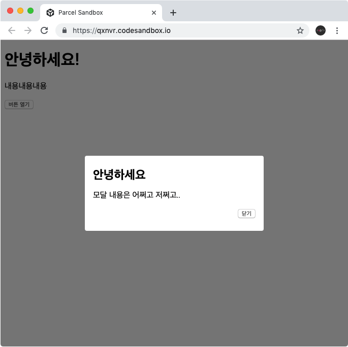
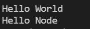

# 3주차 JS 스터디 정리

| 장     | 제목                       |
| ------ | -------------------------- |
| 4장    | HTML과 JavaScript 연동하기 |
| 책 1장 | 노드 시작하기              |
| 책 3장 | 노드 기능                  |

## 4장

### HTML 과 JavaScript 연동하기

- HTML 사용 시, UI 보여주기 OK
- 사용자의 인터렉션(상호작용)에 따라 동적으로 UI 업데이트? → JS 연동
- 인터렉션 양 많으면 vanilaJS(별도의 라이브러리나 프레임워크 사용 X 형태)보다는 React, Vue, Angular 등 도구 사용

### 4.1 카운터

[ex1] 버튼을 클릭하면 숫자가 올라가거나 내려가는 카운터

**1) UI 만들기**

```html
// UI 만들기

<!DOCTYPE html>
<html>
  <head>
    <title>Parcel Sandbox</title>
    <meta charset="UTF-8" />
  </head>

  <body>
    <h2 id="number">0</h2>
    <div>
      <button id="increase">+1</button>
      <button id="decrease">-1</button>
    </div>

    <script src="src/index.js"></script>
  </body>
</html>
```

⇒ id 값 설정하면 JS에서 쉽게 해당 DOM 선택 가능

\*DOM? 각 태그에 대한 정보를 갖고 있는 JS 객체

**2) DOM 선택하기**

```jsx
const number = document.getElementById("number");
const increase = document.getElementById("increase");
const decrease = document.getElementById("decrease");

console.log(number);
console.log(increase);
console.log(decrease);

// 출력
//<h2 id="number">0</h2>
//<button id="increase">+1</button>
//<button id="decrease">-1</button>

console.log(number.innerText); // 내용
console.log(increase.offsetTop); // top 위치
console.log(decrease.id); // id

// 출력
//0
//74
//decrease
```

**3) 이벤트 설정하기**

```jsx
// 버튼 클릭 시, 콘솔에 텍스트 출력하는 이벤트

const number = document.getElementById("number");
const increase = document.getElementById("increase");
const decrease = document.getElementById("decrease");

increase.onclick = () => {
  console.log("increase 가 클릭됨");
};

decrease.onclick = () => {
  console.log("decrease 가 클릭됨");
};

// 버튼 클릭 시, 숫자값을 올리거나 내리는 이벤트

increase.onclick = () => {
  const current = parseInt(number.innerText, 10);
  number.innerText = current + 1;
};

decrease.onclick = () => {
  const current = parseInt(number.innerText, 10);
  number.innerText = current - 1;
};
```

⇒ parseInt: 문자열을 숫자로 변환해주는 함수, 두 번째 인자 = 10진수

**결과**


### 4.2 모달

모달: 기존의 내용을 가리고 나타나는 메세지 박스 형태의 UI

**결과**



**1) HTML 구성**

```html
<!DOCTYPE html>
<html>
  <head>
    <title>Parcel Sandbox</title>
    <meta charset="UTF-8" />
  </head>

  <body>
    <h1>안녕하세요!</h1>
    <p>내용내용내용</p>
    <button>버튼 열기</button>
    <div class="modal-wrapper">
      <div class="modal">
        <div class="modal-title">안녕하세요</div>
        <p>모달 내용은 어쩌고 저쩌고..</p>
        <div class="close-wrapper">
          <button>닫기</button>
        </div>
      </div>
    </div>
    <script src="src/index.js"></script>
  </body>
</html>
```


**2) CSS 스타일링**

```css
body {
  font-family: sans-serif;
}

.modal-wrapper {
  position: fixed;
  top: 0;
  left: 0;
  width: 100%;
  height: 100%;
  background: rgba(0, 0, 0, 0.5);
  display: flex;
  align-items: center;
  justify-content: center;
}

.modal {
  background: white;
  padding: 24px 16px;
  border-radius: 4px;
  width: 320px;
}

.modal-title {
  font-size: 24px;
  font-weight: bold;
}

.modal p {
  font-size: 16px;
}

.close-wrapper {
  text-align: right;
}
```


JS 기본 설정

```jsx
import "./styles.css";
```

**3) display 스타일을 사용하여 모달 열고 닫기**

열고 닫는 기능: display 스타일 사용

```html
// 추가된 부분: .modal-wrapper 인라인 스타일 추가, 각 버튼 id

<button id="open">버튼 열기</button>
<div class="modal-wrapper" style="display: none;">
  <div class="modal">
    <div class="modal-title">안녕하세요</div>
    <p>모달 내용은 어쩌고 저쩌고..</p>
    <div class="close-wrapper">
      <button id="close">닫기</button>
    </div>
  </div>
</div>
```

⇒ display: none 사용 시, 해당 엘리먼트 화면에서 숨겨짐

```jsx
import "./styles.css";

const open = document.getElementById("open"); //id로 선택
const close = document.getElementById("close"); //id로 선택
const modal = document.querySelector(".modal-wrapper");
open.onclick = () => {
  modal.style.display = "flex";
};
close.onclick = () => {
  modal.style.display = "none";
};
```

⇒ 만약 id가 아닌 클래스로 DOM 선택하고 싶다면?

document.getElementByClassName || document.querySelector 사용

\*document.querySelector 사용하여 class 값으로 DOM 선택 시 텍스트 앞에 . 붙이기

## 1장

### 1.1 핵심 개념 이해하기

### **Node.js: Chrome V8 Javascript 엔진으로 빌드된 Javascript 런타임**

1. **서버**

   노드: 서버 애플리케이션 실행할 때 가장 많이 사용

   **서버?**

   네트워크를 통해 클라이언트에 정보나 서비스를 제공하는 컴퓨터 or 프로그램**(⇒ 요청을 받아 응답 + 다른 서버에 요청 보내기(이땐 서버가 클라이언트 역할))**

   **클라이언트?**

   요청을 보내는 주체 ex) 브라우저, 데스크톱 프로그램 등

   서버 → 클라이언트의 요청에 대해 YES or NO로 응답 가능

   노드 ⇒ 자바스크립트 프로그램이 서버로 기능하기 위한 도구 제공 → 서버 역할 수행 가능

2. **자바스크립트 런타임**

   노드: 자바스크립트 런타임

   **런타임?** 특정 언어로 만든 프로그램들을 실행할 수 있는 환경

   ⇒ 자바스크립트 프로그램을 컴퓨터에서 실행할 수 O (노드): 자바스크립트 실행기

   노드: V8 & libuv 라이브러리(둘 다 C와 C++로 구현) 사용

   libuv: 노드의 특성인 이벤트 기반, 논 블로킹 I/O 모델 구현

3. **이벤트 기반**

   이벤트 기반: 이벤트가 발생할 때 미리 지정해둔 작업을 수행하는 방식 ex) 클릭, 네트워크 요청

   → 이벤트 리스너에 콜백함수를 등록한다

   = 특정 이벤트가 발생할 때 무엇을 할지 미리 등록한다.

   → 노드에서 이벤트 발생 시 이벤트 리스너에 등록해둔 콜백 함수 호출, 발생한 이벤트가 없거나 발생했던 이벤트를 다 처리하면 다음 이벤트가 발생할 때까지 기다림

   1. 이벤트 루프: 여러 이벤트가 동시에 발생했을 때 어떤 순서로 콜백 함수 호출할지 판단, 이벤트 발생 시 호출할 콜백 함수를 관리하고, 호출된 콜백 함수의 실행 순서 결정하는 역할, 노드가 종료될 때까지 이벤트 처리를 위한 작업을 반복 ⇒ 루프

      \*anonymous: 처음 실행 시의 전역 컨텍스트(함수가 호출되었을 때 생성되는 환경)

      - 자바스크립트 코드는 실행 시 기본적으로 전역 컨텍스트 안에서 돌아가
      - 함수가 실행되는 동안 호출 스택에 머물러 있다 실행이 완료되면 호출 스택에서 지워짐
      - anonymous 컨텍스트까지 실행이 완료되면 호출 스택은 비어있게 돼

   [ex1] setTimeout 사용 시 호출 스택으로 설명하기 힘듦

   ```jsx
   function run() {
     console.log("3초 후 실행");
   }
   console.log("시작");
   setTimeout(run, 3000);
   console.log("끝");

   //결과
   //시작
   //끝
   //3초 후 실행
   ```

   b. 백그라운드: setTimeout 같은 타이머나 이벤트 리스너들이 대기하는 곳, 자바스크립트 가 아닌 다른 언어로 작성된 프로그램, 여러 작업이 동시에 실행될 수 있음

   c. 태스크 큐: 이벤트 발생 후, 백그라운드에서 태스크 큐로 타이머나 이벤트 리스너의 콜백 함수를 보냄, 정해진 순서대로 콜백들이 줄 서 있으므로 콜백 큐라고도 함, 콜백은 보통 완료된 순서대로 줄 서 있지만 특정 경우에는 순서가 바뀌기도

   [ex1] 실행 순서

   전역 컨텍스트인 anonymous가 호출 스택에 들어감 → setTimeout이 호출 스택에 들어감 → 호출 스택에 들어간 순서와는 반대로 실행 → setTimeout 먼저 실행 → 타이머와 함께 run 콜백을 백그라운드로 보냄 → setTimeout 호출 스택에서 빠짐 → anonymous가 호출 스택에서 빠짐 → 백그라운드가 3초를 센 후 run 함수를 태스크 큐로 보냄

   - 3초를 센다 = 백그라운드에 맡겨진 작업이 완료되었다
   - 태스크 큐: 여러 개의 큐로 구성

   1. 이벤트 루프: 호출 스택이 비어 있으면 태스크 큐에서 함수를 하나씩 가져와 호출 스택에 넣고 실행, 태스크 큐에 콜백 함수가 들어올 때까지 계속 대기

   2. 호출 스택: 함수가 너무 많이 들어있으면 3초가 지난 후에도 run 함수가 실행되지 않을 수도 O, 이벤트 루프가 호출 스택이 비어 있을 때에만 태스크 큐에 있는 run 함수를 호출 스택으로 가져오기 때문

   ⇒ setTimeout의 시간이 정확하지 않을 수도 있는 이유!

4. **논 블로킹 I/O**

   이벤트 루프를 잘 활용하면 오래 걸리는 작업을 효율적으로 처리 가능

   작업 1) 동시에 실행될 수 있는 작업: 자바스크립트 상에서 돌아가는 것이 아닌 I/O 작업

   작업 2) 동시에 실행될 수 없는 작업: 우리가 작성한 자바스크립트 코드

   - I/O: 입력/출력 ex) 파일 시스템 접근(파일 읽기, 파일 쓰기, 폴더 만들기), 네트워크 통한 요청
     ⇒ 노드는 논 블로킹 방식으로 처리
     논 블로킹 방식? 이전 작업이 완료될 때까지 대기하지 않고 다음 작업을 수행
     블로킹? 이전 작업이 끝나야만 다음 작업 수행 가능
     논 블로킹 방식이 같은 작업을 더 짧은 시간에 처리할 수 있음
     단, '전제': 작업들이 모두 동시에 처리될 수 있는 작업
   - 노드: I/O 작업 백그라운드로 넘겨 동시에 처리, 동시에 처리될 수 있는 작업들은 최대한 묶어 백그라운드로 넘겨야 시간 절약 가능 ⇒ 작업 순서에 따라 성능이 크게 달라짐

   [ex2] 블로킹 방식의 코드

   ```jsx
   function longRunningTask() {
     //오래 걸리는 작업
     console.log("작업 끝");
   }

   console.log("시작");
   longRunningTask();
   console.log("다음 작업");

   //결과
   //시작
   //작업 끝 (작업이 완료되기 전까지는 '다음 작업'이 출력되지 않아)
   //다음 작업

   //변경
   console.log("시작");
   setTimeout(longRunningTask, 0);
   console.log("다음 작업");

   //결과
   //시작
   //다음작업
   //작업 끝
   ```

   ⇒ setTimeout(콜백, 0): 코드를 논 블로킹으로 만들기 위해 사용하는 기법 중 하나 (다른 방식을 더 많이 사용)

   [ex2] 실행 순서

   setTimeout의 콜백함수인 longRunningTask가 태스크 큐로 보내짐 → 순서대로 실행 X → 다음 작업이 먼저 실행되고 → 그 후에 오래 걸리는 작업이 완료

   \*그러나 위와 같이 코드를 작성하면 동시에 실행되는 코드가 아니라 실행 순서만 바뀐 코드, 따라서 소요 시간이 절약 X ⇒ I/O 작업이 없어도 실행 순서를 바꿔 간단한 작업이 대기하는 상황을 막을 수 있다는 점의 의의

   - 논 블로킹 ≠ 동시
   - 동시성: 동시 처리가 가능한 작업을 논 브로킹 처리해야 얻을 수 O
   - setTimeout(콜백, 0): 0으로 설정해서 바로 실행되는 것 X, 지연 시간이 존재할 수 O
   - 동기 = 블로킹 (같은 건 아니고 유사함!), 비동기 = 논 블로킹

5. **싱글 스레드**

   싱글 스레드: 스레드가 하나

   ⇒ 자바스크립트 코드가 동시에 실행될 수 없는 이유

   - 프로세스: 운영체제에서 할당하는 작업의 단위 ex) 노드, 웹 브라우저 같은 프로그램
     - 프로세스 간의 자원 공유 X
     - 스레드를 여러 개 생성하여 여러 작업 동시 처리 가능
   - 스레드: 프로세스 내에서 실행되는 흐름의 단위
     - 부모 프로세스의 자원을 공유
     - 같은 주소의 메모리에 접근 가능 → 데이터 공유 O

   노드: 싱글 스레드 BUT! 싱글 스레드로 동작하지 X

   [노드의 동작]

   프로세스 생성 → 프로세스에서 스레드 생성 → 내부적으로 스레드 여러 개 생성 → 직접 사용자가 제어할 수 있는 스레드는 하나 → 이래서 싱글 스레드로 여겨짐

   - 요청이 많이 들어오면 한 번에 하나씩 요청을 처리
   - 블로킹이 심하게 일어나는 작업을 처리하지만 않으면 싱글 스레드로도 충분
   - 블로킹이 발생할 것 같은 경우 → 논 블로킹 방법으로 대기 시간 최대한 줄여
   - 싱글보다 멀티가 더 좋아보여? 꼭 그렇지는 않음, 그러나 멀티 스레드가 모두 논 블로킹 방식으로 작동하는 것이 좋은데 프로그래밍 하는 것이 상당히 어려워 멀티 프로세싱 방식 사용

   a. 멀티 스레딩

   : 하나의 프로세스 안에서 여러 개의 스레드 사용

   : CPU 작업이 많을 때 사용

   : 프로그래밍이 어려움

   b. 멀티 프로세싱

   : 여러 개의 프로세스 사용

   : I/O 요청이 많을 때 사용

   : 프로그래밍이 비교적 쉬움

   ⇒ I/O 작업 처리할 때: 멀티 스레딩 < **멀티 프로세싱(효율적)** → 노드

### 1.2 서버로서의 노드

노드: 싱글 스레드, 논 블로킹 모델 사용 ⇒ 노드 서버 또한 동일한 모델

즉, 노드의 장단점 = 위의 모델들의 장단점

**장점**

서버에는..

- I/O 요청이 많아 I/O 처리를 잘하는 노드 사용하기 Good
- libuv 라이브러리 사용하여 I/O 작업 → 논 블로킹 방식으로 처리
- 스레드 하나가 많은 수의 I/O 혼자서 감당 OK
- 싱글 스레드 방식의 프로그래밍은 멀티보다 쉬워
- 웹 서버 내장
- 자바스크립트 사용 → 웹 브라우저도 자바스크립트를 사용하기 때문에 하나의 언어로 웹 사이트를 개발할 수 있어 개발 생산성을 높임
- xml 대신 json 사용하여 데이터 주고받는데 json ⇒ 자바스크립트 형식
- 안정성, 보안성 검증됨

**단점**

- CPU 부하가 큰 작업에 적합 X ⇒ CPU 연산을 많이 요구할 경우 스레드 하나가 처리하기 어려움
- 작성하는 코드는 모두 스레드 하나에서 처리
- 멀티스레드 기능이 있어도 CPU 많이 사용하는 작업을 위한 서버 X
- 하나뿐인 스레드가 에러로 인해 멈추지 않도록 잘 관리(관리 X ⇒ 서버 전체 멈춤)
- 웹 서버가 내장되어있어도 서버 규모가 커지만 웹 서버를 연결해야함
- 비동기에 강점을 보이는 언어(Go), 정적 파일 제공 로드 밸런싱에 특화된 웹 서버(nginx)에 비해 속도 느림

**노드를 어디에 사용해야하는가?**

→ 개수는 많지만 크기는 작은 데이터를 실시간으로 주고 받는 것에 적합 (I/O에 특화)

ex) 실시간 채팅 어플, 주식 차트, JSON 데이터 제공하는 API 서버

### 1.3 서버 외의 노드

### 노드: 자바스크립트 런타임

용도 → 서버에만 한정된 것 X

노드 기반의 웹 프레임워크: 앵귤러, 리액트 뷰

1. 앵귤러: 구글에서 프론트엔드 앱 구현
2. 리액트: 페이스북

노드 기반의 모바일 개발 도구: 리액트 네이티브

ex) 페이스북, 인스타그램, 핀터레스트, 월마트, 테슬라 등

노드 기반의 데스크탑 개발 도구: 일렉트론

ex) Atom, Slack, Discord, VScode

### 1.4 개발 환경 설정하기

내용 placeholder

### 1.5 함께 보면 좋은 자료

내용 placeholder

## 3장

### 3.1 REPL 사용하기

자바스크립트 ⇒ 스크립트 언어: 미리 컴파일 하지 않아도 즉석에서 코드 실행 O

REPL: Read(읽고), Eval(해석), Print(반환), Loop(종료까지 반복)

[실습] REPL 직접 사용


입력한 코드

⇒ REPL이 읽고 해석한 뒤 바로 결과물 출력, 종료되기 전까지 입력 대기

한 줄 코드는 테스트하기 좋지만 여러 줄 코드는 실행하기 불편

⇒ 해결

긴 코드는 자바스크립트 파일로 만든 후 파일을 통째로 실행하는 것이 좋음

### 3.2 JS 파일 실행하기

[실습] JS 파일 만들기 (helloWorld.js)




\*REPL에서 입력하여 실행하는 것이 아니라 직접 콘솔에 입력

- REPL로 들어가는 명령어: node
- 콘솔에서 노드를 통해 파일을 실행하는 명령어: node [자바스크립트 파일 경로]

### 3.3 모듈로 만들기

노드:코드를 모듈로 만들 수 있음 ↔ 브라우저의 자바스크립트

**모듈?**

: 특정한 기능을 하는 함수나 변수들의 집합

: 자체로도 하나의 프로그램

: 다른 프로그램의 부품으로 사용 OK

: 여러 프로그램에서 해당 모듈 재사용 OK (= 자바스크립트에서 코드 재사용을 위해 함수 만드는 것)

→ 프로그램에 모듈을 도입하여 필요한 기능만 재사용 가능

: 파일 하나 → 모듈 하나

: 파일 별로 코드를 모듈화 OK → 관리 편함

[실습] 모듈 만들기 (var.js)


[실습] 모듈 (var.js) 참조하는 JS 파일 만들기 (func.js)


⇒ require 함수 안: 불러올 모듈의 경로

⇒ 다른 폴더에 있는 파일도 모듈로 사용 OK

[실행 순서]

var.js 에서 변수 불러옴 → 숫자의 홀짝을 판별하는 함수 선언 → module.exports에 함수 대입

\*module.exports에는 객체 뿐만 아니라 함수나 변수 대입도 가능

[실습] index.js


⇒ var.js & func.js 모두 참조: 모듈 하나가 여러 개의 모듈 사용 가능

- 모듈 하나가 여러 개의 모듈에 사용도 가능
- 모듈로부터 값 불러올 때 변수 이름 다르게 지정 가능
  ex) func.js의 checkOddEven이 checkNumber 이름으로 사용되고 있음

[실행 결과]


⇒ 실습 도중 오류: 파일 이름 오타

**장점**

- 여러 파일에 걸쳐 재사용되는 함수나 변수를 모듈로 만들어두면 편리

**단점**

- 모듈이 많아지고 모듈 간의 관계가 얽히게 되면 구조를 파악하기 어려움

⇒ require함수나 module 객체는 따로 선언하지 않아도 사용 가능

**WHY?** 노드에서 기본적으로 제공하는 내장 객체

\*ES2015 모듈

자바스크립트: 자체 모듈 시스템 문법 생성

```jsx
import {odd, even} from "./var";

function checkOddOrEven(num) {
  if (num % 2) {
    return odd;
  }
  return even;
}

export default checkOddOrEven;

// require -> import & module.exports -> export default
```

---
