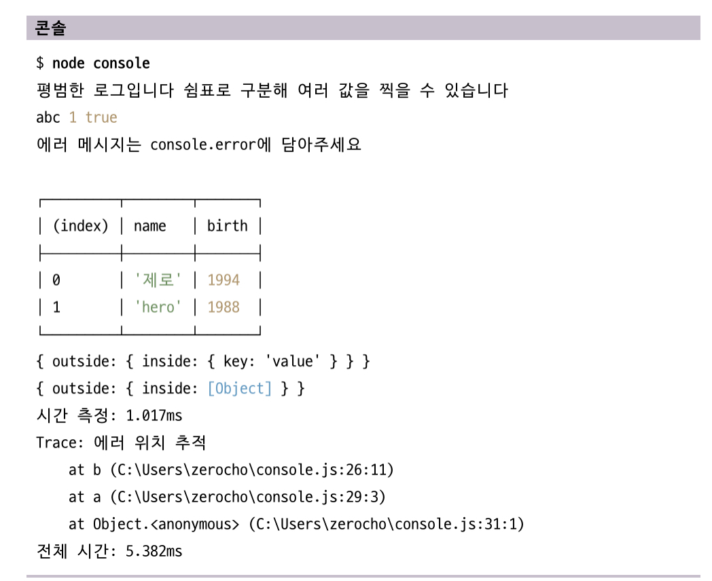

# 4주차 정리

3.4 노드 내장 객체 알아보기

노드 프로그래밍을 할 때 가장 많이 쓰이는 내장 객체들

3.4.1) global

- 브라우저의 window와 같은 전역 객체, 전역 객체이므로 모든 파일에서 접근 가능
- window.open의 window처럼 생략 또한 가능, 파일 간의 데이터를 공유할 때 사용한다.

**3.4.2) console**

- 디버깅을 하는 데 주로 사용.
- 대표적인 것은 consol.lig 메서드이다.
- 이외의 로깅 함수들
    - console.time(레이블) : console.timeEnd과 대응되며 같은 레이블을 가진 time- timeEnd 사이의 시간을 측정한다.
    - consol.log(내용) : 평범한 로그를 콘솔에 표시
    - console.error(에러 내용) : 에러를 콘솔에 표시
    - console.table(배열) : 배열의 요소로 객체 리터럴을 넣으면 객체의 속성들이 테이블 형식으로 표현됨
    - console.dir(객체, 옵션) : 객체를 콘솔에 표시할 때 사용
    - console.trace(레이블) : 에러가 어디서 발생했는지 추적할 수 있게 함
    
    ```jsx
    const string = 'abc';
    const number = 1;
    const boolean = true;
    const obj = {
      outside: {
        inside: {
          key: 'value',
        },
      },
    };
    console.time('전체 시간');
    console.log('평범한 로그입니다 쉼표로 구분해 여러 값을 찍을 수 있습니다');
    console.log(string, number, boolean);
    console.error('에러 메시지는 console.error에 담아주세요');
    
    console.table([{ name: '제로', birt: 1994 }, {name: 'hero', birth: 1988 }]);
    
    console.dir(obj, { colors: false, depth: 2 });
    console.dir(obj, { colors: true, depth: 1 });
    
    console.time('시간 측정');
    for (let i = 0; i < 100000; i++) {}
    console.timeEnd('시간 측정');
    
    function b() {
      console.trace('에러 위치 추적');
    }
    function a() {
      b();
    }
    a();
    console.timeEnd('전체 시간');
    ```
    
    

3.4.3) 타이머

- 아이디 반환하는 타이머 함수들
    - setTimeout(콜백함수, 밀리초): 주어진 밀리초(1,000분의1초) 이후에 콜백 함수 실행
    - setInterval(콜백함수, 밀리초): 주어진 밀리초마다 콜백 함수를 반복 실행
    - setImmediate(콜백함수): 콜백 함수를 즉시 실행
- 아이디를 사용하여 타이머 취소 가능
    - clearTimeout(아이디): setTimeout 을 취소함
    - clearInterval(아이디): setInterval을 취소함
    - clearImmediate(아이디): setImmediate을 취소함
    

3.4.4) __filename, __dirname

- 경로에 대한 파일 정보를 제공
- 파일에 __filename, __dirname을 넣어두면 실행할 때 현재 파일명과 현재의 파일 경로로 바뀌게 됨

**3.4.5) module, exports, require**
- 모듈을 만들 때 module.exports만 사용했으나, 이 말고도 exports 객체로도 모듈을 제작할 수 있음
- require은 모듈을 불러오는 함수.
    - require.cache : 한번 require 한 파일은 여기에 저장되므로 다음번 require할 때는 이곳에 있는 게 재사용됨
    - require.main : 노드 시행 시의 첫 모듈을 가리킴
    

3.4.6) process

- process 객체 : 현재 실행되고 있는 노드 프로세스에 대한 정보를 담고 있음
- 다양한 속성이 있음
    - process.env : REPL에 process.env를 입력하면 다양한 정보 출력되는데, 이는 시스템의 환경 변수이다.
        - UV_THREADPOOL_SIZE, NODE_OPTIONS 등
    - process.nextTick(콜백) : 이벤트 루프가 다른 콜백 함수들보다 이것의 콜백 함수를 우선적으로 처리하도록 만듦
    - process.exit(코드) : 실행중인 노드 프로세스를 종료

3.5 노드 내장 모듈 사용하기

3.5.1) os

- os모듈에 운영체제의 정보가 담겨있어 가져올 수 있음
- 종류
    - os.arch( ): process.arch와 동일
    - os.platform( ): process.platform과 동일
    - os.type( ): 운영체제의 종류
    - os.uptime( ): 운영체제 부팅 이후 흐른 시간(초)을 보여줌
    - os.hostname( ): 컴퓨터의 이름
    - os.release(): 운영체제의 버전
    - os.homedir(): 홈 디렉터리 경로
    - os.tmpdir(): 임시 파일 저장 경로
    - os.cpus(): 컴퓨터 코어 정보
    - os.freemem(): 사용 가능한 메모리(RAM)
    - os.totalmem(): 전체 메모리 용량

3.5.2) path

- 폴더와 파일의 경로를 쉽게 조작하도록 도와주는 모듈
- 운영체제별로 경로 구분자가 다르기 때문에 필요함(\윈도 타입, /POSIX 타입)
    - path.sep : 경로의 구분자. 윈도는 \, 이고 POSIX는 /이다
    - path.delimiter : 환경 변수의 구분자. process.env.PATH를 입력하면 여러 개의 경로가 이 구분자로 구분되어 있음. 윈도는 ;(세미콜론), POSIX는 :(콜론)
    - path.dirname(경로) ****: 파일이 위치한 폴더 경로를 보여줌
    - path.extname(경로) : 파일의 확장자를 보여줌
    - path.basename(경로, 확장자) : 파일의 이름(확장자 포함)을 표시. 파일의 이름만 표시하고 싶다면 basename의 두 번째 인수로 파일의 확장자를 넣으면 된다.
    - path.parse(경로) : 파일 경로를 root, dir, base, exit, name으로 분리
    - path.format(객체) : path.parse()한 객체를 파일 경로로 합침
    - path.normalize(경로) : / 나 \ 를 실수로 여러 번 사용했거나 혼용했을 때 정상적인 경로로 변환
    - path.isAbsolute(경로) : 파일의 경로가 절대경로인지 상대경로인지를 true난 false로 알림
    - path.relative(기준경로, 비교경로) : 경로를 두 개 넣으면 첫 번째 경로에서 두 번째 경로로 가는 방법을 알림
    - path.join(경로, ...) : 여러 인수를 넣으면 하나의 경로로 합침. 상대경로인 ..(부모 디렉터리)와 .(현 위치)도 알아서 처리
    - path.resolve(경로, ...) : path.join과 비슷하나, 동작 방식에 차이가 있음. / 를 만날때 절대경로로 인식해 앞의 경로를 무시.

3.5.3) url

- 인터넷 주소를 쉽게 조작하도록 도와주는 모듈
- WHATWG 방식과 노드에서 사용하던 방식 두가지가 있음
    - WHATWG 방식
        - URL생성자가 url모듈 안에 있기에 이 생성자에 주소를 넣어서 객체로 만들면 주소가 부분별로 정리됨
        - username, password, origin, searchParams 속성이 여기에만 존재
    - 기존 노드 방식
        - url.paras(주소) : 주소를 분해함. username, password대신에 auth속성이 있음, searchParams대신 query가 있음
        - url.format(객체) : WHATWG 방식 url, 기존 url 모두 사용할 수 있음. 분해되었던 url 객체를 다시 원래 상태로 조립

→ host 부분 없이 pathname만 오는 주소의 경우에는 WHATWG방식이 처리할 수 없음

- myURL안에는 searchParams 객체가 있는데, 이 안에 있는 다양한 메서드가 있음
    - getAll(키) : 키에 해당하는 모든 값들을 가져옴
    - get(키) : 키에 해당하는 첫 번째 값만 가져옴
    - has(키) : 해당 키가 있는지 없는지를 검사
    - keys() : searchParams의 모든 키를 반복기 객체로 가져옴
    - values() : searchParams의 모든 값을 반복기 객체로 가져옴
    - append(키, 값) : 해당 키를 추가한다. 같은 키의 값이 있다면 유지하고 하나 더 추가
    - set(키, 값) : append와 비슷하지만, 같은 키의 값들을 모두 지우고 새로 추가
    - delete(키) : 해당 키를 제거
    - toString() : 조작한 searchParams객체를 다시 문자열로 만듦. 이 문자열을 search에 대입하면 주소 객체에 반영됨.

3.5.4) querystring

- WHATWG 방식 대신 기존 노드 방식 사용할 때 search 부분을 사용하기 위해 객체로 만드는 모듈
    - querystring.parse(쿼리) : url의 query 부분을 자바스크립트 객체로 분해
    - querystring.stringify(객체) : 분해된 객체를 다시 문자열로 조립
    
    → 간단하게 분해되고 조립되므로 편리함
    

3.5.5) crypto

- 다양한 방식의 암호화를 도와주는 모듈
- 종류
    - 단방향 암호화 : 복호화할 수 없는 암호화 방식. 한번 암호화하고 나면 원래의 문자열을 찾을 수 없음(고객 비밀번호 같은 것은 복호화할 필요가 없음)
    - 양방향 암호화 : 암호화한 문자열을 복호화할 수 있음. 키(열쇠) 라는 것이 사용됨.
        
        → 자세한 암호화 방법은 생략
        
    
     
    

3.5.6) util

- 각종 편의 기능을 모아 둔 모듈. 계속해서 API가 추가되고 있으며 중요도가 떨어져 삭제되기도 함.
- 가장 많이 사용되는 두 메서드
    - util.deprecate : 함수가 deprecated 처리되었음을 알림. deprecate란 중요도가 떨어져 더 이상 사용되지 않고 앞으로 사라지게 될 것이라는 의미. 기능을 제거하지는 않지만 더 이상 사용하지 마세요! 란 의미이다.
    - util.promisify : 콜백 패턴을 프로미스 패턴으로 바꿈. 바꿀 함수를 인수로 제공
    

3.5.7) worker_threads

- 노드에서 멀티 스레드 방식으로 작업할 수 있게 해 주는 모듈
- 처리 도중 몇개의 처리를 병렬적으로 처리하는 형태를 멀티-스레드(multi-thread)라고 함

 → 책 참고하기

3.5.8) child_process

- 노드에서 다른 프로그램을 실행하고 싶거나 명령어를 수행하고 싶을 때 사용하는 모듈
- 다른 언어의 코드(파이썬과 같은)를 실행하고 결괏값을 받아올 수 있음

3.6 파일 시스템 접근하기

- fs모듈 : 파일 시스템에 접근하는 모듈. 즉 파일을 생성하거나 삭제하고, 읽거나 쓸 수 있음.
- 관련 내용

3.6.1) 동기 메서드와 비동기 메서드

- 동기 메서드와 비동기 메서드
    
    노드는 대부분의 메서드를 비동기 방식으로 처리하나, 몇몇 메서드는 동기 방식으로 처리할 수 있음.
    
    : 동기와 비동기의 차이 → 백그라운드 작업 완료 확인 여부
    
    - 비동기 방식으로 하되 순서를 유지하고 싶을 떄
        
        → 이전 readFile의 콜백에 다음 readFile을 넣으면 됨.  이 때 콜백 지옥이 펼쳐질 수 있는데, Promise나 async/await으로 어느 정도 해결할 수 있음
        

3.6.2) 버퍼와 스트림 이해하기

toString 메서드 사용하는 이유 : data가 버퍼이기 때문. 그렇다면 버퍼가 무엇인지?

- 버퍼링, 스트리밍 : 버퍼링은 영상 제작까지 데이터 모으는 동작, 스트리밍은 방송인의 컴퓨터에서 시청자 컴퓨터로 영상 데이터를 조금씩 송출하는 것
- 버퍼
    
    : 노드는 파일을 읽을 때 메모리에 파일 크기만큼 공간을 마련해두며 파일 데이터를 메모리에 저장한 뒤 사용자가 조작할 수 있게 함. 이때 메모리에 저장된 데이터가 버퍼.
    
    - Buffer : 버퍼를 직접 다룰 수 있는 클래스
        - from(문자열) : 문자열을 버퍼로 만듦.
        - toString(버퍼) : 버퍼를 다시 문자열로 만들 수 있음
        - concat(배열) : 배열 안에 든 버퍼들을 하나로 합침
        - alloc(바이트) : 빈 버퍼를 생성함. 바이트를 인수로 넣으면 그 크기만큼
        
- 스트림
    
    : 버퍼의 크기를 작게 만든 후 여러 번으로 나눠서 보내는 방식이 등장하는데, 이를 편리하게 만들어준 것이 스트림
    
    - createReadStream : 파일을 읽는 스트림 메서드

3.6.3) 기타 fs 메서드 알아보기

- 파일 시스템을 조작하는 다양한 메서드들이 존재함.
    - fs.access(경로, 옵션, 콜백) : 폴더나 파일에 접근할 수 있는지를 체크
    - fs.mkdir(경로, 콜백) : 폴더를 만드는 메서드
    - fs.open(경로, 옵션, 콜백) : 파일의 아이디(fd변수)를 가져오는 메서드
    - fs.rename(기존경로, 새경로, 콜백) : 파일의 이름 바꾸는 메서드
    - fs.readdir(경로, 콜백) : 폴더 안의 내용물을 확인할 수 있음
    - fs.unlink(경로, 콜백) : 파일을 지울 수 있음.
    - fs.rmdir(경로, 콜백) : 폴더를 지울 수 있음
    

3.6.4) 스레드풀 알아보기

- 비동기 메서드들은 백그라운드에서 실행되고, 실행된 후에는 다시 메인 스레드의 콜백 함수나 프로미스의 then 부분이 실행됨. 이때 fs 메서드 여러번 실행해도 백그라운들에서 동시에 처리되는데, 스레드풀이 있기 때문.
- fs 외에도 내부적으로 스레드풀 사용하는 모듈 → crypto, zlib, dns.lookup 등

**3.7 이벤트 이해하기**

- createReadStream 같은 경우는 내부적으로 알아서 data와 end 이벤트를 호출하지만, 직접 이벤트를 만들 수 있음.
- events 모듈을 사용하면 됨. → 객체를 만든 후, 이 객체는 이벤트 관리를 위한 메서드들이 있음
    - on(이벤트명, 콜백) : 이벤트 이름과 이벤트 발생 시의 콜백을 연결→ 리스닝이라고 부름
    - addListener(이벤트명, 콜백) : on과 같은 기능
    - emit(이벤트명) : 이벤트를 호출하는 메서드
    - once(이벤트명, 콜백) : 한번만 실행되는 이벤트
    - removeAllListeners(이벤트명) : 이벤트에 연결된 모든 이벤트 리스너 제거
    - removeListener(이벤트명, 리스너) : 이벤트에 연결된 리스너를 하나씩 제거
    - off(이벤트명, 콜백) : 노드 10 버전에서 추가된 메서드로, removeListener와 같은 기능
    - ListeneCount(이벤트명) : 현재 리스너가 몇개 연결되어 있는지 확인
    

**3.8 예외 처리하기**

- 예외란? :  처리하지 못한 에러. 이러한 에러들은 실행 중인 노드 프로세스를 멈추게 함.
- 멀티 스레드 프로그램에서는 스레드 하나가 멈추면 그 일을 다른 스레드가 대신 하지만, 노드의 메인 스레드는 하나 뿐이므로 소중하게 보호해야 한다.
- 메인 스레드가 에러로 인해 멈춘다는 것은 스레드를 갖고 있는 프로세스가 멈춘다는 것, 이는 곧 전체 서버가 멈춘다는 것
- 에러 처리 방법
    - try-catch문 : 에러가 발생할 것 같은 부분을 감싸준다.
    
    ```jsx
    setInterval(() => {
      console.log('시작');
      try {
        throw new Error('서버를 고장내주마!');
      } catch (err) {
        console.error(err);
      }
    }, 1000);
    ```
    
            - 에러가 발생하긴 하나, try/catch문으로 잡을 수 있음.
    
    - 노드 자체에서 잡아주는 에러 : fs.unlink로 존재하지 않는 파일을 지우고 있음.
    
    ```jsx
    const fs = require('fs');
    
    setInterval(() => {
      fs.unlink('./abcdefg.js', (err) => {
        if (err) {
          console.error(err);
        }
      });
    }, 1000);
    ```
    
    - 에러가 발생했을 때 에러를 throw 하곤 하는데, throw하면 노드 프로세스가 멈추니 throw 시 try/catch문으로 에러를 잡아야 함
    - 프로미스 에러는 catch하지 않아도 알아서 처리된다. 다만, 노드 버전이 올라감에 따라 바뀔 수 있기에 사용할 때는 항상 catch를 붙여주는 걸 권장
    - 예측 불가능한 에러 처리
        - 객체에 uncaughtException 이벤트 리스너 달기 → 그러나 최후의 수단으로 사용하기!
    
    ```jsx
    process.on('uncaughtException', (err) => {
      console.error('예기치 못한 에러', err);
    });
    
    setInterval(() => {
      throw new Error('서버를 고장내주마!');
    }, 1000);
    
    setTimeout(() => {
      console.log('실행됩니다');
    }, 2000);
    ```
    

3.8.1) 자주 발생하는 에러들

<자주 발생하는 에러>

- node: command not found: 환경 변수가 제대로 설정되지 않아서 생기는 에러
- ReferenceError: 모듈 is not defined: 모듈을 require 했는지 확인하기
- Error: Cannot find module 모듈명: 해당 모듈을 require 했지만 설치가 않았을 때 생기는 에러. npm i 명령어로 설치
- Error: Can't set headers after they are sent: 요청에 대한 응답을 보낼 때 응답을 두 번 이상 보냄
- FATAL ERROR: CALL_AND_RETRY_LAST Allocation failed - JavaScript heap out of memory: 코드를 실행할 때 메모리가 부족하여 스크립트가 정상 작동하지 않는 경우
- UnhandledPromiseRejectionWarning: UnhandledPromise rejection : 프로미스 사용 시 catch 메서드를 붙이지 않아서 발생, 항상 catch를 붙여 에러 상황에 대비하기
- EADDRINUSE 포트번호 : 해당 포트번호에 이미 다른 프로세스가 연결되어있음
- EACCES or EPERM : 노드가 작업을 수행하는데 권한이 충분하지 않음
- EJSONPARSE : package.json 등의 JSON 파일에 문법 오류가 있는 경우
- ECONNREFUSED : 요청을 보냈으나 연결이 성립하지 않을 때 발생하는 에러
- ETARGET: package.json에 기록한 패키지 버전이 존재하지 않을 때
- ETIMEOUT: 요청을 보냈으나 응답이 일정 시간 내에 오지 않을 때
- ENOENT: no such file or directory: 지정한 폴더나 파일이 존재하지 않는 경우

---

---

---

---

---

---

---

---
