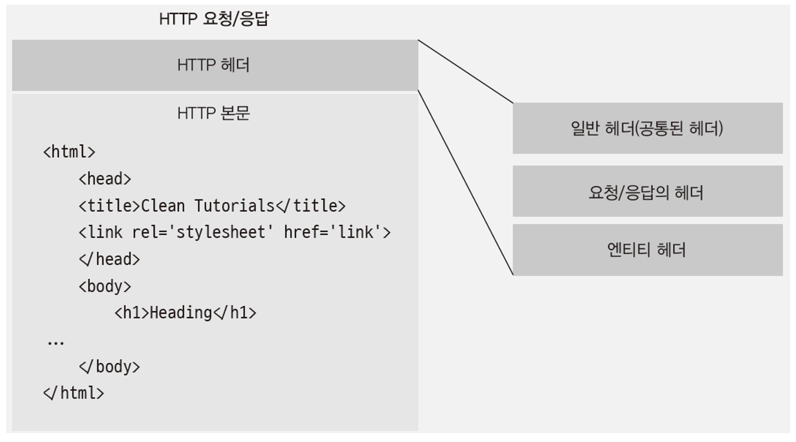

# 4주차 JS 스터디 정리

| 장   | 제목          |
| ---- | ------------- |
| 책 3장 마무리 | 노드 기능 |
| 책 4장 | http 모듈로 서버 만들기 |

## 3장

### 3.4 노드 내장 객체 알아보기
### 3.4.1 global
 노드의 전역 객체
 - 브라우저의 window 같은 역할
 - 모든 파일에서 접근 가능
 - global 속성에 값을 대입하면 다른 파일에서도 사용가능

### 3.4.2 console
 브라우저의 console과 유사
 - console.time, console.timeEnd: 시간 로깅
 - console.error: 에러 로깅
 - console.log: 평범한 로그
 - console.dir: 객체 로깅
 - console.trace: 호출스택 로깅

### 3.4.3 타이머 메서드
set 메서드에 clear 메서드가 대응된다.

- setTimeout(콜백 함수, 밀리초) : 주어진 밀리초(1000분의 1) 이후에 콜백함수를 실행한다.
- setInterval(콜백 함수, 밀리초) : 주어진 밀리초마다 콜백함수를 반복 실행한다.
- setImmediate(콜백 함수) : 콜백 함수를 즉시 실행한다.

이 타이머 함수들은 모두 아이디를 반환한다. 아이디를 사용하여 타이머를 취소할 수 있다.

- clearTimeout(아이디) : setTimeout을 취소한다.
- clearInterval(아이디) : setInterval을 취소한다.
- clearImmediate(아이디) : setImmdiate를 취소한다.

### 3.4.4 __filename, __dirname
- __filename : 현재 파일 경로
- __dirname : 현재 폴더(디렉터리) 경로

### 3.4.5 module, exports, require

**module** 객체 말고 **exports** 객체로도 모듈을 만들 수 있다.

- exports에 객체의 속성이 아닌 다른 값을 대입하면 참조 관계가 깨짐

**this**
 - 최상의 스코프의 this는 module.exports를 가리킨다.
 - 함수 선언문 내부의 this는 global 객체를 가리킨다.

**require**
 - require가 제일 위에 올 필요 없다.
 - require.cache에 한 번 require한 모듈에 대한 캐슁 정보가 들어있다.
 - requrie.main은 노드 실행 시 첫 모듈을 가리킨다.

### 3.4.6 process
현재 실행되고 있는 노드 프로세스에 대한 정보를 담고 있음

## 3.5 노드 내장 모듈 사용하기

### 3.5.1 OS
운영체제의 정보를 담고 있음

### 3.5.2 path
폴더와 파일의 경로를 쉽게 조작하도록 도와주는 모듈

### 3.5.3 url
인터넷 주소를 쉽게 조작하도록 도와주는 모듈

### 3.5.4 querystring
url 사용시 search를 객체로 만들어 사용

### 3.5.5. crypto
 - 암호화 가능, 복호화 불가능
 - 단방향 암호화는 주로 해쉬를 쓴다.

### 3.5.6 util
각종 편의를 모아둔 모듈
ex) deprecated, promisfy

### 3.5.7 worker_threads
노드에서 멀티 스레드 방식으로 작업이 가능하다.

### 3.5.8 child_process
노드에서 다른 프로그램을 실행하고 싶거나 명령어를 수행하고 싶을 때 사용

## 3.6 파일 시스템 접근하기
####fs
 - 파일 시스템에 접근하는 모듈
 - 파일 폴더 CRUD 가능
 - 웹과 달리 권한을 갖는다.

####버퍼와 스트림
 - 버퍼: 일정한 크기로 모아두는 데이터
 - 버퍼링: 버퍼에 데이터가 찰 때까지 모으는 작업
 - 스트림: 데이터의 흐름

## 3.7 이벤트 이해하기
이벤트 모듈로 커스텀 이벤트를 만들 수 있음

## 3.8 예외 처리하기
***예외: 처리하지 못한 에러***
 - 노드는 프로세스/스레드를 멈춘다
 - 에러처리는 필수.

### try catch문
기본적으로 try catch 문으로 예외를 처리함
- 에러가 생길만 한 곳을 try catch로 감싼다.

### 노드의 비동기 메서드 에러처리
콜백함수에서 에러 객체를 제공한다.

### 프로미스의 에러
따로 처리하지 않아도 된다.

---

## 4장
### 4.1 요청과 응답 이해하기
서버와 클라이언트의 관계
 - 클라이언트가 서버로 요청
 - 서버는 요청을 처리
 - 처리 후 클라이언트로 응답

### 4.2 REST와 라우팅 사용하기
REST란, HTTP URI를 통해 자원을 명시하고 HTTP 메서드(POST, GET, PUT, DELETE)등을 통해 해당 자원에 대한 (생성, 조회, 갱신, 삭제)등의 명령을 적용하는 것.

- GET: 서버 자원을 가져오고자 할 때 사용
- POST: 서버에 자원을 새로 등록하고자 할 때 사용
- PUT: 서버의 자원을 요청에 들어있는 자원으로 치환할 떄 사용
- DELETE: 서버의 자원을 삭제하고자 할 때 사용

### 4.3 쿠키와 세션 이해하기
***쿠키: 키 = 값의 쌍***
- 매 요청마다 서버에 동봉해서 보냄
- 서버는 쿠키를 읽어 누구인지 파악함

####헤더와 본문

 
 - 쿠키는 부가적인 정보이므로 헤더에 저장한다.

####http 상태 코드
 요청이 성공인지 실패인지 알려줌
 - 2xx: 성공
 - 3xx: 리다이렉션
 - 4xx: 요청 오류
 - 5xx: 서버 오류

***세션***
 쿠키의 정보는 노출되고 수정되는 위험이 있기 때문에 세션을 사용
 - 중요한 정보는 서버에서 관리, 클라이언트에게는 세션 키만 제공
 - 서버에 세션 객체를 생성, 키를 만들어 속성명으로 사용
 - 속성 값에 정보를 저장하고 키를 클라이언트에 보냄

### 4.4 https와 http2

#### https
웹 서버에 SSL 암호화를 추가하는 모듈
- 오고가는 모든 데이터를 암호화한다.

#### http2
SSL 암호화와 함께 최신 HTTP 프로토콜인 http/2를 사용하는 모듈
 - 요청 및 응답 방식이 기존보다 개선됨
 - 웹의 속도도 개선됨

### 4.5 cluster
 기본적으로 싱글 스레드인 JS node가 CPU 코어를 모두 사용할 수 있게 해주는 모듈
  - 포트를 공유하는 노드 프로세스를 여러개 둘 수 있음
  - 요청이 많이 들어왔을 때 병렬로 실행된 서버 개수만큼 요청 분산
  - 서버에 무리가 덜 감
  - 8개인 코어를 쓴다해서 성능이 8배가 되는 것은 아니다
  - 단점: 컴퓨터 자원(메모리, 세션 등)을 공유 못한다 -> redis 등 별도 서버로 해결함
---
