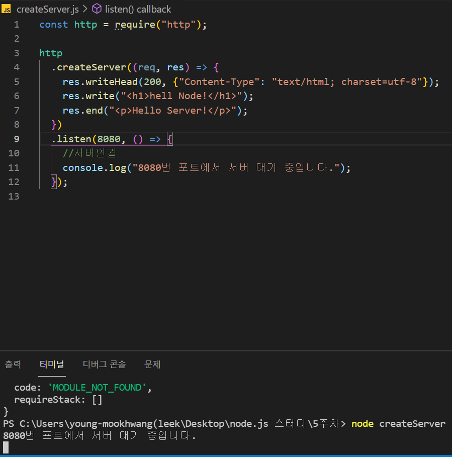

# 4주차 JS 스터디 정리

| 장   | 제목          |
| ---- | ------------- |
| 책 3장 마무리 | 노드 기능 |
| 책 4장 | http 모듈로 서버 만들기 |

## **3장**

### **3.4 노드 내장 객체 알아보기**

1. global: 전역 객체, 모든 파일에서 접근 가능, 생략 가능, 파일 간에 간단한 데이터 공유할 때 사용
2. console: 디버깅을 위해 사용
    1. console.time(레이블): console.timeEnd(레이블)과 대응, 같은 레이블을 가진 time과 timeEnd 사이의 시간 측정
    2. console.log(내용): 평범한 로그를 콘솔에 표시, 여러 내용 동시 표시 가능
    3. console.error(에러 내용): 에러를 콘솔에 표시
    4. console.table(배열): 배열 요소로 객체 리터럴을 넣으면, 객체 속성이 테이블 형식으로 표현
    5.  console.dir(객체, 옵션): 객체를 콘솔에 표시할 때 사용
    6. console.trace(레이블): 에러가 어디서 발생했는지 추적할 수 O
3. 타이머
    1. setTimeout(콜백함수, 밀리초): 주어진 밀리초 이후에 콜백 함수 실행
    2. setInterval(콜백함수, 밀리초): 주어진 미리초마다 콜백 함수 반복 실행
    3. setImmediate(콜백함수): 콜백 함수 즉시 실행
    
    ⇒ 아이디 반환
    
    d. clearTimeout(아이디): setTimeout 취소
    
    e. clearInterval(아이디): setInterval 취소
    
    f. clearImmediate(아이디): setImmediate 취소
    
4. __filename, __dirname: 파일 사이에 모듈 관계가 있는 경우가 많으므로 떄로는 현재 파일의 경로나 파일명을 알아야, 경로에 대한 정보 제공
5. module, exports, require
6. process
    1. process.env: 많은 정보 출력, 시스템의 환경 변수
    2. process.nextTick(콜백): 콜백함수를 우선으로 처리
    3. process.exit(코드): 실행 중인 노드 프로세스 종료

### **3.5 노드 내장 모듈 사용하기**

1. os: 노드는 os 모듈에 정보가 담겨 있어 정보를 가져올 수 있음
    1. os.arch(): process.arch와 동일
    2. os.platform(): process.platform과 동일
    3. os.type(): os 종류
    4. os.uptime(): 부팅 이후 흐른 시간을 보여줌
    5. os.hostname(): 컴퓨터의 이름
    6. os.release(): os의 버전
    7. os.homedir(): 홈 디렉터리 경로
    8. os.tmpdir(): 임시 파일 저장 경로
    9. os.cpus(): 컴퓨터의 코어 정보
    10. os.freemem(): 사용 가능한 메모리
    11. os.totalmem(): 전체 메모리 용량
2. path: 폴더와 파일의 경로를 쉽게 조작하도록 도와주는 모듈
    - 윈도우: \로 구분
    - POSIX: /로 구분
    1. path.sep: 경로 구분자
    2. path.delimiter: 환경 변수의 구분자
    3. path.dirname(경로): 파일이 위치한 폴더 경로
    4. path.extname(경로): 파일의 확장자
    5. path.basename(경로, 확장자): 파일의 이름(확장자 포함) 표시
    6. path.parse(경로): 파일 경로를 root, dir, base, ext, name 분리
    7. path.format(객체): path.parse()한 객체를 파일 경로
    8. path.normalize(경로): /나 ￦를 실수로 여러 번 사용했거나 혼용했을 때 정상 경로 반환
    9. path.isAbsolute(경로): 파일의 경로가 절대 or 상대
    10. path.relative(기준경로, 비교경로): 경로를 두 개 넣으면 첫 번째 경로에서 두 번째 경로로 가는 방법
    11. path.join(경로, ...): 여러 인수를 넣으면 하나의 경로로 합침
    12. path.resolve(경로, ...): path.join과 비슷
        - 차이? /만나면 후자는 절대 경로로 인식하여 앞의 경로 무시, 전자는 상대 경로 처리
3. url: 인터넷 주소 쉽게 조작하도록 도와주는 모듈
    - WHATWG 방식
    - 예전부터 노드에서 사용하던 방식
    1. url.parse(주소): 주소 분해 (↔ username, password 대신 auth / searchParams 대신 query)
    2. url.format(객체): WHATWG와 기존 모두 가능 → 분해되었던 url 원상태로 조립
4. querystring: 기존 url 사용시 search 부분 사용 쉽게 객체로 만드는 부분
5. crypto: 암호화
    1. 단방향 암호화: 복호화할 수 없는 암호화 방식: 해시 기법
    2. 양방향 암호화: 복호화 가능, 키 사용, 대칭형 암호화에서 암호를 복호화하려면 암호화할 때 사용한 키와 같은 키 사용
6. util: 각종 편의 기능을 모아둔 모듈
7. worker_thread: 멀티 스레드 방식으로 작업하는 방법
8. child_process: 노드에서 다른 프로그램을 실행하고 싷ㅍ거나 명령어를 수행하고 싶을 때 사용하는 모듈
    1. exec: 셸 실행하여 명령어 수행
    2. spawn: 새로운 프로세스 띄우며 명령어 실행

### **3.6 파일 시스템 접근하기**

fs 모듈: 파일 시스템에 접근하는 모듈 (파일 생성, 삭제, 읽기, 쓰기)

1. 동기 메서드와 비동기 메서드: 백그라운드 작업 완료 확인 여부
    
    ↔ 블로킹 & 논블로킹: 함수가 바로 return 되는지 여부
    
2. 버퍼와 스트림 이해하기
    1. 버퍼 이용
        1. 버퍼링: 영상을 재생할 수 있을 때까지 데이터 모으는 동작
        
        ⇒ 이와 비슷하게 파일을 읽을 때 메모리에 파일 크기만큼 공간을 마련해두고 파일 데이터를 메모리에 저장한 뒤 사용자가 조작할 수 있도록 → 버퍼: 메모리에 저장된 데이터
        
    2. 스트림 이용
        1. 스트리밍: 시청자의 컴퓨터로 영상 데이터를 조금씩 전송하는 동작
        
        ⇒ 모든 내용을 버퍼에 다 쓴 후에야 다음 동작으로 넘어가므로 파일 읽기, 압축, 파일 쓰기 등의 조작을 연달아 한다면 매번 전체 용향을 버퍼로 처리 → 다음 단계 가능
        
        스트림: 버퍼 크기 작게 하여 여러 번으로 나눠 보내는 방식
        
3. 스레드풀: 비동기 메서드들은 백그라운드에서 실행되고 실행된 후 다시 메인 스레드의 콜백 함수나 프로미스의 then 부분 실행, 이때 fs 메서드 여러 번 실행해도 백그라운들에서 동시에 처리되는 이유
    
    ex) crypto, zlib, dns, lookup
    
    ⇒ 직접 컨트롤할 수 없지만 개수를 조절할 수 X
    

### **3.7 이벤트 이해하기**

스트림: on('data', 콜백) or on('end', 콜백) 사용

→ data나 end 이벤트가 발생할 때 콜백 함수를 호출하도록 이벤트를 등록한 것

⇒ 이와 같은 이벤트를 직접 만들 수 있음: event 모듈 사용

### **3.8 예외 처리하기**

예외: 처리하지 못한 에러(실행 중인 노드 프로세스를 멈추게)

- 멀티 스레드: 스레드 하나가 멈추면 그 일을 다른 스레드가 대신 but, 노드의 메인 스레드는 하나 뿐이라 보호할 필요o
- 메인 스레드가 에러로 인해 멈춤 = 스레드를 갖고 있는 프로세스가 멈춤(= 전체 서버도 멈춤)
1. try-catch문: 에러가 발생할 것 같은 부분 감싸기
2. throw: 에러가 발생했을 때 에러를 throw → throw 시 try/catch문으로 에러를 받아야 돼

*프로미스 에러: catch하지 않아도 알아서 처리

[예기치 못한 에러 발생 처리]

⇒ 객체에 uncaughtException 이벤트 리스너 달기

<자주 발생하는 에러>

1. node: command not found: 노드 설치 시 환경 변수가 제대로 설정되지 않은 것
2. ReferenceError: 모듈 is not defined: 모듈을 require 했는지 확인
3. Error: Cannot find module 모듈명: 해당 모듈을 require 했지만 설치가 안된 경우 → npmi 로 설치
4. Error: Can't set headers after they are sent: 요청에 대한 응답을 보낼 때 응답을 두 번 이상 보낸 경우
5. FATAL ERROR: CALL_AND_RETRY_LAST Allocation failed - Javascript heap out of memory: 코드를 실행할 때 메모리가 부족하여 스크립트가 정상 작동하지 않는 경우
6. UnhandledPromiseRejectionWarning: 프로미스 사용 시 catch 메서드를 붙이지 않으면 발생, 항상 catch를 붙여 에러 상황에 대비
7. EADDRINUSE 포트번호: 해당 포트번호에 이미 다른 프로세스가 연결되어있는 경우
8. EACCES or EPERM: 노드가 작업을 수행하는데 권한이 충분 X
9. EJSONPARSE: JSON 파일에 문법 오류가 있는 경우
10. ECONNREFUSED: 요청을 보냈으나 연결이 성립하지 않을 때 발생
11. ETARGET: package.json에 기록한 패키지 버전이 존재하지 않을 때 발생
12. ETIMEOUT: 요청을 보냈으나 응답이 일정 시간 내에 오지 않을 때 발생
13. ENOENT: no such file or directory: 지정한 폴더나 파일이 존재하지 않는 경우

## **4장**

### **4.1 요청과 응답 이해하기**

클라이언트 → 서버: 요청

서버 → 클라이언트: 응답

요청&응답: 이벤트 방식(요청이 왔을 때 어떤 작업을 수행할지 이벤트 리스너를 미리 등록해둬야)

http: 웹 브라우저의 요청을 처리할 수 있음

http ⇒ 인수로 요청에 대한 콜백 함수를 넣을 수 있고 요청이 들어올 때마다 매번 콜백 함수 실행, 콜백함수에 응답 적기

- req: requst 요청에 관한 정보
- res: response 응답에 관한 정보

localhost: 현재 컴퓨터의 내부 주소 = 외부에서 접근할 수 없고 자신의 컴퓨터에서만 접근 가능

= 127.0.0.1(IP)

서버 종료: ctrl+c

<res 객체>

- res.writeHead: 응답에 대한 정보를 기록하는 메서드, 첫 번째 인수로 성공적인 요청임을 의미하는 200, 두 번째 인수로 응답에 대한 정보를 보내는데 콘텐츠의 형식이 html임을 알리는 것, utf-8을 한글 표시를 위해 charset 설정
    - 헤더: 정보가 기록되는 부분
- res.write: 첫 번째 인수는 클라이언트로 보낼 데이터, html 모양의 문자열을 보냈지만 버퍼를 보낼 수도 있음, 여러 번 호출해서 데이터를 여러 개 보내도 돼
    - 본문: 데이터가 기록되는 부분
- res.end: 응답을 종료하는 메서드, 인수가 있다면 데이터도 클라이언트로 보내고 응답 종료

*listen 메서드에 콜백 함수를 넣는 대신, listening 이벤트 리스너를 붙여도 돼(+ error 이벤트 리스너)

*한 번에 여러 서버를 실행할 수 있음

*포트번호가 같으면 eaddrinus 에러

res.write와 res.end에 일일이 html을 적는 것은 비효율적 → html 파일을 미리 만들어두는 것이 좋음그 파일을 fs 모듈로 읽어서 전송 가능

요청이 들어오면 먼저 fs 모듈로 html 파일을 읽음, data 변수에 저장된 버퍼를 그대로 클라이언트에 보내면 돼 ⇒ 예기치 못한 에러가 발생한 경우 에러 메세지를 응답(에러 메세지 = 일반 문자열text/plain)

### **4.2 REST와 라우팅 사용하기**

REST: REpresentational State Transfer의 줄임말, 서버의 자원을 정의하고 자원에 대한 주소를 지정하는 방법

- 주소: 의미를 명확히 전달하기 위해 명사로 구성
- /user: 사용자 정보에 관련된 자원을 요청
- /post: 게시글에 관련된 자원을 요청

<HTTP 요청 메서드>

- GET: 서버 자우너을 가져오고자 할 때 사용, 요청의 본문에 데이터 X, 데이터를 서버로 보내야 한다면 쿼리스트링을 사용
- POST: 서버에 자원을 새로 등록하고자 할 때 사용, 요청의 본문에 새로 등록할 데이터 넣어 보냄
- PUT: 서버의 자원을 요청에 들어 있는 자원으로 치환할 때 사용, 요청의 본문에 치환할 데이터 넣어
- PATCH: 서버 자원의 일부만 수정할 때 사용, 요청의 본문에 일부 수정할 데이터 넣어 보냄
- DELETE: 서버의 자원을 삭제하고자 할 때 사용, 요청의 본문에 데이터 넣지 X
- OPTIONS: 요청을 하기 전에 통신 옵션을 설명하기 위해 사용

*주소 하나가 요청 메소드를 여러 개 가질 수 O

*장점: 주소와 메서드만 보고 요청의 내용을 알아볼 수 있음

### **4.3 쿠키와 세션 이해하기**

클라이언트에서 보내는 요청의 단점: 누가 요청을 보내는지 알 수 없음(물론 요청을 보내는 IP주소나 브라우저 정보를 받아올 수 O)

**쿠키: 유효기간, 키-값**

브라우저 → 쿠키가 있다면 자동으로 동봉해서 보내주므로 따로 처리X

서버 → 브라우저: 쿠리를 보낼 대만 코드 작성하여 처리 ⇒ 서버: 미리 클라이언트에 요청자를 추정할 만한 정보를 쿠키로 만들어 보내고, 클라이언트로부터 쿠키를 받아 요청자 파악

쿠키: 사용자가 누구인지 추적하고 있는 것 → 이 때문에 개인정보 유출 방지를 위해 쿠키를 주기적으로 지우라고 권고하는 것

- 쿠키: 요청의 헤더에 담겨 전송 ⇒ 문자열 형식으로 존재
- 브라우저 응답의 헤더에 따라 쿠키 저장
- 파비콘: 웹 사이트 탭에 보이는 이미지
- 쿠키 설정 시, 각종 옵션 넣을 수 있으며 옵션 사이 세미콜론(;) 써서 구분
- 쿠키에 들어가면 안되는 글자
    - 한글(encodeURIComponent), 줄바꿈
- 쿠키=쿠키값: 기본적인 쿠키 값
- Expires=날짜: 만료 기한
- Max-age=초: 날짜 대신 초
- Domain=도메인명: 쿠키가 전송될 도메인 특정 가능
- Path=URL: 쿠키가 전송될 URL 특정
- Secure: HTTPS일 경우에만 쿠키 전송
- HttpOnly: 설정 시 자바스크립트에서 쿠키 접근 X

**세션: 서버에 사용자 정보를 저장하고 클라이언트와는 세션 아이디로만 소통**

세션 아이디: 꼭 쿠키를 사용해서 주고 받지 X 수 있음

쿠키 많이 사용 이유: 간단해서

**세션 쿠키: 세션을 위해 사용하는 쿠키**

### **4.4 http와 https**

https 모듈: 웹 서버에 SSL 암호화 추가 → GET&POST 요청을 할 때 오가는 데이터 암호화 ⇒ 중간에 다른 사람이 요청 가로채도 내용 확인할 수 X

노드의 http2 모듈: SSL 암호화와 더불어 최신 HTTP 프로토콜인 http/2 사용할 수 있게

⇒ 웹 속도 많이 개선

### **4.5 cluster**

cluster 모듈: 싱글 프로세스로 동작하는 노드가 CPU 코어를 모두 사용할 수 있게 하는 모듈

- 포트 공유하는 노드 프로세스 여러 개
- 요청이 많이 들어왔을 때 병렬로 실행된 서버의 개수만큼 요청이 분산되게 OK
- 서버에 무리 덜 줌
- 메모리를 공유하지 X
- 세션을 메모리에 저장하는 경우 → 레디스 등의 서버를 도입하여 해결 OK

*워커 프로세스: 실질적인 일을 하는 프로세스 

*모든 워커가 종료되면 서버 응답 X

*코드: process.exit의 인수로 넣어준 코드 출력

*신호: 존재하는 경우 프로세스를 종료한 신호의 이름 출력 ⇒ 워커 프로세스가 존재하기 때문에 오류가 발생해도 서버가 정상 작동할 수 있음

⇒ 주소 수가 많아질수록 코드는 길어짐, 이때 쿠키와 세션 추가 → 더 복잡: Express

------
