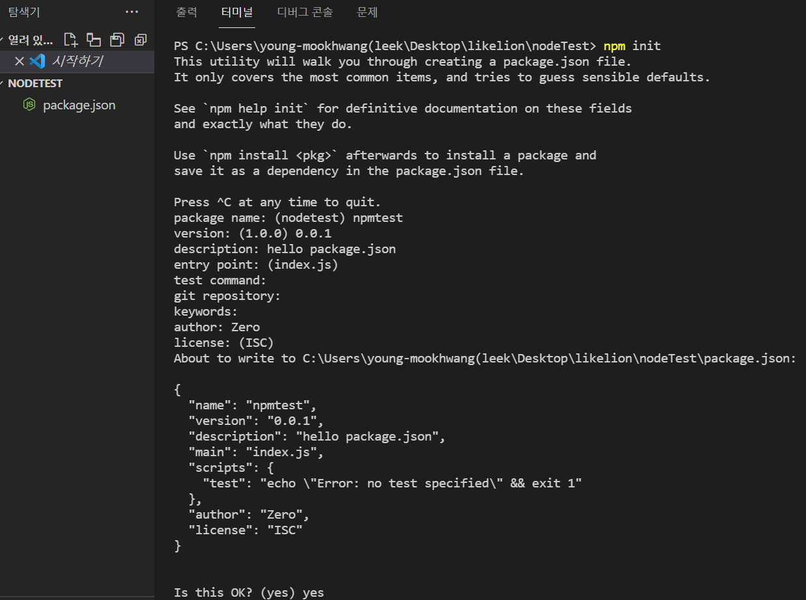
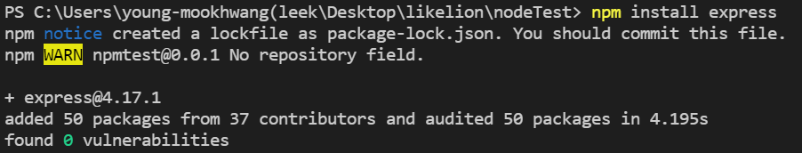
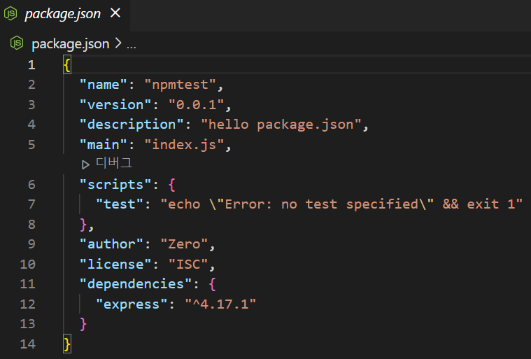

# 5주차 JS 스터디 정리

| 장   | 제목          |
| ---- | ------------- |
| 책 5장 | 패키지 매니저 |
| 책 6장 | 익스프레스 웹 서버 만들기 |

## 5장

### 5.1 npm 알아보기

npm = Node Package Manager(노드 패키지 매니저)

### 5.2 package.json으로 패키지 관리하기

설치한 패키지 버전을 관리하는 파일 = package.json

→ 따라서 노드 프로젝트를 시작하기 전 폴더 내부에 '무조건' package.json 먼저 만들고 시작

npm ⇒ package.json을 만드는 명령어 제공

- package name: 패키지의 이름
- version: 패키지의 버전
- entry point: 자바스크립트 실행 파일 진입점
- test command: 코드를 테스트할 때 입력할 명령어
- git repository: 코드를 저장해둔 깃 저장소 주소
- keywords: npm 공식 홈페이지에서 패키지 쉽게 찾을 수 있도록
- license: 해당 패키지의 라이선스







dependencies: 설치된 버전, node_modules 폴더: 설치한 패키지

- 개발용 패키지: npm install —save-dev [패키지]
- 전역설치: npm이 설치되어 있는 폴더에 설치
- rimraf: rm -rf로 지정한 파일이나 폴더를 지우는 명령어

### 5.3 패키지 버전 이해하기

→ 버전 항상 세 자리: SemVer (Semantic Versioning)방식의 버전 넘버링

: 버전 번호를 어떻게 정하고 올려야 하는지 명시하는 규칙

버전의 첫 번째 자리: major 버전, 0: 초기 개발중, 1: 정식 버전

버전의 두 번째 자리: minor 버전

버전의 세 번째 자리: patch 버전, 기존 기능에 문제가 있어 수정한 것을 내놓았을 때 올림

- 새 버전을 배포한 후 그 버전의 내용을 절대 수정하면 x
- 버전의 숫자마다 의미가 부여되어 있으므로 다른 패키지 사용할 때도 버전만 보고 에러 발생 여부 가늠 가능

### 5.4 기타 npm 명령어

- npm outdated: 업데이트할 수 있는 패키지가 있는지 확인 가능
- npm adduser: npm 로그인을 위한 명령어
- npm whoami: 로그인한 사용자가 누구인지 알림
- npm logout: npm adduser로 로그인한 계정을 로그아웃
- npm version [버전]: package.json 버전 올림
- npm deprecate [패키지명] [버전] [메세지]: 해당 패키지 설치할 때 경고 메세지 띄우는 명령어
- npm publish: 자신이 만든 패키지 배포 시 사용
- npm unpublish: 배포한 패키지 제거할 때 사용
- npm ci: package.json 대신 package-lock.json 기반하여 패키지 설치

### 5.5 패키지 배포하기

- npm 배포 시 주의사항: 코드가 공개되는 것이므로 배포 전에 개인정보가 코드에 들어있지 아닌지 꼭 확인해야 함

## 6장

### 6.1 익스프레스 프로젝트 시작하기

- app.set("port", process.env.PORT || 3000): 서버가 실행될 포트 설정
- app.set(키, 값): 데이터 저장
- app.get(주소, 라우터): 주소에 대한 get 요청이 올 때 어떤 동작을 할지


### 6.2 자주 사용하는 미들웨어

미들웨어: 익스프레스의 핵심

- 미들웨어: 요청과 응답의 중간에 위치
- 미들웨어는 app.use와 함께 사용 ⇒ app.use(미들웨어)
- app.use에 매개변수가 req, res, next인 함수 넣으면 됨
- 위에서부터 아래로 순서대로 실행되면서 요청과 응답 사이에 특별한 기능 추가 가능
- app.use(미들웨어): 모든 요청에서 미들웨어 실행
- app.use('/abc', 미들웨어): abc로 시작하는 요청에서 미들웨어 실행
- app.post('/abc', 미들웨어): abc로 시작하는 post 요청에서 미들웨어 실행

⇒ app.get이나 app.use 라우터 + 미들웨어 여러 개 가능 (next 호출해야 다음 미들웨어 넘어갈 수 있음)

- 미들웨어를 통해 요청과 응답에 다양한 기능 추가 가능

1. **morgan**

: 콘솔에서 나오는 로그 ⇒ morgan 미들웨어에서 나오는 것(요청과 응답에 대한 정보를 콘솔에 기록)

: app.use(morgan('dev'))

: 인수를 바꾸면 로그가 달라짐, 인수 → dev(개발 환경), combined(배포 환경), common, short, tiny 등

: 요청과 응답을 한눈에 볼 수 있어 편리

2. **static**

: 정적인 파일들을 제공하는 라우터 역할

: 설치할 필요 x

: app.use('요청 경로', express.static('실제경로'))

: app.use('/', express.static(path.join(\_\_dirname, 'public')))

: 함수의 인수로 정적 파일들이 담겨 있는 폴더 지정

: 서버의 폴더 경로와 요청 경로가 달라 외부인이 서버의 구조를 쉽게 파악할 수 없어 보안에 도움

3. **body-parser**

: 요청의 본문에 있는 데이터를 해석해 req.body 객체로 만들어주는 미들웨어

: 데이터나 ajax 요청의 데이터 처리(단, 멀티파트 데이터는 처리 x)

: app.use(express.json())

: app.use(express.urlencoded({extended: false}))

: 일부 기능이 익스프레스에 내장되어있어 설치할 필요 x

: json - json 형식의 데이터 전달 방식

: url-encoded - 주소 형식으로 데이터 보내는 방식

4. **cookie-parser**

: 요청에 동봉된 쿠키를 해석해 req.cookies 객체로 만듦

: app.use(cookieParser(비밀키))

: 해석된 쿠키들을 req.cookies 객체에 들어감

: 첫 번째 인수 - 비밀키, 서명된 쿠키가 있는 경우 제공한 비밀 키를 통해 해당 쿠키가 내 서버가 만든 쿠키임을 검증 가능

: 쿠키 - 클라이언트에서 위조하기 쉬워 비밀 키를 통해 만들어낸 서명을 쿠키 값 뒤에 붙임

: cookie-parser가 쿠키를 생성할 때 쓰이는 것 x

: 쿠키 생성/제거 - res.cookie, res.clearCookie

: 쿠키 값 지우려면 키와 값 외에 옵션도 정확히 일치해야 쿠키가 지워짐(expires나 maxAge옵션 일치하지 않아도 돼)

5. **express-session**

: 세션 관리용 미들웨어

: 로그인 등의 이유로 세션을 구현하거나 특정 사용자를 위한 데이터를 임시적으로 저장해둘 때 유용

: 세션 - 사용자 별로 req.session 객체 안에서 유지

: 인수 - 세션에 대한 설정

: cookie 옵션 - 세션 쿠키에 대한 설정

: store 옵션 - store 옵션을 통해 데이터베이스를 연결하여 세션을 유지하는 것이 좋음 → 레디스 자주 사용

: express-session으로 만들어진 req.session 객체에 값 대입 or 삭제해서 세션 변경할 수 있음

: 세션 한 번에 삭제하려면 req.session.destroy 메서드 호출하면 됨

6. **미들웨어의 특성 활용하기**

: req, res, next를 매개변수로 가지는 함수로서 app.use, app.get, [app.post](http://app.post) 등으로 장학

: 특정한 주소의 요청에만 미들웨어가 실행되게 하려면 첫 번째 인수로 주소를 넣으면 됨

: 여러 개의 미들웨어 장착 가능

: 다음 미들웨어로 넘어가려면 next 함수 호출

: next 호출하지 않는 경우, res.send 나 res.sendFile 등의 메서드로 응답

: 미들웨어 장착 순서에 따라 어떤 미들웨어는 실행되지 않을 수 있음

: 미들웨어 간에 데이터 전달하는 방법도 존재

: 미들웨어 안에 미들웨어 넣는 방식으로 동작

```jsx
app.use(morgan("dev"));
//or
app.use((req, res, next) => {
  morgan("dev")(req, res, next);
});
```

→ 이 패턴은 기존 미들웨어의 기능을 확장할 수 있음

7. **multer**

: 이미지, 동영상 등을 비롯한 여러 가지 파일들을 멀티파트 형식으로 업로드할 때 사용하는 미들웨어

: body-parser로 처리할 수 없고 직접 파싱하기 어려워 미들웨어 사용하면 편리

- multer 함수 인수: 설정
- storage 속성: 어디에 어떤 이름으로 저장할지 넣음
- destination, filename 함수: req 매개변수에는 요청에 대한 정보
- file 객체: 업로드한 파일에 대한 정보
- done 매개변수: 첫 번째 인수 → 에러가 있다면 에러, 두 번째 인수 → 실제 경로나 파일 이름
- limits: 업로드에 대한 제한 사항 설정
- 설정 끝나면 upload 변수 생성

### 6.3 Router 객체로 라우팅 분리하기

: indexRouter ⇒ app.use('/') → localhost:3000

: userRouter ⇒ app.use('/user') → localhost:3000/host

: 같은 주소의 라우터 여러 개 만들 수 있음

: 주소 :id - 다른 값을 넣을 수 있음, id에 해당하는 1이나 123을 조회할 수 있음, req.params 객체 내

: 일반 라우터보다 뒤에 위치

: 다양한 라우터를 아우르는 와일드카드 역할을 하므로 일반 라우터보다는 뒤에 위치해야 다른 라우터 방해 x

### 6.4 req, res 객체 살펴보기

1. req

- req.app: req 객체를 통해 app 객체에 접근 가능
- req.body: body-parser 미들웨어가 만드는 요청의 본문을 해석한 객체
- req.cookies: cookie-parser 미들웨어가 만드는 요청의 쿠키를 해석한 객체
- req.id: 요청한 ip 주소
- req.params: 라우트 매개변수에 대한 정보가 담긴 객체
- req.query: 쿼리스트링에 대한 정보가 담긴 객체
- req.signedCookies: 서명된 쿠키들은 req.cookies 대신 이곳에 담겨 있음
- req.get(헤더 이름): 헤더의 값을 가져오고 싶을 때 사용하는 메서드

2. res

- [res.app](http://res.app): res.app 처럼 res 객체를 통해 app 객체에 접근할 수 있음
- res.cookie(키, 값, 옵션): 쿠키를 설정하는 메서드
- res.clearCookie(키, 값, 옵션): 쿠키를 제거하는 메서드
- res.end(): 데이터 없이 응답 보냄
- res.json(JSON): JSON 형식의 응답
- res.redirect(주소): 리다이렉트할 주소와 함께 응답을 보냄
- res.render(뷰, 데이터): 템플릿 엔진을 렌더링해서 응답할 때 사용하는 메서드
- res.send(데이터): 데이터와 함께 응답
- res.sendFile(경로): 경로에 위치한 파일 응답
- res.set(헤더, 값): 응답의 헤더 설정
- res.status(코드): 응답 시의 http 상태 코드를 지정

### 6.5 템플릿 엔진 사용하기

html: 정적인 언어, 주어진 기능만 사용할 수 있고 사용자가 기능을 직접 추가할 수 x

1. **퍼그(제이드)**

: views - 템플릿 파일들이 위치한 폴더를 지정하는 것

: res.render 메서드가 이 폴더 기준으로 템플릿 엔진 찾아서 렌더링

: view engine - 어떠한 종류의 템플릿 엔진을 사용할지 나타냄

1-1. html 표현

= 기존 html과 다르게 화살괄호<>와 닫는 태그 x

= 탭 or 스페이스로만 태그의 부모 자식 관계 규명

= 모든 파일에 동일한 종류의 들여쓰기 적용

1-2. 변수

= 자바스크립트 변수를 템플릿에 렌더링 가능

= 라우터 뿐만 아니라 다른 미들웨어에서도 res.locals 객체에 접근할 수 있음

= 다른 미들웨어에서 템플릿 엔진용 변수 미리 넣을 수 있음

= 변수를 텍스트로 사용하고 싶다면 태그 뒤에 =을 붙인 뒤 변수 입력

= 서버에서 클라이언트로 내려보낼 때 #{}와 =을 매우 빈번하게 사용

= 기본적으로 변수의 특수 문자 → html 엔티티 (문법과 관련없는 문자로 바꾸는 행위)

= 이스케이프 원하지 않는다면 != 사용

1-3. 반복문

: 반복 가능한 변수인 경우에만 해당

: 반복문 사용 시 인덱스도 가져올 수 있음

1-4. 조건문

: 조건문으로 편리하게 분기 처리할 수 있음

: if, else if, else 사용 가능

1-5. include

: 다른 퍼그나 html 파일 넣을 수 있음

: 헤더나 푸터, 내비게이션처럼 웹 제작 시 공통되는 부분을 따로 관리할 수 있어 매 페이지마다 동일한 html을 넣어야 하는 번거로움 없앰

: include 파일 경로 사용

1-6. extends와 block

: 레이아웃 정할 수 있음

: 공통되는 레이아웃 부분을 따로 관리할 수 있음

: include와도 함께 사용 가능

: block 여러 개 가능, block [블록명]

2. **넌적스**

: 모질라에서 만듦

: html 문법을 그대로 추가하되 추가로 자바스크립트 문법을 사용 할 수 있으며 파이썬 템플릿 엔진인 Twig 문법과 비슷

: configure의 첫 번째 인수 - views 폴더의 경로

: 두 번째 인수 - 옵션

: express 속성에 app 객체 연결, watch 옵션이 true면 html 파일이 변경될 때 템플릿 엔진을 다시 렌더링

: 파일은 html 그대로 사용 가능

: 넌적스 구분하려면 확장자로 njk 사용하면 돼

2-1. 변수

: res.render 호출 시 보내는 변수를 넌적스가 처리

: {{}}로 감쌈

: 내부에 변수 사용할 수 있으며 

: 이스케이프하고 싶지 않다면 {{변수 | safe}}

2-2. 반복문

: 특수 구문 

: for in 문, endfor문 사이

: 인덱스 사용 시 loop.index 특수한 변수 사용 가능

2-3. 조건문

:    
: case문 없지만 elif로 분기 처리 가능

2-4. include

: 다른 html 넣을 수 있음

: 헤더나 푸터, 내비게이션처럼 웹 제작 시 공통되는 부분을 따로 관리할 수 있어 매 페이지마다 동일한 html을 넣어야 하는 번거로움 없앰

: include 파일 경로

2-5. extends와 block

: 레이아웃 정할 수 있음

: 공통되는 레이아웃 따로 관리 가능

: include와 함께 사용 가능

: 레이아웃이 될 파일에는 공통된 마크업을 넣되 페이지마다 달라지는 부분을 block으로 비워둠

: block 여러 개 가능

: block 선언 방법 - 

: block이 되는 파일  로 레이아웃 파일 지정하고 block 부분 넣음

3. **에러 처리 미들웨어**

: 에러 처리 미들웨어 error라는 템플릿 파일을 렌더링

: 렌더링 시 res.locals.message와 res.locals.error에 넣어준 값을 함께 렌더링

: error 객체의 스택 트레이스 - 시스템 환경이 배포환경이 아닌 경우에만 표시

: 배포환경인 경우 에러 메세지만 표시

------
