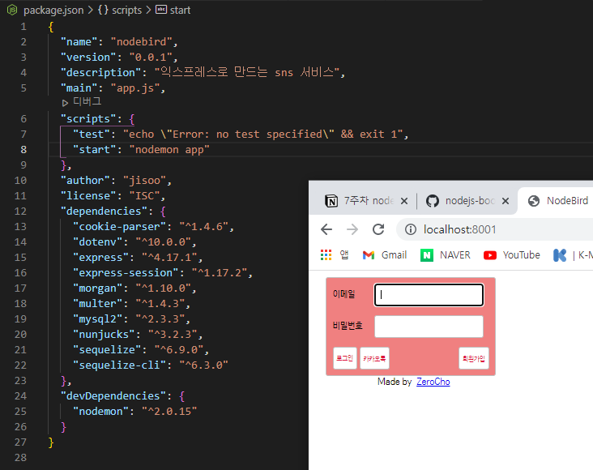
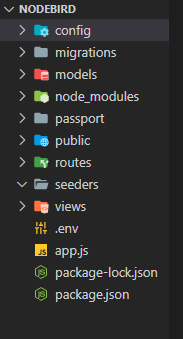

# 7주차 JS 스터디 정리

| 장  | 제목                           |
| --- | ------------------------------ |
| 9장 | 익스프레스로 SNS 서비스 만들기 |

## 9장

### 9.1 프로젝트 구조 갖추기




### 9.2 데이터베이스 세팅하기

**<mysql>**

로그인 기능: 사용자 테이블

게시글 저장: 게시글 테이블

해시태그 사용: 해시태그 테이블

- models

1. models/user.js

: 사용자 정보를 저장하는 모델

: 로컬 로그인이라 가정하고 defaultValue = local

2. models/post.js

: 게시글 내용과 이미지 경로 저장

: 게시글 등록자의 아이디를 담은 컬럼은 나중에 관계 설정 시 시퀄라이즈가 알아서 생성

3. models/hashtag.js

: 태그의 이름을 저장

: 태그로 검색하기 위함

⇒ 생성한 모델 → 시퀄라이즈에 등록, models/index.js에는 시퀄라이즈가 자동으로 생성한 코드들이 들어있지만 전반적으로 수정, 각 모델들을 시퀄라이즈 객체에 연결

1. user.js

: 각 모델 간의 관계를 associate 함수 안에 정의

User ↔ Post (1:N) hasmany 사용

User ↔ User(N:M) ex) 팔로잉, 팔로워

: 모델 이름과 컬럼 이름 따로 정해야 함

: as 옵션으로 모델을 구분할 수 있도록 함

: Follow 모델로 설정

2. post.js

User ↔ Post(1:N) belongsTo 사용

: 사용자 한 명, 그에 속한 게시글이 여러 개

3. hashtag.js

Post ↔ Hashtag(N:M)

: PostHashtag 모델로 설정

⇒ 모델 총 5개

### 9.3 Passport 모듈로 로그인 구현하기

→ 직접 로그인 x, 소셜 로그인

[ex1] passport/index.js

```jsx
const passport = require("passport");
const local = require("./localStrategy");
const kakao = require("./kakaoStrategy");
const User = require("../models/user");

module.exports = () => {
  passport.serializeUser((user, done) => {
    done(null, user.id);
  });

  passport.deserializeUser((id, done) => {
    User.findOne({where: {id}})
      .then((user) => done(null, user))
      .catch((err) => done(err));
  });

  local();
  kakao();
};
```

: passpost.serializeUser

- **로그인 시** 실행, req.session(세션) 객체에서 어떤 데이터를 저장할지 정하는 메서드(사용자 정보가 들어있음)
- 매개변수로 done, done함수의 두 번째 인자 user.id
  - done의 첫 번째 인수는 에러 발생 시 사용, 두 번째 인수에는 저장하고 싶은 데이터
- 로그인 시 사용자 데이터를 세션에 저장하는데 세션에 사용자 정보를 모두 저장하면 세션의 용량이 커지고 데이터 일관성에 문제가 발생하기 때문에 아이디만 저장하라고 명령

: passport.deserializeUser

- 매 요청 시 실행, passport.session 미들웨어가 이 메서드를 호출
  - serializeUser의 done의 두 번째 인수로 넣었던 데이터 = deserializeUser의 매개변수 = 사용자 아이디
- 사용자 아이디를 받아서 데이터베이스에서 사용자 정보를 조회하고 조회한 정보를 req.user에 저장하여 앞으로 req.user로 로긍니한 사용자의 정보를 가져올 수 있다.

**<요약>**

serailizeUser: 사용자 정보 객체를 세션에 아이디로 저장하는 것

deserializeUser: 세션에 저장한 아이디를 통해 사용자 정보 객체를 불러오는 것(세션에 불필요한 데이터를 담아두지 않기 위한 과정)

**<전체 과정>**

1. 라우터를 통해 로그인 요청 들어옴
2. 라우터에서 passport.authenticate 메서드 호출
3. 로그인 전략 수행
4. 로그인 성공 시 사용자 정보 객체와 함께 req.login 호출
5. req.login 메서드가 passport.serializeUser 호출
6. req.session에 사용자 아이디만 저장
7. 로그인 완료

**<로그인 이후의 과정>**

1. 요청이 들어옴
2. 라우터에 요청이 도달하기 전에 passport.session 미들웨어가 passport.deserializeUser 메서드 호출
3. req.session에 저장된 아이디로 데이터베이스에서 사용자 조회
4. 조회된 사용자 정보를 req.user에 저장
5. 라우터에서 req.user 객체 사용 가능

### 9.3.1 로컬 로그인 구현하기

로컬 로그인: 다른 sns 서비스를 통해 로그인하지 않고 자체적으로 회원가입 후 로그인하는 것

→ 아이디/비밀번호 or 이메일/비밀번호를 통해 로그인하는 것

- passport-local 모듈 필요
- 로그인한 사용자는 회원가입과 로그인 라우터에 접근하지 못하도록(이미 로그인했기 때문)
  → 접근 권한을 제어하는 미들웨어 필요
- 로그인 중? req.isAuthenticated() = true ↔ false
- 자신의 프로필은 로그인 해야 볼 수 있음 → isLoggedin 미들웨어, isAuthenticated() = true여야 next 호출되어 res.render가 있는 미들웨어로 넘어가기 가능 ↔ false: 로그인 창이 있는 메인 페이지로 리다이렉트
- 회원가입 페이지? 로그인 하지 않은 사람에게, isNotLoggedin 미들웨어로 req.isAuthenticated() = false일때만 next 호출

1. 회원가입 라우터: 기존에 같은 이메일로 가입한 사용자가 있는지 조회한 뒤 있다면 회원가입 페이지로 되돌려 보낸다. 단, 주소 뒤에 에러를 쿼리 스트링으로 표시, 같은 이메일로 가입한 사용자가 없다면 비밀번호는 암호화, 사용자 정보를 생성
2. 로그인 라우터: 로그인 요청이 들어오면 passport.authenticate('local') 미들웨어가 로컬 로그인 전략 수행
3. 로그아웃 라우터: req.logout 메서드는 req.user 객체를 제거하고 req.session.destroy는 req.session 객체의 내용을 제거, 세션 정보를 지운 후 메인 페이지로 되돌아가면 로그아웃 되어있을 것

**<로그인 전략>**

1. 먼저 사용자 데이터베이스에서 일치하는 이메일이 있는지 찾은 후 있다면 bcrypt 함수로 비밀번호를 비교
2. 비밀번호까지 일치하면 done함수의 두 번째 인수로 사용자 정보를 넣어 보냄
   - 두 번째 인수를 사용하지 않는 경우: 로그인에 실패했을 때만
   - 첫 번째 인수를 사용하는 경우: 서버 쪽에서 에러가 발생한 경우
   - 세 번째 인수를 사용하는 경우: 로그인 처리 과정에서 비밀번호가 일치하지 않거나 존재하지 않는 회원일 때와 같은 사용자 정의 에러 발생 시
3. done 호출 후 다시 passport.authenticate의 콜백 함수에서 나머지 함수 실행
4. if) 로그인 성공 시 메인 페이지로 리다이렉트되면서 로그인 폼 대신 회원정보 뜸

### 9.3.2 카카오 로그인 구현하기

카카오 로그인: 로그인 인증 과정을 카카오에 맡기는 것

- 사용자: 새로운 사이트에 가입할 필요x
- 서비스 제공자: 로그인 과정을 검증된 SNS에 안심하고 맡길 수 있음
- 회원가입 절차 x

### 9.4 multer 패키지로 이미지 업로드 구현하기

: 이미지 업로드 - multer 모듈(멀티미디어 형식의 이미지 업로드)

**<전략>**

input 태그를 통해 이미지 선택 시 바로 업로드 진행 → 업로드된 사진 주소를 다시 클라이언트에게 알림

- 게시글을 저장할 때에는 데이터베이스에 직접 이미지 데이터를 넣는 대신 이미지 경로만 저장(이미지: 서버 디스크에 저장)

1. POST /post/img 라우터: 이미지 하나를 업로드 받은 뒤 이미지의 저장 경로를 클라이언트로 응답
2. POST /post 라우터: 게시글 업로드를 처리하는 라우터, 이전 라우터에서 이미지를 업로드했다면 이미지 주소도 req.body.url 로 전송

- 게시글을 데이터베이스에 저장한 후 게시글 내용에서 해시태그를 정규표현식으로 추출

### 9.5 프로젝트 마무리하기

**<user.js>**

1. POST /user/:id/follow 라우터 - :id 부분이 req.params.id, 팔로우할 사용자 데이터베이스에서 조회, 시퀄라이즈에서 추가한 addFollowing 메서드로 현재 로그인한 사용자와의 관계 지정
2. req.user에 팔로워와 팔로잉 목록 저장(req.user 바꾸려면 deserializeUser 조작해야)
3. 세션에 저장된 아이디로 사용자 정보를 조회할 때 팔로잉, 팔로워 목록 같이 조회
4. 팔로워 아이디 리스트를 넣는 이유: 팔로워 아이디 리스트에 게시글 작성자의 아이디가 존재하지 않으면 팔로우 버튼 보여주기 위함

**<page.js>**

1. GET /hashtag 라우터: 해시태그로 조회, 쿼리스트링으로 해시태그 이름을 받고 해시태그 값이 없는 경우 메인페이지로 돌려보냄
2. 데이터베이스에서 해당 해시태그를 검색 후, 해시태그 있다면 시퀄라이즈에서 제공하는 getPosts 메서드로 모든 게시글 가져옴
3. 가져올 때 작성자 정보를 합침
4. 조회 후 메인 페이지를 렌더링하면서 전체 게시글 대신 조회된 게시글만 twists 넣어 렌더링
5. routes/post.js 와 routes/user.js를 app.js에 연결
6. 업로드한 이미지를 제공할 라우터는 express.static 미들웨어로 uploads 폴더와 연결(express.static 여러 번 쓸 수 있음)

---
