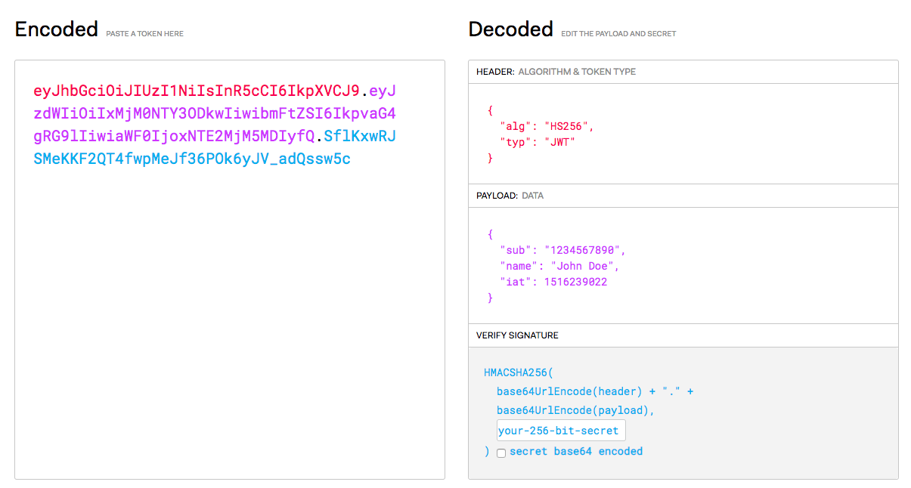
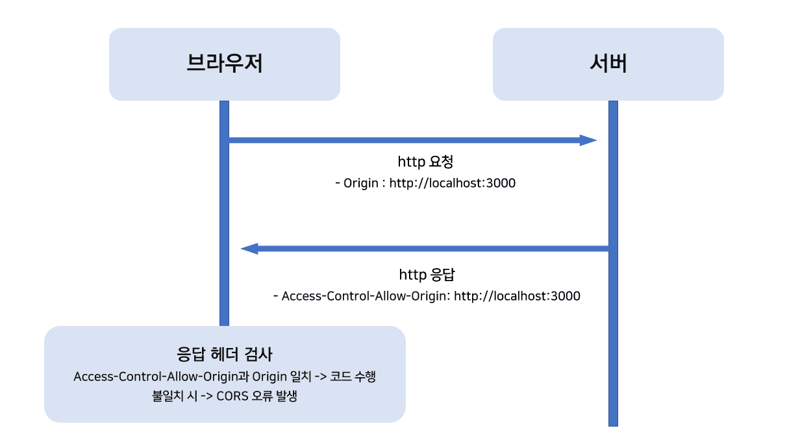

# 8주차 JS 스터디 정리

| 장   | 제목               |
| ---- | ------------------ |
| 10장 | 웹 API 서버 만들기 |

## 10장

### 10.1 API 서버 이해하기
#### API
 - 다른 애플리케이션에서 현재 프로그램의 기능을 사용할 수 있게함
 
 API는 손님(프로그램)이 주문할 수 있게 메뉴(명령 목록)를 정리하고, 주문(명령)을 받으면 요리사(응용프로그램)와 상호작용하여 요청된 메뉴(명령에 대한 값)를 전달
 ```쉽게 말해, API는 프로그램들이 서로 상호작용하는 것을 도와주는 매개체로 볼 수 있다.```

### 10.2 프로젝트 구조 갖추기
 1. package 설치, routes, middleware 생성
 2. app.js 생성
 3. 도메인 모델 작성
    - API를 사용할 도메인을 저장하는 모델
    - ENUM type 활용해서 free, premium 등급 구분 등 구현
 4. 도메인 등록 라우터 생성
 5. 도메인 등록하고 비밀번호 발급
    - 도메인이 다른 프론트앤드에서 요청하면 CORS 에러 발생

### 10.3 JWT 토큰으로 인증하기
 #### 1. 인증을 윈한 JWT
 - 클라이언트가 데이터를 가져가게 하려면 인증 과정이 필요함
 ##### JWT Json Web Token
  - 헤더, 페이로드 ,시그니처
  - 헤더: 토큰의 종류, 해시 알고리즘 정보
  - 페이로드: 토큰의 내용물이 인코딩된 부분
  - 시그니처: 토큰 변조되었는지 확인
   
 #### 2. JWT 사용시 주의점
   
   
   - 페이로드 내용을 볼 수 있으므로 민감한 내용을 담지 않는다.
 #### 3. 노드에서 JWT 사용하기
 - jwt 비밀키 env에 저장
    ```javascript
    JWT_SECRET=jwtsecret
    ```
 - verify token middleware 작성
    ```javascript
    exports.verifyToken = (req, res, next) => {
        try {
            req.decoded = jwt.verify(req.headers.authorization, process.env.JWT_SECRET);
            return next();
        } catch (error) {
            if (error.name === 'TokenExpiredError') { // 유효기간 초과
            return res.status(419).json({
                code: 419,
                message: '토큰이 만료되었습니다',
            });
            }
            return res.status(401).json({
            code: 401,
            message: '유효하지 않은 토큰입니다',
            });
        }
    };
    ```
 - JWT 토큰 발급 라우터 작성
    ```javascript
    router.post('/token', async (req, res) => {
    const { clientSecret } = req.body;
    try {
        const domain = await Domain.findOne({
        where: { clientSecret },
        include: {
            model: User,
            attribute: ['nick', 'id'],
        },
        });
        if (!domain) {
        return res.status(401).json({
            code: 401,
            message: '등록되지 않은 도메인입니다. 먼저 도메인을 등록하세요',
        });
        }
        const token = jwt.sign({
        id: domain.User.id,
        nick: domain.User.nick,
        }, process.env.JWT_SECRET, {
        expiresIn: '1m', // 1분
        issuer: 'nodebird',
        });
        return res.json({
        code: 200,
        message: '토큰이 발급되었습니다',
        token,
        });
    } catch (error) {
        console.error(error);
        return res.status(500).json({
        code: 500,
        message: '서버 에러',
        });
    }
    });
    ```
 - app.js에 라우터 연결
 - JWT 토큰으로 로그인
    세션 쿠키 발급 대신 JWT 토큰을 쿠키로 발급

### 10.4 다른 서비스에서 호출하기

### 10.5 SNS API 서버 만들기

### 10.6 사용량 제한 구현하기
 - DOS 동격 등을 대비
    ```shell
    npm i express-rate-limit
    ```
    - apiLimiter 미들웨어 추가
    - deprecated 미들웨어는 사용하면 안되는 라우터에 붙여서 사용시 경고로 쓰임
 - 응답 코드
    

### 10.7 CORS 이해하기

 
 - 요청을 보내는 프런트와 요청을 받는 프론트가 다르면 에러가 발생
    1. CORS: Cross-Origin Resource Sharing 문제
    2. POST 대신 OPTIONS 요청을 먼저 보내 서버가 도메인을 허용하는지 미리 체크
 - CORS 문제 해결 방법
    ```Access-Control-Allow-Origin 응답 헤더를 넣어줘 CORS 문제 해결 가능```
    ```shell
    npm i cors
    ```
    ```javascript
    router.use(async (req, res, next) => {
        const domain = await Domain.findOne({
            where: { host: url.parse(req.get('origin')).host },
        });
        if (domain) {
            cors({
            origin: req.get('origin'),
            credentials: true,
            })(req, res, next);
        } else {
            next();
        }
    });
    ```
    - credentials: true 해야 프론트와 백앤드 간에 쿠키가 공유됨

 - 클라이언트 도메인 검사
    - 호스트와 비밀키가 모두 일치할 때만 CORS 허용
 - CORS 요청 보내기
    - 응답 헤더의 도메인 확인
    
 - 프록시 서버
    - CORS 문제의 또 다른 해결책
    
---
