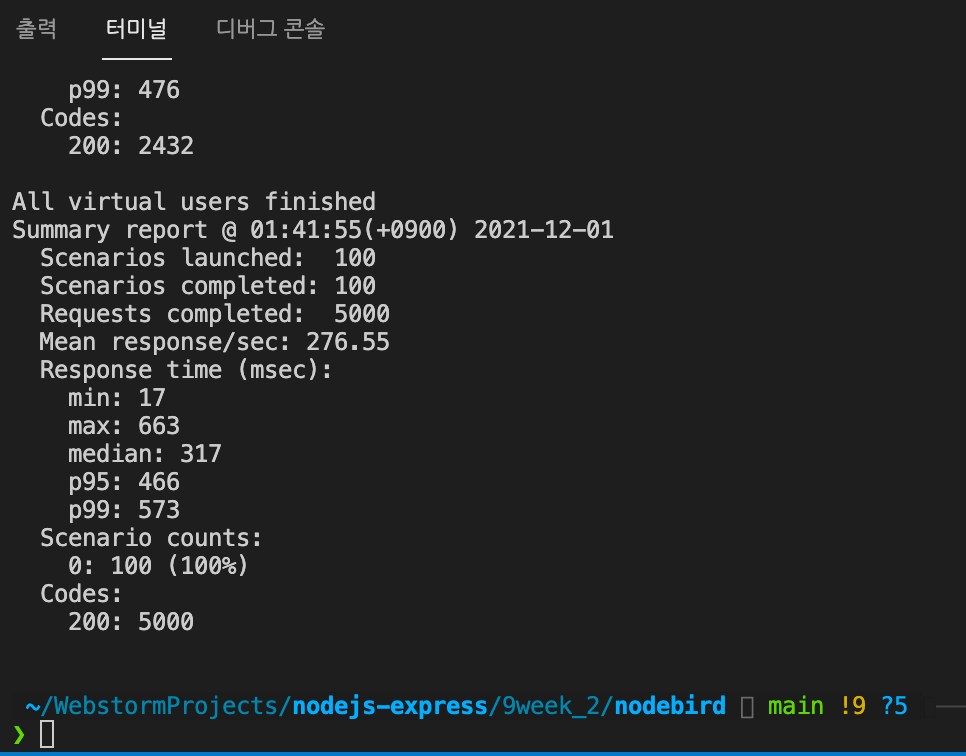
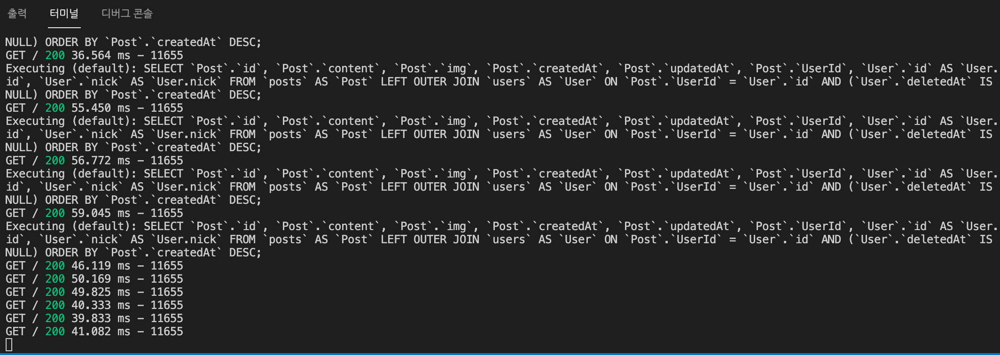
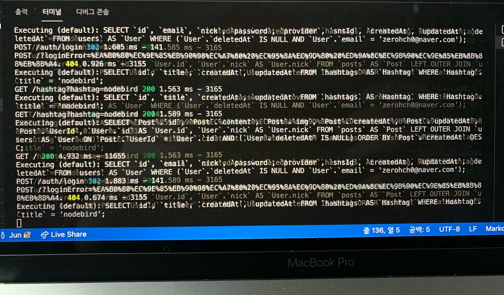
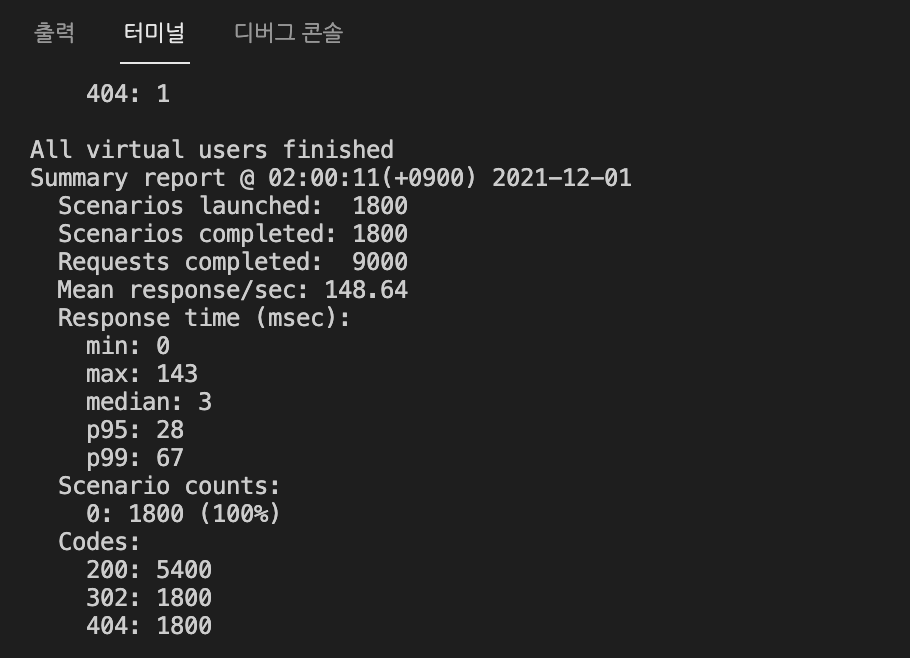

# 9주차 JS 스터디 정리

| 장   | 제목               |
| ---- | ------------------ |
| 11장 | 노드 서비스 테스트하기 |

## 11장

### 11.1 테스트 준비하기

### 11.2 유닛 테스트

### 11.3 테스트 커버리지

### 11.4 통합 테스트
 #####  ```단위테스트한 여러개를 합쳐서 테스트 하는 것```
 ```supertest로 auth 라우터를 통합테스트```
 - 라우터의 배치에 따라 다양한 시나리오를 테스트 해볼 수 있다.
 - 예를 들어 로그인 먼저하고 회원가입, 혹은 로그인 후 다시 로그인 등
 
 ##### supertest
```shell
npm i -D supertest
```
 - 요청을 모킹함
 - 가짜 요청을 보내고, 가짜 응답을 검사해서 시뮬레이션 했을 때 잘 응답하는지 테스트하기 위해

```javascript
// app.listen(app.get('port'), () => {
//   console.log(app.get('port'), '번 포트에서 대기중');
// });
```
 - app에서 listen 부분만 따로 분리하고 테스트 진행 (테스트 시 서버 실행되는 것을 막기 위해)

 ```shell
 npx sequelize db:create --env test
 ```
 - 테스트용 데이터 베이스 설정 (통합테스트에서는 데이터를 모킹하지 않음)
 
 ##### beforeAll
 ```javascript
 beforeAll(async () => {
  await sequelize.sync(); // DB에 테이블을 생성
 });
 ```
 - 테스트를 실행하기 전에 수행

 ##### beforeEach
 ```javascript
 describe('POST /login', () => {
  const agent = request.agent(app);
  beforeEach((done) => { // 로그인 수행
    agent
      .post('/auth/login')
      .send({
        email: 'zerohch0@gmail.com',
        password: 'nodejsbook',
      })
      .end(done);
  });
 ```
 - 테스트 하기 직전에 수행됨
 - 테스트가 여러개 있는 경우, 테스트 실행 전 마다 수행된다.
 - beforeEach 영향을 받기 싫은 테스트가 있는 경우, beforeEach가 포함된 describe 외부에 따로 만들어줌.
 
 ##### afterAll
 ```javascript
 afterAll(async () => {
      await sequelize.sync({ force: true}); // 데이터 지워지고 테이블 재생성
 });
 ```
 - 테스트 후 데이터베이스에 데이터가 남아 있으면 다음 테스트에 영향을 줄 수 있기 때문
 - 처음 성공하고 두번째 테스트에서 실패할 수 있음

 ##### agent
 ```javascript
test('이미 로그인했으면 redirect /', (done) => {
    const message = encodeURIComponent('로그인한 상태입니다.');
    agent // 위에서 로그인 한 agent
      .post('/auth/join')
      .send({
        email: 'zerohch0@gmail.com',
        nick: 'zerocho',
        password: 'nodejsbook',
      })
      .expect('Location', `/?error=${message}`) // 이미 로그인 된 agent기 때문에 error
      .expect(302, done);
  }
 ```
 - 로그인 상태가 유지되도록 해줌
 - 여러 테스트에 거쳐서 해당 상태가 유지된다.


### 11.5 부하 테스트
```내 서버가 얼마나 버틸 수 있는가?```

##### artillery
 ```shell
 $ npm i -D artillery
 $ npx artillery quick --count 100 -n 50 http://localhost:8001 
 ```
 - 100 명의 사용자가 50번씩 요청

 
 
 - 최종 보고서
     - 100명 수행
     - 100명 성공
     - 총 5000 개의 요청
     - 요청 처리에 276 ms 걸림
     - p95: 뒤에서 5번째 느린 경우
     - p99: 하위 1%의 경우

 
 
 - 서버에 5000개의 요청이 들어간 모습

 ##### loadtest
 - 시나리오를 세워볼 수 있음
 - json 형식의 파일을 작성해야함 혹은 YAML
 - 예상되는 사용자들의 흐름 flow를 작성해줌
 
 ```YAML 문법에 관련된 공식 문서```
 
 https://www.artillery.io/docs/guides/guides/test-script-reference
 
 ```shell
 npx artillery run loadtest.json
 ```
 
 

 - 요청 후반부가 될 수록 응답 시간이 길어짐
 

### 11.6 프로젝트 마무리하기
 - 테스트를 한다고 해서 무조건 안전한 것은 아니다
 - 자신이 짠 코드는 최대한 많이 테스트
 - 테스트하기 어려운 패키지는 모킹한다
 - 모킹에서의 통과가 실제에서의 통과를 100% 장담하지 않음
 - 그럼에도 테스트를 수행하는 것이 더 좋음
---
