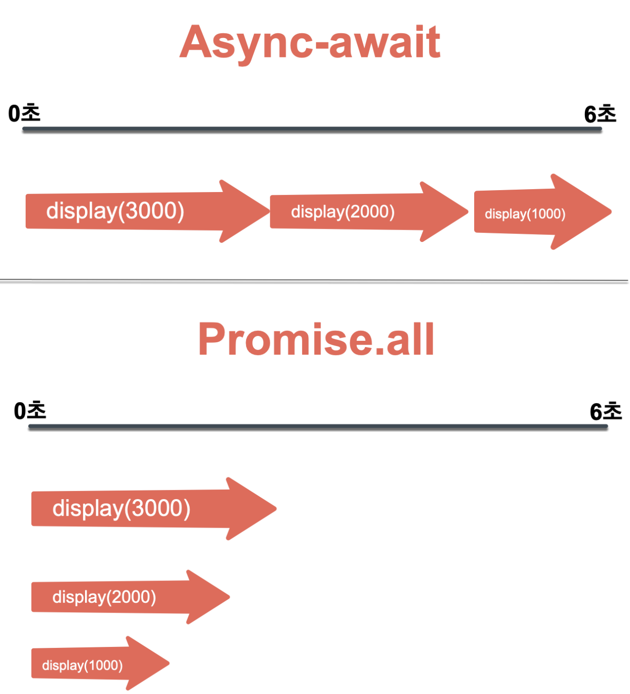

# 3장. 자바스크립트에서 비동기 처리 다루기


## 1. Promise

비동기 작업을 편하게 처리하기 위해 ES6에 도입된 기능

콜백 함수로 비동기 작업을 처리할 때 코드가 난잡해지는 점을 개선 가능


- Callback Hell(콜백지옥) 

  비동기적으로 처리해야하는 일이 많아져, 코드의 깊이가 계속 깊어지는 현상

```javascript
function increaseAndPrint(n, callback) {
  setTimeout(() => {
    const increased = n + 1;
    console.log(increased);
    if (callback) {
      callback(increased);
    }
  }, 1000);
}

increaseAndPrint(0, (n) => {
  increaseAndPrint(n, (n) => {
    increaseAndPrint(n, (n) => {
      increaseAndPrint(n, (n) => {
        increaseAndPrint(n, (n) => {
          console.log("끝!");
        });
      });
    });
  });
});

```


**Promise는 성공할 수도, 실패할 수도 있음**

- 성공 시 resolve 호출하기
- 실패 시 reject 호출하기


구현방법

```javascript
const myPromise = new Promise((resolve, reject)) => {
	//구현..
}
```


**성공시키는 상황**

- resolve 호출 시 특정 값을 파라미터로 넣어주면, 그 값을 작업이 끝난 후 사용 가능

- 작업 종료 후 또 다른 작업 해야할 때 Promise 뒤에 .then(...)을 붙여서 사용

  

EX1) 1초 뒤 성공시키는 상황 구현

```javascript
const myPromise = new Promise((resolve, reject) => {
  setTimeout(() => {
    resolve(1);
  }, 1000);
});

myPromise.then((n) => {
  console.log(n);
});

```


**실패하는 상황**

- reject를 사용

- .catch를 통해 실패 시 수행 할 작업 설정 가능

  

EX2) 1초 뒤 실패하는 상황 구현

```javascript
const myPromise = new Promise((resolve, reject) => {
  setTimeout(() => {
    reject(new Error());
  }, 1000);
});

myPromise
  .then((n) => {
    console.log(n);
  })
  .catch((error) => {
    console.log(error);
  });

```


**Promise로 코드의 깊이 길어지지 않게 하기**

```javascript
function increaseAndPrint(n) {
  return new Promise((resolve, reject) => {
    setTimeout(() => {
      const value = n + 1;
      if (value === 5) {
        const error = new Error();
        error.name = "ValueIsFiveError";
        reject(error);
        return;
      }
      console.log(value);
      resolve(value);
    }, 1000);
  });
}

increaseAndPrint(0)
  .then((n) => {
    return increaseAndPrint(n);
  })
  .then((n) => {
    return increaseAndPrint(n);
  })
  .then((n) => {
    return increaseAndPrint(n);
  })
  .then((n) => {
    return increaseAndPrint(n);
  })
  .then((n) => {
    return increaseAndPrint(n);
  })
  .catch((e) => {
    console.error(e);
  });

```

```javascript
function increaseAndPrint(n) {
  return new Promise((resolve, reject) => {
    setTimeout(() => {
      const value = n + 1;
      if (value === 5) {
        const error = new Error();
        error.name = "ValueIsFiveError";
        reject(error);
        return;
      }
      console.log(value);
      resolve(value);
    }, 1000);
  });
}

increaseAndPrint(0)
  .then(increaseAndPrint)
  .then(increaseAndPrint)
  .then(increaseAndPrint)
  .then(increaseAndPrint)
  .then(increaseAndPrint)
  .catch((e) => {
    console.error(e);
  });

```


**Promise 사용 시 불편한 점**

- 에러를 잡을 때 몇 번째에서 발생했는지 알아내기 어려움
- 특정 조건에 따라 분기를 나누는 작업이 어려움
- 특정 값을 공유해가며 작업을 처리하기 까다로움


async/await으로 위의 문제점을 해결할 수 있음


## 2. async/await

비동기 처리 방식인 callback 함수와 promise의 단점을 보완,<br>
깔끔하게 promise를 사용할 수 있는 문법

example
```javascript
function resolveAfter2Seconds() {
  return new Promise(resolve => {
    setTimeout(() => {
      resolve('resolved');
    }, 2000);
  });
}

async function asyncCall() {
  console.log('calling');
  const result = await resolveAfter2Seconds();
  console.log(result);
  // expected output: "resolved"
}

asyncCall();

```
결과
```javascript
// "calling"
// "resolved"
```


### async
async 함수는 promise를 반환한다. 만약 함수의 반환 값이 promise가 아니라면 암묵적으로 promise로 감싸진다.

예를들어
```javascript
async function foo(){
	return 1
}
```
위의 코드는 아래와 같다.
```javascript
function foo(){
	return Promise.resolve(1)
}
```

### await
async 함수에 await이 포함된다.<br>
async 함수의 실행을 일시 중지하고 전달 된 Promise의 해결을 기다린다.<br>
그 다음 Promise가 fulfill 되면 async 함수를 다시 시작하고 await의 반환값은 Promise에서 fulfill 된 값이 된다.

예를들어
```javascript
function resolveAfter2seconds(x) {
	return new Promise(resolve => {
		setTimeout( () => {
			resolve(x);
		}, 2000);
	});
}

async function f1(){
	const x = await resolveAfter2seconds(10);
	console.log(x);
}

f1();
```
예상결과
```javascript
10
```

resolveAfter2seconds의 Promise가 await에 넘겨지면, await은 Promise의 status가 fulfill 되기를 기다렸다가 해당 값을 반환한다.

### 에러처리
만약 await Promise가 reject 될 경우, throws the error<br>
await가 던진 에러는 throw가 에러를 잡을 때 처럼, try ... catch로 잡을 수 있다.

예를들어
```javascript
async function f() {
	try{
		let response = await fetch('http://유효하지-않은-url');
	}catch(err){
		console.error(err); //TypeError: Failed to fetch
	}
}

f();
```
예상결과
```javascript
// TypeError: Failed to fetch
```
이와 같이 에러가 발생하면 제어 흐름이 catch 블록으로 넘어간다.

### Promise.all()

여러 개의 프라미스를 동시에 실행시키고 모든 프라미스가 준비될 때까지 기다린다.<br>
여러 Promise의 결과를 집계할 때 유용하게 사용할 수 있다.<br>

예를들어
```javascript
function sleep(ms){
	return new Promise(resolve => setTimeout(resolve, ms));
}

const getDog = async () => {
	await sleep(1000);
	return '멍멍이';
};

const getRabbit = async () => {
	await sleep(1000);
	return '토끼';
};

async function process() {
	const results = await Promise.all([getDog(), getRabbit()]);
	console.log(results);
}

process();
```
예상결과
```
// ["멍멍어", "토끼"]
```
거부하는 경우<br>
Promise.all()은 배열 내 요소 중 어느 하나라도 거부하면 즉시 거부한다.


### Promise.race()
인자로 주어진 순회 가능한 Promise 중 가장 먼저 완료되는 것의 결과값을 가져온다.

예를들어
```javascript
function sleep(ms) {
  return new Promise(resolve => setTimeout(resolve, ms));
}

const getDog = async () => {
  await sleep(1000);
  return '멍멍이';
};

const getRabbit = async () => {
  await sleep(500);
  return '토끼';
};

async function process() {
  const first = await Promise.race([ getDog(),getRabbit() ]);
  console.log(first);
}

process();
```
예상 결과
```javascript
// "토끼"
```
가장 먼저 완료된 Promise가 실패한 경우, 실패로 간주한다.

### 참고
https://javascript.info/async-await

https://ko.javascript.info/async-await

https://developer.mozilla.org/ko/docs/Web/JavaScript/Reference/Statements/async_function

https://developer.mozilla.org/ko/docs/Web/JavaScript/Reference/Global_Objects/Promise

