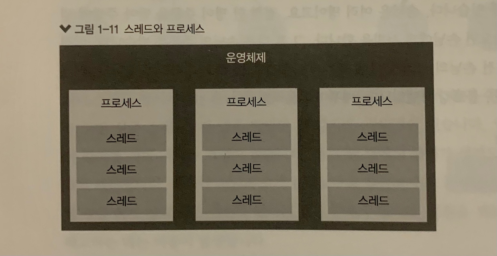
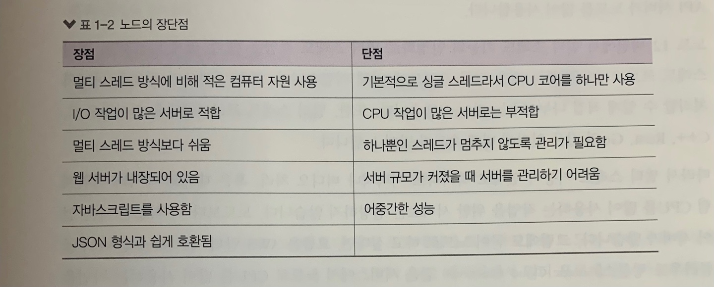

# 1.1.5 싱글 스레드

**싱글 스레드란?**

스레드가 하나뿐이라는 것을 의미이다. → 자바스크립트 코드가 동시에 실행될 수 없는 이유이다.

**[프로세스와 스레드의 차이]**

- 프로세스는 운영체제에서 할당하는 작업의 단위이다. 노드나 웹 브라우저 같은 프로그램은 개별적인 프로세스이다. 프로세스 간에는 메모리 등의 자원을 공유하지 않는다.
- 스레드는 프로세스 내에서 실행되는 흐름의 단위이다. 프로세서는 스레드를 여러 개 생성해 여러 작업을 동시에 처리할 수 있다. 스레드들은 부모 프로세스의 자원을 공유한다. 같은 주소의 메모리에 접근 가능하므로 데이터를 공유할 수 있다.


노드가 싱글 스레드라는 말을 들어봤을 것이다. 하지만 엄밀히 말하면 싱글 스레드로 동작하지는 않는다. 노드를 실행하면 먼저 프로세스가 하나 생성된다. 그리고 그 프로세스에서 스레드들을 생성하는데, 이때 내부적으로 스레드를 여러 개 생성한다. 그중에서 직접 제어할 수 있는 스레드는 하나뿐이다. 그래서 흔히 노드가 싱글 스레드라고 여겨지는 것이다.

# **1.2 서버로서의 노드**



→ 노드 사용자들이 말하는 가장 큰 장점은 언어로 자바스크립트를 사용한다는 것이다. 웹 브라우저도 자바스크립트를 사용하므로 서버까지 노드를 사용하면 하나의 언어로 웹 사이트를 개발할 수 있다. 이로써 개발 생산성을 획기적으로 높였고, 생산성이 중요한 기업이 노드를 채택하는 이유가 되었다. 

# 3.1 REPL 사용하기

입력한 코드를 읽고(Read), 해석하고(Eval), 결과물을 반환하고(Print), 종료할 때까지 반복한다(Loop)고 해서 REPL(Read Eval Print Loop)이라고 부른다.

```jsx
$ node
>
```

프롬프트가 > 모양으로 바뀌었다면 자바스크립트 코드를 입력할 수 있다. 

- 입력한 코드를 REPL이 읽고(Read) 해석한(Eval) 뒤 바로 결과물을 출력했다(Print). 그리고 종료되기 전까지 여러분의 입력을 기다린다.(Loop)
- REPL을 종료하려면 Ctrl + C를 두 번 누르거나, REPL창에 .exit을 입력하면 된다.
- REPL은 한두 줄짜리 코드를 테스트해보는 용도로는 좋지만 여러 중의 코드를 실행하기에는 불편하다.
- 긴 코드인 경우에는 코드를 자바스크립트 파일로 만든 후 파일을 통째로 실행하는 것이 좋다.


# 3.2 JS 파일 실행하기

- 콘솔에서 node [자바스크립트 파일 경로]로 실행한다. (확장자 .js 는 생략해도 된다.)

**<파일/폴더 이름 제한>**

파일이나 폴더의 이름에 쓸 수 없는 문자들이 있다. 대표적으로, /, \, |, <, >, :, ", ?, * 등이 있다. 파일이나 폴더를 만들 때 위 문자들은 피해서 이름짓자.


# 3.3 모듈로 만들기

### 모듈이란?

: 특정한 기능을 하는 함수나 변수들의 집합이다.

- 모듈로 만들어두면 여러 프로그램에 해당 모듈을 재사용할 수 있다. 자바스크립트에서 코드를 재사용하기 위해 함수로 만드는 것과 비슷하다.
- 보통 파일 하나가 모듈 하나가 된다. 파일별로 코드를 모듈화할 수 있어 관리하기 편하다.

**실습) var.js와 func.js, index.js를 같은 폴더에 만들어보자.**

```jsx
// var.js 
const odd = '홀수입니다';
const even = '짝수입니다';

module.exports = {
	odd, even,
};
```

→ var.js에 변수 두 개를 선언했다. 그리고 module.exports에 변수들을 담은 객체를 대입했다. 이제 이 파일은 모듈로서 기능한다. (변수를 모아둔 모듈). 다른 파일에서 이 파일을 불러오면 module.exports에 대입된 값을 사용할 수 있다. 

```jsx
// func.js
const { odd, even } = require('./var'); 
//require 함수 안에 불러올 모듈의 경로를 적음. js나 json 같은 확장자 생략 가능

function checkOddOrEven(num){
	if (num  % 2){
		return odd;
	}
	return even;
}
module.exports = checkOddEven;
```

→ var.js 에서 변수를 불러온 뒤, 숫자의 홀짝을 판별하는 함수를 선언했다. 그리고 다시 module.exports에 함수를 대입했다. 이렇게 다른 모듈 (var.js)을 사용하는 파일을 다시 모듈(func.js)로 만들 수 있다. 또한, module.exports에는 객체만 대입해야 하는 것이 아니라 함수나 변수를 대입해도 된다.

```jsx
// index.js
const { odd, even } = require('./var');
const checkNumber = require('./func');

function checkStringOddOrEven(str) {
	if (str.length % 2) {
		return odd;
	}
	return even;
}

console.log(checkNumber(10));
console.log(checkStringOddOrEven('hello'));
```

→ index.js는 var.js와 func.js를 모두 참조한다. 모듈 하나가 여러 개의 모듈을 사용할 수 있는 것이다. 또한, var.js가 func.js와 index.js에 두 번 쓰이는 것처럼, 모듈 하나가 여러 개의 모듈에 사용될 수도 있다.

```jsx
$ node index.js
짝수입니다.
홀수입니다. 
```

⇒ 여러 파일에 걸쳐 재사용되는 함수나 변수를 모듈로 만들어두면 편리하다. 그러나 모듈이 많아지고 모듈 간의 관계가 얽히게 되면 구조를 파악하기 어렵다는 단점도 있다. 노드에서는 대부분의 파일이 다른 파일을 모듈로 사용하고 있으므로 모듈을 만들고 사용하는 방법을 꼭 알아두어야 한다.
