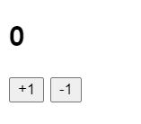
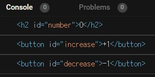
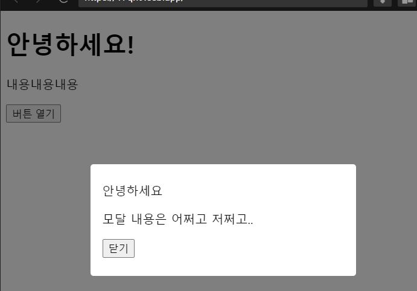
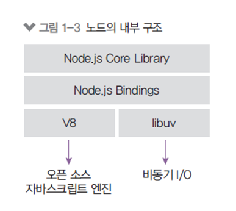
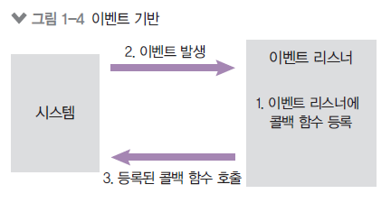
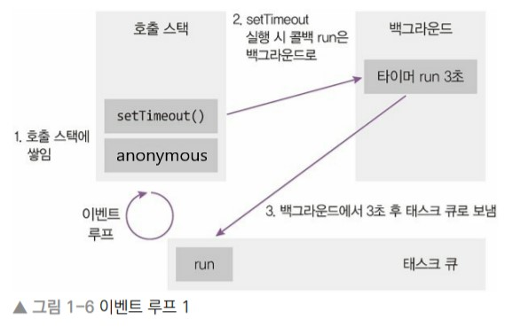
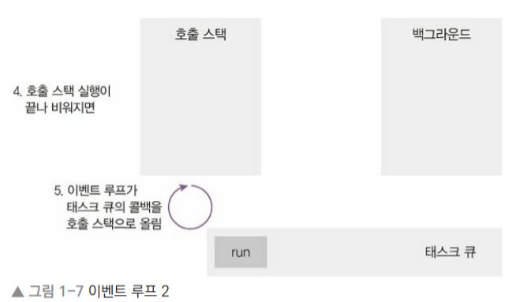
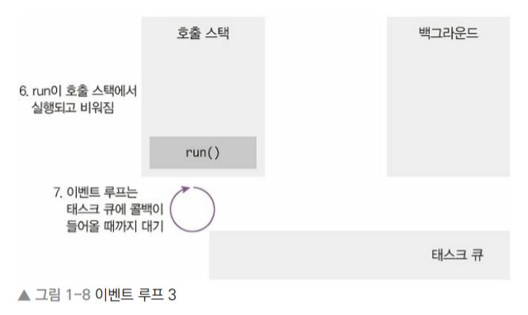

# 3주차 JS 스터디 정리


| 장   | 제목          |
| ---- | ------------- |
| 4장 | HTML과 JavaScript 연동하기 |
| 책 1장 | 노드 시작하기 |
| 책 3장 | 노드 기능 |

## 4장

---

### 4.1 카운터

  버튼을 클릭하면 숫자가 올라가거나 내려가는 카운터를 만들어보자.

### UI 만들기

```jsx
<!--index.html-->
<html>
  <head>
    <title>Parcel Sandbox</title>
    <meta charset="UTF-8" />
  </head>

  <body>
    <h2 id="number">0</h2>
    <div>
      <button id="increase">+1</button>
      <button id="decrease">-1</button>
    </div>

    <script src="src/index.js"></script>
  </body>
</html>
```

### 결과




### DOM 이란?

  각 태그에 대한 정보를 지니고 있는 JavaScript 객체


### DOM 선택하기

  `id`로 DOM을 선택하고 싶을 땐 `getElementById("[id 값]")` 를 사용한다.

```jsx
//index.js
const number = document.getElementById("number");
const increase = document.getElementById("increase");
const decrease = document.getElementById("decrease");

console.log(number);
console.log(increase);
console.log(decrease);
```

### 결과




### DOM에 내장되어있는 기능들

```jsx
const number = document.getElementById("number");
const increase = document.getElementById("increase");
const decrease = document.getElementById("decrease");

//index.js
console.log(number.innerText); // 내용
console.log(increase.offsetTop); // top 위치
console.log(decrease.id); // id
```


### DOM 이벤트 설정하기

DOM에 이벤트를 설정하려면 `on이벤트이름` 값에 함수를 설정하면 된다. 

```jsx
//index.js
const number = document.getElementById("number");
const increase = document.getElementById("increase");
const decrease = document.getElementById("decrease");

increase.onclick = () => {
  console.log("increase 가 클릭됨");
};

decrease.onclick = () => {
  console.log("decrease 가 클릭됨");
};
```

```jsx
increase.onclick = () => {
  const current = parseInt(number.innerText, 10);
  number.innerText = current + 1;
};

decrease.onclick = () => {
  const current = parseInt(number.innerText, 10);
  number.innerText = current - 1;
};
```

`parseInt` - 문자열을 숫자로 변환해주는 함수


### 자주 쓰이는 이벤트 목록

`ondblclick`(더블클릭할 때), `onerror`(에러가 발생했을 때), `onkeydown`(키를 눌렀을 때), `onkeypress`(키를 누르고 있을 때), `onkeyup`(키를 눌렀다 뗐을 때), `onload`(문서나 객체가 로딩되었을 때), `onmouseover`(마우스가 객체 위에 올라왔을 때), `onmouseout`(마우스가 객체 바깥으로 나갔을 때), `onreset`(Reset 버튼을 눌렀을 때), `onresize`(객체의 크기가 바뀌었을 때), `onscroll` (스크롤바를 조작할 때), `onsubmit`(폼이 전송될 때)


### 4.2 모달

**기존의 내용을 가리고 나타나는 메시지박스 같은 형태의 UI** 

```jsx
<!--index.html-->
    <div class="modal-wrapper">
      <div class="modal">
        <div class="modal-title">안녕하세요</div>
        <p>모달 내용은 어쩌고 저쩌고..</p>
        <div class="close-wrapper">
          <button>닫기</button>
        </div>
      </div>
    </div>
```

```jsx
/*styles.css*/
.modal-wrapper {
  position: fixed;
  top: 0;
  left: 0;
  width: 100%;
  height: 100%;
  background: rgba(0, 0, 0, 0.5);
  display: flex;
  align-items: center;
  justify-content: center;
}

.modal {
  background: white;
  padding: 24px 16px;
  border-radius: 4px;
  width: 320px;
}
```

---

### 결과




### display 스타일을 사용하여 모달 열고 닫기

`display: none;`  스타일 사용 시 해당 엘리먼트는 화면에서 숨겨진다. 

```jsx
<button id="open">버튼 열기</button>
    <div class="modal-wrapper" style="display: none;">
      <div class="modal">
        <div class="modal-title">안녕하세요</div>
        <p>모달 내용은 어쩌고 저쩌고..</p>
        <div class="close-wrapper">
          <button id="close">닫기</button>
        </div>
      </div>
    </div>
```

```jsx
//index.js
import "./styles.css";

const open = document.getElementById("open"); // 모달 열기 버튼
const close = document.getElementById("close"); // 모달 닫기 버튼
const modal = document.querySelector(".modal-wrapper");

open.onclick = () => {
  modal.style.display = "flex";
};
close.onclick = () => {
  modal.style.display = "none";
};
```

`class` 값으로 DOM을 선택하려면 `document.getElementsByClassName` 또는`document.querySelector` 를 사용한다.


## 1장

---

### 1.1 핵심 개념 이해하기

### 노드란?

> Node.js는 Chrome V8 Javascript 엔진으로 빌드된 Javascript 런타임이다.
> 


**노드가 서버라는 말이 없는 이유**

- 노드는 서버만 실행할 수 있는 것이 아니다.
- 자바스크립트로 서버 수행 코드를 작성하면 노드가 이것을 실행시켜서 서버의 역할을 수행할 수 있도록 해주는 것이다.


### 1.1.1 서버

**서버 :** 네트워크를 통해 클라이언트의 요청에 따라 정보나 서비스를 제공하는 컴퓨터 또는 프로그램

**클라이언트 :**  요청을 보내는 주체

- 브라우저, 데스크톱 프로그램, 모바일 앱, 다른 서버에 요청을 보내는 서버


### 1.1.2 자바스크립트 런타임

- **런타임** : 특정 언어로 만든 프로그램들을 실행할 수 있게 해주는 환경
- **노드** : 자바스크립트 실행기
- 노드 이전에도 자바스크립트 런타임을 만들기 위한 많은 시도가 있었지만, `엔진 속도 문제`로 실패
- 노드 이후 Javascript는 html과 브라우저에 대한 종속성으로부터 벗어남


**노드 내부 구조**




### 1.1.3 이벤트 기반

이벤트가 발생할 때 미리 지정해둔 작업을 수행하는 방식이다. 

- **이벤트** : 클릭, 네트워크 요청, 타이머 등
- **이벤트 리스너** : 이벤트를 등록하는 함수
- **콜백 함수** : 이벤트 발생 시 실행될 함수


**이벤트 기반 시스템**




**이벤트 루프**

여러 이벤트가 동시에 발생했을 때 어떤 순서로 콜백 함수를 호출할지 판단한다.

- **이벤트 루프**
    - 이벤트 발생 시 호출할 콜백 함수들을 관리
    - 호출된 콜백 함수의 실행 순서를 결정하는 역할 담당
    - 노드가 종료될 때까지 이벤트 처리를 위한 작업 반복
- **백그라운드** :
    - setTimeout 같은 타이머나 이벤트 리스너들이 대기하는 곳
    - 자바스크립트가 아닌 다른 언어로 작성된 프로그램이라고 봐도 됨
    - 여러 작업이 동시에 실행될 수 있음
- **태스크 큐**
    - 이벤트 발생 후, 백그라운드에서 태스크 큐로 타이머나 이벤트 리스너의 콜백함수를 보냄
    - 정해진 순서대로 콜백들이 줄을 서 있으므로 콜백 큐라고도 부름
    - 콜백들은 보통 완료된 순서대로 줄을 서있지만, 특정한 경우에는 순서가 바뀌기도 함


**setTimeout 함수의 콜백 run이 호출 스택에 언제들어가는지**





이벤트 루프는 호출 스택이 비어 있을 때만 태스크 큐에 있는 run 함수를 호출하는 것이기때문에, 호출 스택에 함수들이 너무 많이 들어있으면 3초가 지난 후에도 이 run 콜백은 실행되지 않을 수도 있다.

⇒ setTimeout의 시간이 정확하지 않을 수도 있는 이유이다.


### 1.1.4 논블로킹 I/O

> 노드는 대부분 `동기` 이면서 `블로킹` ,  `비동기` 이면서 `논블로킹` 이다.
> 
- **블로킹**
    
    : 이전 작업이 끝나야만 다음 작업을 수행하는 것을 의미한다. 즉, 코드가 순서대로 실행된다.
    
- **논블로킹**
    
    : 이전 작업이 완료될 때까지 대기하지 않고 다음 작업을 수행함을 뜻한다. 다시 말해, 코드가 순서대로 실행되지 않을 수도 있다. 무조건 랜덤하게 실행되는게 아니라 어떤 규칙(뒤에 나오는 실행 context & 이벤트 루프)에 따라 실행된다는 의미이다. **동시에 돌아가지 않는다.**
    

주의!

⇒ 논 블로킹과 동시가 같은 의미가 아니다. 동시성은 동시 처리가 가능한 작업을 논 블로킹 처리해야 얻을 수 있다는 점 알아두자!

# 1.1.5 싱글 스레드

**싱글 스레드란?**

스레드가 하나뿐이라는 것을 의미이다. → 자바스크립트 코드가 동시에 실행될 수 없는 이유이다.

**[프로세스와 스레드의 차이]**

- 프로세스는 운영체제에서 할당하는 작업의 단위이다. 노드나 웹 브라우저 같은 프로그램은 개별적인 프로세스이다. 프로세스 간에는 메모리 등의 자원을 공유하지 않는다.
- 스레드는 프로세스 내에서 실행되는 흐름의 단위이다. 프로세서는 스레드를 여러 개 생성해 여러 작업을 동시에 처리할 수 있다. 스레드들은 부모 프로세스의 자원을 공유한다. 같은 주소의 메모리에 접근 가능하므로 데이터를 공유할 수 있다.


노드가 싱글 스레드라는 말을 들어봤을 것이다. 하지만 엄밀히 말하면 싱글 스레드로 동작하지는 않는다. 노드를 실행하면 먼저 프로세스가 하나 생성된다. 그리고 그 프로세스에서 스레드들을 생성하는데, 이때 내부적으로 스레드를 여러 개 생성한다. 그중에서 직접 제어할 수 있는 스레드는 하나뿐이다. 그래서 흔히 노드가 싱글 스레드라고 여겨지는 것이다.

# **1.2 서버로서의 노드**


→ 노드 사용자들이 말하는 가장 큰 장점은 언어로 자바스크립트를 사용한다는 것이다. 웹 브라우저도 자바스크립트를 사용하므로 서버까지 노드를 사용하면 하나의 언어로 웹 사이트를 개발할 수 있다. 이로써 개발 생산성을 획기적으로 높였고, 생산성이 중요한 기업이 노드를 채택하는 이유가 되었다. 

# 3.1 REPL 사용하기

입력한 코드를 읽고(Read), 해석하고(Eval), 결과물을 반환하고(Print), 종료할 때까지 반복한다(Loop)고 해서 REPL(Read Eval Print Loop)이라고 부른다.

```jsx
$ node
>
```

프롬프트가 > 모양으로 바뀌었다면 자바스크립트 코드를 입력할 수 있다. 

- 입력한 코드를 REPL이 읽고(Read) 해석한(Eval) 뒤 바로 결과물을 출력했다(Print). 그리고 종료되기 전까지 여러분의 입력을 기다린다.(Loop)
- REPL을 종료하려면 Ctrl + C를 두 번 누르거나, REPL창에 .exit을 입력하면 된다.
- REPL은 한두 줄짜리 코드를 테스트해보는 용도로는 좋지만 여러 중의 코드를 실행하기에는 불편하다.
- 긴 코드인 경우에는 코드를 자바스크립트 파일로 만든 후 파일을 통째로 실행하는 것이 좋다.


# 3.2 JS 파일 실행하기

- 콘솔에서 node [자바스크립트 파일 경로]로 실행한다. (확장자 .js 는 생략해도 된다.)

**<파일/폴더 이름 제한>**

파일이나 폴더의 이름에 쓸 수 없는 문자들이 있다. 대표적으로, /, \, |, <, >, :, ", ?, * 등이 있다. 파일이나 폴더를 만들 때 위 문자들은 피해서 이름짓자.


# 3.3 모듈로 만들기

### 모듈이란?

: 특정한 기능을 하는 함수나 변수들의 집합이다.

- 모듈로 만들어두면 여러 프로그램에 해당 모듈을 재사용할 수 있다. 자바스크립트에서 코드를 재사용하기 위해 함수로 만드는 것과 비슷하다.
- 보통 파일 하나가 모듈 하나가 된다. 파일별로 코드를 모듈화할 수 있어 관리하기 편하다.

**실습) var.js와 func.js, index.js를 같은 폴더에 만들어보자.**

```jsx
// var.js 
const odd = '홀수입니다';
const even = '짝수입니다';

module.exports = {
	odd, even,
};
```

→ var.js에 변수 두 개를 선언했다. 그리고 module.exports에 변수들을 담은 객체를 대입했다. 이제 이 파일은 모듈로서 기능한다. (변수를 모아둔 모듈). 다른 파일에서 이 파일을 불러오면 module.exports에 대입된 값을 사용할 수 있다. 

```jsx
// func.js
const { odd, even } = require('./var'); 
//require 함수 안에 불러올 모듈의 경로를 적음. js나 json 같은 확장자 생략 가능

function checkOddOrEven(num){
	if (num  % 2){
		return odd;
	}
	return even;
}
module.exports = checkOddEven;
```

→ var.js 에서 변수를 불러온 뒤, 숫자의 홀짝을 판별하는 함수를 선언했다. 그리고 다시 module.exports에 함수를 대입했다. 이렇게 다른 모듈 (var.js)을 사용하는 파일을 다시 모듈(func.js)로 만들 수 있다. 또한, module.exports에는 객체만 대입해야 하는 것이 아니라 함수나 변수를 대입해도 된다.

```jsx
// index.js
const { odd, even } = require('./var');
const checkNumber = require('./func');

function checkStringOddOrEven(str) {
	if (str.length % 2) {
		return odd;
	}
	return even;
}

console.log(checkNumber(10));
console.log(checkStringOddOrEven('hello'));
```

→ index.js는 var.js와 func.js를 모두 참조한다. 모듈 하나가 여러 개의 모듈을 사용할 수 있는 것이다. 또한, var.js가 func.js와 index.js에 두 번 쓰이는 것처럼, 모듈 하나가 여러 개의 모듈에 사용될 수도 있다.

```jsx
$ node index.js
짝수입니다.
홀수입니다. 
```

⇒ 여러 파일에 걸쳐 재사용되는 함수나 변수를 모듈로 만들어두면 편리하다. 그러나 모듈이 많아지고 모듈 간의 관계가 얽히게 되면 구조를 파악하기 어렵다는 단점도 있다. 노드에서는 대부분의 파일이 다른 파일을 모듈로 사용하고 있으므로 모듈을 만들고 사용하는 방법을 꼭 알아두어야 한다.
