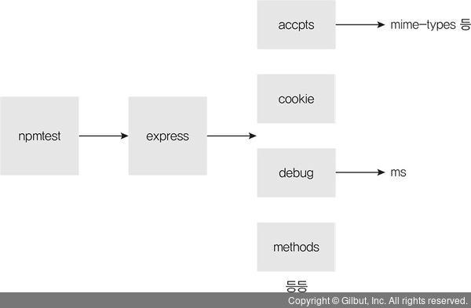

# 5장 패키지 매니저

## 5.1 npm 알아보기

npm : Node Package Manager의 약어

대부분 자바스크립트 프로그램은 패키지라는 이름으로 npm에 등록되어 있어, 특정 기능을 하는 패키지가 필요하다면 npm에서 찾아 설치하면 된다.

패키지 : npm에 업로드된 노드 모듈

패키지가 다른 패키지를 사용할 수 있다. → 의존 관계

*대체자 yarn (페이스북이 내놓은 패키지 매니저) : 페이스북 진영의 프레임워크를 사용할 때 볼 수 있음.

## 5.2 package.json으로 패키지 관리하기

package.json : 설치한 패키지의 버전을 관리하는 파일

! 노드 프로젝트를 시작하기 전에 폴더 내부에 무조건 package.json부터 만들고 시작해야 한다 !

npm init : package.json을 만드는 명령어

- package name : 패키지의 이름 / package.json의 name 속성
- version : 패키지의 버전
- entry point : 자바스크립트 실행 파일 진입점, 마지막으로 module.exports를 하는 파일을 지정 / -package.json의 main 속성
- test command : 코드를 테스트할 때 입력할 명령어 / package.json scripts 속성 안의 test 속성
- git repository : 코드를 저장해준 깃 저장소 주소, 소스에 문제가 생겼을 때 사용자들이 이 저장소에 방문에 문제를 제기하거나 코드 수정본을 올릴 수 있음 / package.json의 repository 속성
- keywords : npm 홈페이지에서 패키지를 쉽게 찾을 수 있도록 함 / package.json의 keywords 속성
- license : 해당 패키지의 라이선스

- 라이선스 - npm에 등록되어 있는 패키지는 대부분 오픈소스인데 이는 라이선스 별로 제한 사항이 있으므로 설치 전 반드시 라이선스를 확인해야 한다.

ISC, MIT, BSD 라이선스 - 사용한 패키지와 라이선스만 밝히면 자유롭게 사용 가능

아파치 라이선스 - 사용은 자유롭지만 특허권에 대한 제한 포함

GPL 라이선스 - 이 계열의 패키지를 사용한 패키지를 배포할 때는 자신의 패키지도 GPL로 배포하고 소스 코드도 공개해야 함

npm init 실행이 완료되면 미리보기에 나왔던 그대로 생성된다.

```jsx
{
  "name": "npmtest",
  "version": "0.0.1",
  "description": "hello package.json",
  "main": "index.js",
  "scripts": {
    "test": "echo \\"Error: no test specified\\" && exit 1"
  },
  "author": "ZeroCho",
  "license": "ISC"
}
```

scripts 부분 : npm 명령어를 저장해두는 부분 - 콘솔에 npm run [스크립트 명령어] 를 입력하면 해당 스크립트가 실행된다.

여러 개의 명령어를 등록해두고 사용할 수도 있다. 보통 node [파일명]을 저장해두고 npm start로 실행한다.(start, test 는 run을 붙이지 않아도 실행됨)

npm install [패키지 이름] : 패키지 설치, package.json이 있는 폴더의 콘솔에서 입력해야 함

패키지를 설치하면 package.json에 dependencies라는 속성에 새로 생겨 express라는 이름과 함께 설치된 버전이 저장되어 기록된다.

```jsx
{
  "name": "npmtest",
  ...
  "license": "ISC",
  "dependencies": {
    "express": "^4.17.1",
  }
}
```

node_modules 라는 폴더도 생성되었는데 이 안에는 설치한 패키지들이 들어 있다. express가 의존하는 여러 개의 패키지들이 들어있음 → 의존 관계



package-lock.json이라는 파일도 생성되었는데 node_modules에 들어있는 패키지들의 정확한 버전과 의존 관계가 담겨 있다. → npm으로 패키지를 설치, 수정, 삭제할 때마다 패키지들 간의 내부 의존 관계를 이 파일에 저장함

- npm install —save-dev [패키지] : 개발용 패키지 설치, 실제 배포 시에는 사용되지 않고 개발 중에만 사용되는 패키지들이다.

개발용 패키지를 설치하면 package.json에 devDependencies라는 속성에 새로 생겨 개발용 패키지들만 따로 관리한다.

- npm install —global [패키지] : 전역 설치 - 패키지를 현대 폴더의 node_modules에 설치하는 게 아닌, npm이 설치되어 있는 폴더에 설치한다, 콘솔의 명령어로 사용 가능(대부분 명령어로 사용하기 위해 전역 설치함)

전역 설치한 패키지는 package.json에 기록되지 않는다.

- npm install —global rimraf : rimraf는 리눅스나 맥의 rm -rf 명령어를 윈도에서도 사용할 수 있게 해주는 패키지, rm -rf는 지정한 파일이나 폴더를 지우는 명령어

rimraf로 node_modules 폴더를 삭제해도 package.json에 설치한 패키지 내역이 들어 있어 npm install만 하면 다시 설치된다.

*전역 설치한 패키지는 package.json에 기록되지 않기 때문에 개발용 패키지로 설치하고 npx라는 명령어를 사용하여 패키지를 전역 설치한 것과 같은 효과를 낸다.

ex)

```jsx
npm install —save-dev rimraf
npx rimraf node_modules 
```

*npm에 등록되지 않은 패키지는 npm install [저장소 주소] 명령어로 설치 가능

*명령어 줄여쓰기

```jsx
npm install → npm i
—save-dev -> -D
—global → -g
```

## 5.3 패키지 버전 이해하기

노드 패키지, 노드의 버전은 모두 세 자리 → SemVer(Semantic Versioning) 방식의 버전 넘버링을 따르기 때문

SemVer : 버전 번호를 어떻게 정하고 올려야 하는지를 명시하는 규칙 → 각각의 패키지는 모두 버전이 다르고 패키지 간의 의존 관계도 복잡함.

버전

- 첫 번째 자리 : major 버전 / 하위 호환이 안 될 정도로 패키지의 내용이 수정되었을 때 올림 / 0 → 초기 개발 중, 1~ → 정식 버전
- 두 번째 자리 : minor 버전 / 하위 호환이 되는 기능 업데이트를 할 때 올림
- 세 번째 자리 : patch 버전 / 새로운 기능이 추가되었다기보다는 기존 기능에 문제가 있어 수정한 것을 내놓았을 때 올림

새로운 버전을 배포한 후에는 그 버전의 내용을 절대 수정하면 안됨 → 수정사항이 생길 시 major, minor, patch 중 하나를 의미에 맞게 올려 새로운 버전으로 배포해야 함.

버전은 숫자마다 의미가 부여되어 있어 버전만 보고 에러 발생 여부를 가늠할 수 있다. ex) major가 업데이트 되었다면 기존 코드와 호환되지 않을 확률이 큼

버전 앞에 붙어 있는 ^, ~, >, < 의 문자들 → 버전에 포함되지 않지만 설치하거나 업데이트할 때 어떤 버전을 설치해야 하는지 알린다.

- ^ : minor 버전까지만 설치하거나 업데이트 / ex. ^1.1.1 → 1.x.x

- ~ : patch 버전까지만 설치하거나 업데이트 / ex. ~1.1.1 → 1.1.x

- > , <, ≥, ≤, = : 초과, 미만, 이상, 이하, 동일

- @latest : 안정된 최신 버전의 패키지 설치 (=@x)

- @next : 가장 최근 배포판 / latest와 다른 점은 안정되지 않은 패키지를 설치할 수 있다는 것

## 5.4 기타 npm 명령어

- npm outdated : 업데이트할 수 있는 패키지가 있는지 확인

Current와 Wanted가 다르다면 업데이트가 필요한 경우

- npm update [패키지] : 업데이트

위의 명령어를 입력하면 업데이트가 가능한 모든 패키지가 wanted에 적인 버전으로 업데이트 된다. Latest는 해당 패키지의 최신 버전이지만 package.json에 적힌 버전 범위와 다르다면 설치되지 않는다.

- npm uninstall [패키지] : 패키지가 node_modules폴더와 package.json에서 사라진다.
- npm search [검색어] : npm 패키지 검색, GUI가 없는 리눅스에서는 이 명령어를 사용해 콘솔로 검색 가능
- npm info [패키지] : 패키지의 세부 정보를 파악할 때 사용, package.json의 내용과 의존 관계, 설치 가능한 버전 정보 표시
- npm adduser : npm 로그인
- npm whoami : 로그인한 사용자가 누구인지 알림, 로그인된 상태가 아니면 에러 발생
- npm logout : npm adduser로 로그인한 계정을 로그아웃할 때 사용
- npm version [버전] : package.json의 버전을 올림, 원하는 버전의 숫자를 넣으면 됨(major, minor, patch의 문자열을 넣어 해당 부분의 숫자를 1씩 올릴 수도 있음)
- npm deprecate [패키지][버전][메시지] : 해당 패키지를 설치할 때 경고 메시지를 띄움, 자신의 패키지에만 이 명령어를 적용할 수 있고 deprecated를 해두면 다른 사용자들이 버그가 있는 버전의 패키지를 설치할 때 경고 메시지가 출력됨.
- npm publish : 자신이 만든 패키지를 배포할 때 사용
- npm unpublish : 배포한 패키지를 제거할 때 사용, 24시간 내에 제거 가능 → 의존 관계 떄문(다른 사람이 사용하고 있는 패키지를 제거하는 경우를 막기 위해 의존 관계 떄문)
- npm ci : package.json대신 package-lock.json에 기반하여 패키지 설치 (더 엄격하게 통제하고 싶을 때)

## 5.5 패키지 배포하기

npm은 패키지의 이름이 겹치는 것을 허용하지 않아 겹칠시, 패키지의 이름을 바꿔서 배포해야 한다. → 굳이 남이 사용하는 패키지의 이름을 사용하고 싶다면 네임스페이스 쓰기

- npm info [패키지] : 누군가가 이름을 사용하고 있는지 확인 / 정보가 나온다면 누군가 사용하는 이름, 에러가 발생하면 사용해도 좋은 이름

package.json에서 원하는 이름으로 name을 바꾸고 다시 npm publish 로 배포하기

- npm unpublish [패키지] —force : 배포한 패키지 삭제 명령어

# 6장 익스프레스 웹 서버 만들기

npm에는 서버를 제작하는 과정에서의 불편함을 해소하고 편의 기능을 추가한 웹 서버 프레임워크가 있다. → 대표적으로 익스프레스! (이 외에도 koa, hapi 등이 있지만 익스프레스가 압도적으로 사용량이 많음)

익스프레스

- http 모듈의 요청과 응답 객체에 추가 기능을 부여함
- 기존 메서드들에 편리한 메서드들을 추가하여 기능을 보완함
- 코드를 분리하기 쉽게 만들어 관리하기에 용이
- if문으로 요청 메서드와 주소를 구별하지 않아도 됨

## 6.1 익스프레스 프로젝트 시작하기

learn-express 폴더 만들기

package.json 생성 (직접 만들어도 되고 콘솔에서 npm init 명령어를 호출해도 됨 )

→ package.json의 scripts 부분에 "start": "nodemon app" 넣기 (nodemon app : app.js를 nodemon으로 실행한다는 뜻 / 서버 자동으로 재시작 or 콘솔에 rs를 입력해 수동으로 재시작 / 개발용에만 권장)

app.js 생성 (서버 역할)

```jsx
[app.js]

const express = require('express');

// 서버가 실행될 포트 설정
const app = express();
app.set('port', process.env.PORT || 3000);

// 주소에 대한 GET 요청이 올 때 어떤 동작을 할 지 적는 부분
// req는 요청에 관한 정보, res는 응답에 관한 정보가 들어있는 객체
app.get('/', (req, res) => {
    res.send('Hello, Express');
});

app.listen(app.get('port'), () => {
    console.log(app.get('port'), '번 포트에서 대기 중');
});
```

http://localhost:3000 접속시 'Hello, Express' 라는 문자열이 담긴 페이지가 뜸

→ HTML로 응답하려면 res.sendFile 메서드 사용

index.html 파일 생성 후 app.js 수정 (굵은 글씨)

```jsx
[app.js]

const express = require('express');
**const path = require('path');**

const app = express();
app.set('port', process.env.PORT || 3000);

app.get('/', (req, res) => {
    //res.send('Hello, Express');
    **res.sendFile(path.join(__dirname, '/index.html'));**
});

app.listen(app.get('port'), () => {
    console.log(app.get('port'), '번 포트에서 대기 중');
});
```

http://localhost:3000 접속시 index.html이 담긴 페이지가 뜸

## 6.2 자주 사용하는 미들웨어

미들웨어 : 요청과 응답을 조작하여 기능을 추가하기도 하고, 나쁜 요청을 걸러내기도 함, 익스프레스의 핵심

app.use와 함께 사용.

미들웨어는 위에서부터 아래로 순서대로 실행되며 요청과 응답 사이에 특별한 기능 추가할 수 있음

주소를 첫 번째 인수로 넣는다면 미들웨어는 해당하는 요청에서만 실행. 넣어주지 않는다면 모든 요청에서 실행.


app.use나 app.get 같은 라우터에 미들웨어 여러 개 장착 가능

에러 처리 미들웨어는 매개변수가 err, req, res, next로 네 개. (모든 매개변수를 사용하지 않더라도 반드시 네 개여야 함!)

err에는 에러에 관한 정보가 담겨있음.

res.status 메서드로 HTTP 상태 코드를 지정할 수 있음 (기본값은 200(성공))

에러 처리 미들웨어를 직접 연결하지 않아도 익스프레스가 기본적으로 에러를 처리하긴 하지만 실무에서는 직접 연결해주는 것이 좋다

```jsx
[app.js]

...
// app.use에 매개변수가 req, res, next인 함수를 넣기 
// 세번째 매개변수 next는 다음 미들웨어로 넘어가는 함수. 실행하지 않을 시 다음 미들웨어가 실행되지 않는다.
app.use((req, res, next) => {
    console.log('모든 요청에 다 실행됩니다.');
    next();
});

//미들웨어 두 개가 연결되어 있음
// 이 때도 next를 호출해야 다음 미들웨어로 넘어갈 수 있음
app.get('/', (req, res, next) => {
    //res.send('Hello, Express');
    //res.sendFile(path.join(__dirname, '/index.html'));
    console.log('GET / 요청에서만 실행됩니다.');
    next();
}, (req, res) => {
    throw new Error('에러는 에러 처리 미들웨어로 갑니다.')
});

//에러 처리 미들웨어
app.use((err, req, res, next) => {
    console.error(err);
    res.status(500).send(err.message);
});

...
```

http://localhost:3000 접속시 '에러는 에러 처리 미들웨어로 갑니다' 라는 문자열이 담긴 페이지가 뜸

콘솔에는 '모든 요청에 다 실행됩니다.',  'GET / 요청에서만 실행됩니다.', '에러는 에러 처리 미들웨어로 갑니다.', ... 가 순서대로 출력됨

dotenv 패키지를 process.env를 관리하기 위해 설치

```jsx
npm i morgan cookie-parser express-session dotenv
```

설치한 패키지 모두 연결

req, res, next는 미들웨어 내부에 들어있어 따로 작성하지 않음

```jsx
[app.js]

const express = require('express');
const morgan = require('morgan');
const cookieParser = require('cookie-parser');
const session = require('express-session');
const dotenv = require('dotenv');
const path = require('path');

dotenv.config();
const app = express();
app.set('port', process.env.PORT || 3000);

app.use(morgan('dev'));
app.use('/', express,static(path.join(__dirname, 'public')));
app.use(express.json());
app.use(express.urlencoded({extended: false}));
app.use(cookieParser(process.env.COOKIE_SECRET));
app.use(session({
    resave: false,
    saveUninitialized: false,
    secret: process.env.COOKIE_SECRET,
    cookie: {
        httpOnly: true,
        secure: false,
    },
    name: 'session-cookie',
}));

app.use((req, res, next) => {
    console.log('모든 요청에 다 실행됩니다.');
    next();
});

...
```

dotenv 패키지는 .env. 파일을 읽어 process.env로 만듦

process.env.COOKIE_SECRET에 cookiesecret 값이 할당

키 = 값 형식으로 추가

process.env 를 .env인 별도의 파일로 관리하는 이유는 보안과 설정의 편의성 때문

```jsx
[.env]

COOKIE_SECRET = cookiesecret
```

## 6.2.1 morgan

요청과 응답에 대한 정보를 콘솔에 기록함

인수로 dev, combined, common, short, tiny 등을 넣을 수 있음 → 인수를 바꾸면 로그가 달라짐

(dev 기준) GET  500 7.409 ms - 50  : [HTTP 메서드] [주소] [HTTP 상태 코드] [응답 속도] - [응답 바이트]

## 6.2.2 static

정적인 파일들을 제공하는 라우터 역할

```jsx
app.use('요청 경로', express,static('실제 경로'));
```

서버의 폴더 경로와 요청 경로는 달라 외부인이 서버의 구조를 쉽게 파악할 수 없음

요청 경로에 해당하는 내용이 없으면 알아서 내부적으로 next를 호출하고, 파일을 발견한다면 다음 미들웨어는 실행되지 않는다. → 응답으로 파일을 보내고 next를 호출하지 않기 때문

## 6.2.3 body-parser

요청의 본문에 있는 데이터를 해석해 req.body 객체로 만들어주는 미들웨어

폼 데이터, AJAX 요청의 데이터를 처리함

멀티파트(이미지, 동영상, 파일) 데이터는 처리하지 못하는데 이때는 multer 모듈을 사용하면 됨.

```jsx
app.use(express.json());
app.use(express.urlencoded({extended: false}));
```

직접 설치해야 하는 경우 : body-parser는 JSON, URL-encoded 형식의 데이터 외에 Raw는 요청의 본문이 버퍼 데이터일 때, Text는 텍스트 데이터일 때 해석하는 미들웨어다. 버퍼나 텍스트 요청을 처리할 필요가 있다면 nody-parser를 설치한 후 밑의 코드와 같이 추가한다.

```jsx
const bodyParser = require('body-parser');
app.use(bodyParser.raw());
app.use(bodyParser.text());
```

JSON : JSON 형식의 데이터 전달 방식

URL-encoded : 주소 형식으로 데이터를 보내는 방식, 폼 전송은 주로 이 방식을 사용함

→ {extended: false} 옵션이 있는데 false면 querystring 모듈을 사용하여 쿼리스트링을 해석하고, true면 qs 모듈을 사용하여 쿼리스트링을 해석한다. (qs는 내장 모듈이 아닌 npm 패키지이다.)

내부적으로 스트림을 처리해 req.body에 추가한다.

## 6.2.4 cookie-parser

요청에 동봉된 쿠키를 해석해 req.cookies 객체로 만듦

```jsx
app.use(cookieParser(비밀키));
```

해석된 쿠키들은 req.cookies 객체에 들어감

첫 번째 인수로 비밀키를 넣어줌 → 서명된 쿠키가 있다면 비밀키를 통해 해당 쿠키가 내 서버가 만든 쿠키임을 검증할 수 있음

비밀키를 통해 만들어낸 서명을 쿠키 값 뒤에 붙임

서명된 쿠키는 req.cookies 대신 req.signedCookies 객체에 들어있음

쿠키를 생성/제거 하기 위해서는 res.cookie, res.clearCookie 메서드를 사용해야 함

→ res.cookie(키, 값, 옵션)

쿠키를 지우려면 키와 값,옵션 모두 정확히 일치해야 함 (옵션에서 expires, maxAge는 일치할 필요 없음)

옵션 중 signed는 이를 true로 설정하면 쿠키 뒤에 서명이 붙음

서명을 위한 비밀키는 cookieParser 미들웨어에 인수로 넣은 process.env.COOKIE_SECRET이 됨.

## 6.2.5 express-session

세션 관리용 미들웨어

특정 사용자를 위한 데이터를 임시적으로 저장해둘 때 유용하다.

세션은 사용자별로 req.session 객체 안에 유지된다.

```jsx
app.use(session({
    resave: false,
    saveUninitialized: false,
    secret: process.env.COOKIE_SECRET,
    cookie: {
        httpOnly: true, //클라이언트에서 쿠키를 확인하지 못하도록 함
        secure: false, //https가 아닌 환경에서도 사용할 수 있게 함, 배포 시에는 true로 설정하는 것이 좋음
    },
    name: 'session-cookie',
}));
```

express-session 1.5 버전 이후부터는 놓는 순서가 상관없어졌지만, 혹시 모르니 cookie-parser 미들웨어 뒤에 놓는 것이 안전하다.

인수로 세션에 대한 설정을 받는다.

- resave : 요청이 올 때 세션에 수정 사항이 생기지 않더라도 세션을 다시 저장할지 설정하는 것
- saveUninitialized : 세션에 저장할 내역이 없더라도 처음부터 세션을 생성할지 설정하는 것

세션 관리 시 클라이언트에 쿠키를 보낸다. (세션쿠키)

안전하게 쿠키를 전송하기 위해 쿠키에 secret의 값을 사용해 서명하는데 cookie-parser의 secret과 같게 설정하면 좋다.

세션 쿠키의 이름은 Name 옵션으로 설정하고 기본 이름은 connect.sid 이다.

cookie 옵션은 세션 쿠키에 대한 설정이고 일반적인 쿠키 옵션이 모두 제공된다.

## 6.2.6 미들웨어의 특성 활용하기

- 미들웨어는 req, res, next를 매개변수로 가지는 함수이고 app.use, app.get 등으로 장착한다.(에러 처리 미들웨어는 err 까지 총 네 개의 매개변수를 가짐)
- 특정한 주소의 요청에만 미들웨어가 실행되게 하려면 첫 번째 인수로 주소를 넣으면 됨
- 동시에 여러 개의 미들웨어를 장착할 수 있음
- next 함수를 호출해 다음 미들웨어로 넘어갈 수 있음.
- next 함수를 호출하지 않는 미들웨어는 res.send, res.sendFile 등의 메서드로 응답을 보내야 한다.
- express.static과 같은 미들웨어는 정적 파일을 제공할 때 next 대신 res.sendFile메서드로 응답을 보내고, 정적파일을 제공하는 경우 express.json, express.urlencoded, cookieParser 미들웨어는 실행되지 않는다.
- 미들웨어 장착 순서에 따라 어떤 미들웨어는 실행되지 않을 수도 있따.
- next 함수에 인수를 넣을 수도 있는데 그럼 특수한 동작을 한다.
  - route 문자열을 넣으면 다음 라우터의 미들웨어로 바로 이등하고, 그 외의 인수를 넣으면 바로 에러 처리 미들웨어로 이동한다. (이 때의 인수는 에러 처리 미들웨어의 err 매개변수가 됨.)
- 미들웨어 간에 데이터를 전달할 수 있음.
  - req.session 객체에 데이터를 넣으면 세션이 유지되는 동안에 데이터도 계속 유지된다.
  - req 객체에 데이터를 넣으면 요청이 끝날 때까지만 데이터를 유지할 수 있다.

```jsx
app.use((req, res, next) => {
	req.data = '데이터 넣기';
	next();
}, (req, res, next) => {
	console.log(req.data); //데이터 받기
	next();
})
```

- req.data를 통해 미들웨어 간에 데이터를 공유할 수 있고 새로운 요청이 오면 req.data는 초기화된다.
- 속성명이 다른 미들웨어와 겹치지 않게 조심해야 한다.

*req 객체는 요청을 보낸 사용자 개개인에게 귀속되므로 app.set 대신 req 객체를 통해 개인의 데이터를 전달하는 것이 좋다.

- 미들웨어 안에 미들웨어를 넣는 방식

  ```jsx
  app.use(morgan('dev'));
  //또는
  app.use((req, res, next) => {
  	morgan('dev')(req, res, next);
  })
  ```

  - 기존 미들웨어의 기능을 확장할 수 있음


### **6.2.7 multer**

**[멀티파트 데이터 형식]**

**form 태그의 enctype이 multipart/form-data인 경우**

- body-parser로는 처리할 수 없고 직접 파싱(해석)하기도 어려우므로 multer라는 미들웨어를 따로 사용하면 편리하다.
- multer 패키지 필요하다. (npm i multer)

**[multer 함수를 호출]**

- storage는 저장할 공간에 대한 정보
- diskStorage는 하드디스크에 업로드 파일을 저장한다는 것
- destination은 저장할 경로
- filename은 저장할 파일명 [파일명+현재시간.확장자]
- Limits는 업로드에 대한 제한 사항을 설정

**[multer의 미들웨어들]**

**single과 none, array, fields 미들웨어 존재**

- single은 하나의 파일을 업로드할 때, none은 파일은 업로드하지 않을 때
- req.file안에 업로드 정보 저장


     → 이미지에 대한 정보가 여기에 보여준다. (배열로 보여준다)

- array와 fields는 여러 개의 파일을 업로드 할 때 사용한다.
- array는 하나의 요청 body 이름 아래 여러 파일이 있는 경우
- fields는 여러 개의 요청 body 이름 아래 파일이 하나씩 있는 경우
- 두 경우 모두 업로드된 이미지 정보가 req.files 아래에 존재한다.


## **6.3 Router 객체로 라우팅 분리하기**

라우터를 많이 연결하면 코드가 매우 길어지므로 익스프레스에서는 라우터를 분리할 수 있는 방법을 제공한다. 

**[라우터 매개변수]**

:id를 넣으면 req.params.id로 받을 수 있다.

- 동적으로 변하는 라우트 매개변수로 만든다.


→ 주소에 :id가 있는데 문자 그대로 :id를 의미하는 것이 아니다. 이 부분에는 다른 값을 넣을 수 있다. 

- 주의할 점으로는 일반 라우터보다 뒤에 위치해야 한다.=


→ 다양한 라우터를 아우르는 와일드카드 역할을 하므로 일반 라우터보다는 뒤에 위치해야 다른 라우터를 방해하지 않는다.


## **6.4 req, res 객체 살펴보기**

익스프레스의 req, res 객체는 http 모듈의 req, res 객체를 확장한 것이다. 

기존 http 모듈의 메서드도 사용할 수 있고, 익스프레스가 추가한 메서드나 속성을 사용할 수도 있다. 

**[req 객체]**

- **req.app** : req 객체를 통해 app 객체에 접근할 수 있다.
- **req.body** : body-parser 미들웨어가 만드는 요청의 본문을 해석한 객체이다.
- **req.cookies** : cookie-parser 미들웨어가 만드는 요청의 쿠키를 해석한 객체이다.
- **req.ip** : 요청의 ip 주소가 담겨 있다.
- **req.params** : 라우트 매개변수에 대한 정보가 담긴 객체이다.
- **req.query** : 쿼리스트링에 대한 정보가 담긴 객체이다.
- **req.signedCookies** : 서명된 쿠키들은 req.cookies 대신 여기에 담겨 있다.
- **req.get(헤더 이름)** : 헤더의 값을 가져오고 싶을 때 사용하는 메서드이다.

**[res 객체]**

- **res.app** :  req.app처럼 res 객체를 통해 app 객체에 접근할 수 있다.
- **res.cookies(키, 값, 옵션) :** 쿠키를 설정하는 메서드이다.
- **res.clearCookie(키, 값, 옵션)** : 쿠키를 제거하는 메서드이다.
- **res.end()** : 데이터 없이 응답을 보낸다.
- **res.json(JSON) :** JSON 형식의 응답을 보낸다.
- **res.redirect(주소) :** 리다이렉트할 주소와 함께 응답을 보낸다.
- **res.render(뷰, 데이터) :** 다음 절에서 다룰 템플릿 엔진을 렌더링해서 응답할 때 사용하는 메서드이다.
- **res.send(데이터)** : 데이터와 함께 응답을 보낸다. 데이터는 문자열일 수도 있고 HTML일수도 있으며, 버퍼일 수도 있고 객체나 배열일 수도 있다.
- **res.sendFile(경로) :** 경로에 위치한 파일을 응답한다.
- **res.set(헤더, 값) :** 응답의 헤더를 설정한다.
- **res.status(코드)** : 응답 시의 HTTP 상태 코드를 지정한다.


## **6.5 템플릿 엔진 사용하기**

HTML의 정적인 단점을 개선

- 반복문, 조건문, 변수 등을 사용할 수 있다.
- 동적인 페이지 작성 가능하다.
- PHP, JSP와 유사하다.


### 6.5.1 퍼그(제이드)

문법이 Ruby와 비슷해 코드 양이 많이 줄어들었다.

- HTML과 많이 달라 호불호가 갈린다.
- 익스프레스에 app.set으로 퍼그 연결한다.
- 퍼그 설치 : npm i pug

**6.5.1.1 Pug - HTML 표현**

- 기존 HTML과 다르게 화살괄호(< >)와 닫는 태그가 없다.
- 자식 태그는 부모 태그보다 들여쓰기 되어 있어야 한다.
    
    들여쓰기에 오류가 있으면 제대로 렌더링되지 않으니 주의!
    
- div 태그인 경우 div 문자는 생략할 수 있다.
- HTML 텍스트는 다음과 같이 태그 또는 속성 뒤에 한 칸을 띄고 입력하면 된다.
- 에디터에서 텍스트를 여러 줄 입력하고 싶다면 파이프( | )를 넣는다. → HTML코드에서는 한 줄로 나온다.
- style이나 script 태그로 CSS 또는 자바스크립트 코드를 작성하고 싶다면 태그 뒤에 점(.)을 붙인다.

**6.5.1.2 Pug - 변수**

서버로부터 받은 변수는 다양한 방식으로 퍼그에서 사용할 수 있다. 변수를 텍스트로 사용하고 싶다면 태그 뒤에 =을 붙인 후 변수를 입력한다. 속성에도 =을 붙인 후 변수를 사용할 수 있다. 텍스트 중간에 변수를 넣으려면 #{변수}를 사용하면 된다. 그러면 변수가 그 자리에 들어간다. #{}의 내부와 = 기호 뒷부분은 자바스크립트로 해석하므로 input 태그의 경우처럼 자바스크립트 구문을 써도 된다.

⇒ 서버에서 데이터를 클라이언트로 내려보낼 때 #{}와 =을 매우 빈번하게 사용하니 꼭 기억하자!

**6.5.1.3 Pug - 반복문**

HTML과 다르게 반복문도 사용할 수 있으며, 반복 가능한 변수인 경우에만 해당된다. 

⇒ for in이나 each in으로 반복문 돌릴 수 있다.

**6.5.1.4 Pug - 조건문** 

if, else, if else문, case when문이 사용 가능하다. 

**6.5.1.5 Pug - include**

퍼그 파일에 다른 퍼그 파일을 넣을 수 있다.

- 헤더, 푸터, 내비게이션 등의 공통 부분을 따로 관리할 수 있어 편리하다.
- include로 파일 경로 지정

**6.5.1.6 Pug - extends와 block**

레이아웃을 정할 수 있다.

- 공통되는 레이아웃을 따로 관리할 수 있어서 좋다.
- include와도 같이 사용


### 6.5.2 넌적스

Pug의 문법에 적응되지 않는다면 넌적스를 사용하면 좋다.

- Pug를 지우고 Nunjucks 설치 (npm i numjucks)
- 확장자는 html 또는 njk(view engine을 njk로)

**6.5.2.1 넌적스 - 변수**

- {{ 변수 }}
- 내부 변수 선언 가능 { %set 변수 = '값' % }
- HTML 이스케이프하고 싶지 않다면 {{ 변수 | safe }}를 사용한다.

**6.5.2.2 넌적스 - 반복문**

-  안에 for in 작성한다. (인덱스는 loop 키워드)

**6.5.2.3 넌적스 - 조건문**

-    로 이루어져 있다.

**6.5.2.4 넌적스 - include**

파일이 다른 파일을 불러올 수 있다. 

- include에 파일 경로 넣어줄 수 있다.
    
    ⇒ 퍼그와 동일하다.
    
**6.5.2.5 넌적스 - extends와 block**

레이아웃을 정할 수 있다. 

- 공통되는 레이아웃 부분을 따로 관리할 수 있어 좋다
- include와도 함께 사용하곤 한다.


### 6.5.3 에러 처리 미들웨어

에러 발생 시 템플릿 엔진과 상관없이 템플릿 엔진 변수를 설정하고 error 템플릿을 렌더링한다.
