# 7주차 JS 스터디 정리

| 장  | 제목                           |
| --- | ------------------------------ |
| 9장 | 익스프레스로 SNS 서비스 만들기 |

## 9장

### 9.1 프로젝트 구조 갖추기
# 9.1 프로젝트 구조 갖추기

#### 1. 프로젝트 폴더 만들기

- nodebird 폴더 만들기


#### 2. `package.json` 생성

- 항상 `package.json`을 제일 먼저 생성해야 함
  - case1 : `package.json`을 생성해주는 `npm init`명령어를 콘솔에서 호출하기
  - case2 : 직접 만들기
- `version`, `description`, `author`, `license`는 원하는 대로 자유롭게 수정해도 됨
- `scripts` 부분에 `start` 속성은 잊지 말고 넣어줘야 함


package.json

```json
{
    "name": "nodebird",
    "version": "0.0.1",
    "description": "익스프레스로 만드는 SNS 서비스",
    "main": "app.js",
    "scripts": {
        "start": "nodemon app"
    },
    "author": "ZeroCho",
    "license": "MIT",
}
```


#### 3. 기본 폴더 구조 구성하기

MySQL 이용 시 : 

```bash
$ npm i sequeilize mysql2 sequelize-cli
```

- `node_modules`폴더와 `package-lock.json`생성 됨


```bash
$ npx sequelize init
```

- `config`, `migrations`, `models`, `seeders` 폴더 생성 됨


> npx 명령어를 사용하는 이유 : 전역 설치(npm i -g)를 피하기 위함


아래의 폴더와 파일들도 생성하기

- `views`폴더 : 템플릿 파일 넣는 용도
- `routes`폴더 : 라우터를 넣는 용도
- `public`폴더 : 정적 파일을 넣는 용도
- `passport`폴더 : passport 패키지를 위한 용도
- `app.js` :  익스프레스 서버 코드를 담는 용도
- `.env` : 설정값들을 담는 용도


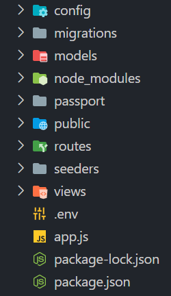

이 구조를 크게 벗어나지 않지만, 고정된 구조는 아님

편의에 따라 바꿔도 되며, 서비스의 규모에 따라 폴더 구조도 복잡해지므로 각 서비스에 맞는 구조 적용 필요


#### 4. 필요한 npm 패키지들 설치

```bash
$ npm i express cookie-parser express-session morgan multer dotenv nunjucks
$ npm i -D nodemon
```


#### 5. `app.js`, `.env` 작성

#### 6. 라우터와 템플릿 엔진 만들기


### 9.2 데이터베이스 세팅하기

### 9.3 Passport 모듈로 로그인 구현하기

### [추가] Passport
##### passport = login logic을 위해 사용한다.
##### express framework에서 등장한 라이브러리, 300가지의 인증방법을 전략이라는 방법으로 쉽게 구현할 수 있게 도와준다.

- 복잡하지만 사용할때 복잡성과 위험성을 보안 전문가가 아닌 사람도 해결할 수 있다. 
- Federated identity.
    - 유명한 서비스에게 사용자가 유효한 사용자가 맞는지를 확인하는 방식으로 인증을 구현.
    - 페이스북, 카카오 등 다양한 전략을 사용할 수 있어야 passport를 제대로 사용하는 것.
    - federated identity는 API에 접근할 수 있는 권한을 부여하는 역할도 하고 있다.

##### passport를 통해 local로 id, pw로 로그인 하는 전략을 위해서 passport-local도 설치해준다. (만약 카카오면 passport-kakao)
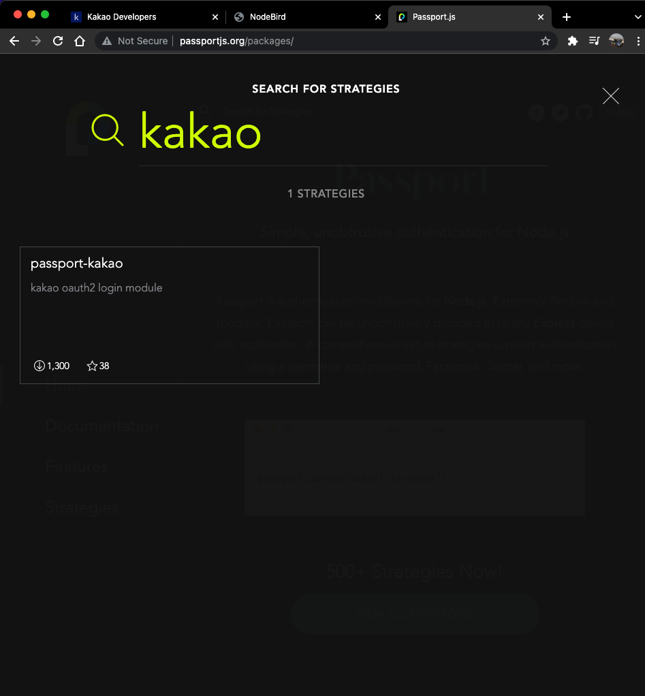


##### passport를 통해 로그인이 수행되는 과정
    로그인 요청 (local)- localStrategy  - login router - serialize user - login router 끝 - 세션 쿠키를 브라우저로 보내줌

```javascript
app.use(session({
  resave: false,
  saveUninitialized: false,
  secret: process.env.COOKIE_SECRET,
  cookie: {
    httpOnly: true,
    secure: false,
  },
}));
app.use(passport.initialize()); // passport를 실행
app.use(passport.session()); // session을 내부적으로 쓴다. 이때 deserialize 실행
```
이걸 app.js에 넣어주는데 이때, session 활성화 코드 아래에 넣어야한다. 세션을 내부적으로 활용하기 때문에

로그인 라우터를 passport 형태로 만들어야한다.
```javascript
router.post('/login', isNotLoggedIn, (req, res, next) => {
  passport.authenticate('local', (authError, user, info) => { // 미들웨어 확장 패턴 - localStartegy를 따라감 (local: id, pw로 로그인 하는 local Strategy를 실행) , (authError, user, info) = done의 인자들
    if (authError) { // 서버 에러 경우
      console.error(authError);
      return next(authError);
    }
    if (!user) { // 로그인 실패한 경우 - 3번째 메세지를 담아서 프론트로 넘겨줌
      return res.redirect(`/?loginError=${info.message}`);
    }
    return req.login(user, (loginError) => { // 로그인 성공한 경우, user 객체를 넘겨줌, passport index로 감 - serialize 실행
      if (loginError) {
        console.error(loginError);
        return next(loginError);
      }
      return res.redirect('/'); // 로그인 성공. 끝. 세션 쿠키를 브라우저로 보내줌
    });
  })(req, res, next); // 미들웨어 내의 미들웨어에는 (req, res, next)를 붙입니다.
});
```

로그인이 성공했는지 실패했는지를 판가름 해준다.
```javascript
passport.use(new LocalStrategy({
    usernameField: 'email', //req.body.email(프론트에서 요청의 바디로 옴), user 필드의 이름을 재설정
    passwordField: 'password', //req.body.pw, password 필드의 이름을 재설정
  }, async (email, password, done) => {
    try {
      const exUser = await User.findOne({ where: { email } }); // 이메일 가진 사람 찾기
      if (exUser) { // 이메일 가진 사람 있는 경우
        const result = await bcrypt.compare(password, exUser.password);
        if (result) {
          done(null, exUser); //done 인자 (서버에러, 성공 여부, 실패시 메세지)
        } else { // 비밀번호 다른 경우
          done(null, false, { message: '비밀번호가 일치하지 않습니다.' });
        }
      } else { // 이메일 가진 사람이 없을 때
        done(null, false, { message: '가입되지 않은 회원입니다.' });
      }
    } catch (error) {
      console.error(error);
      done(error);
    }
  }));
  ```
로그인에 성공하면 다시 login 라우터로 가고 done의 인자를 보내준다.

passport의 serialize, deserialize - passport가 session을 처리하는 방법
처음 로그인하면 serialize를 한번 호출되고 세션의 id를 저장하고
저장된 id를 기준으로 필요한 정보를 조회할때 마다 deserialize를 통해 실제 데이터를 확인한다. 로그인한 사용자인지 아닌지를 파악하기 위해.
```javascript
passport.serializeUser((user, done) => { // 로그인 성공시 유저의 데이터를 첫번쩨 인자로 받는다.
    done(null, user.id);
    // auth.login에서 받은 user 객체를 갖고 세션에 user의 아이디만 저장 - 아이디만 저장하는 이유: 메모리 때문, 실무에서는 메모리에도 저장하지 않음 - 메모리 저장용 db를 따로 사용, done이 실행되면 auth login의 return으로 감
  });

passport.deserializeUser((id, done) => { // 필요할 때(로그인 후 어떤 요청을 보낼 떄) id로 user를 복구해줌. 브라우저가 session을 보내주면 passort session이 id를 알아냄 글고 deserialize 한테 보냄.
User.findOne({ where: { id } })
    .then(user => done(null, user)) //user 객체를 보내줌
    .catch(err => done(err));
});
```
#### flash
- 또한 session 밑에 두어야하고
- session store에 입력한 데이터를 추가하도록 해준다.
- flash msg는 1회용 메세지다. 데이터를 세션에 저장했다, 데이터를 사용하면 세센에서 사라짐.
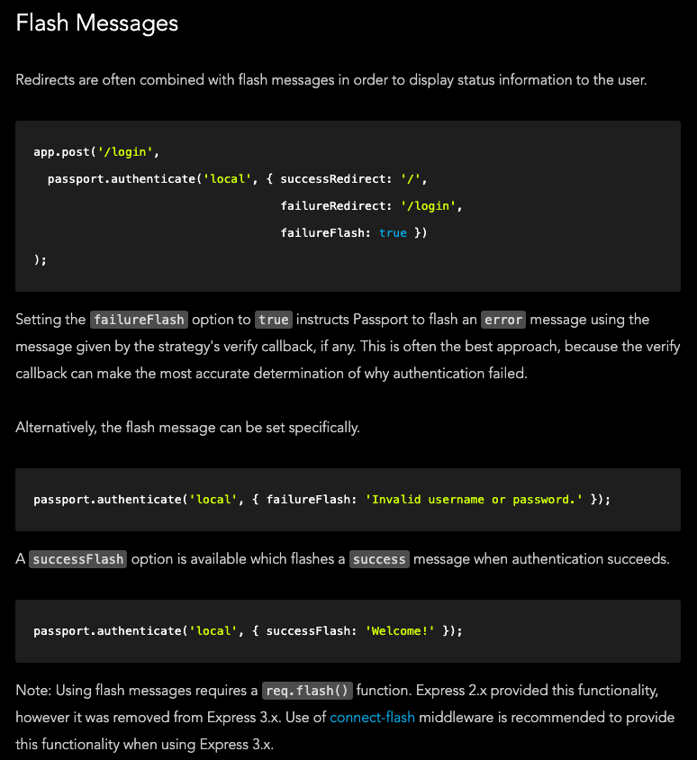

- 잘못된 이메일 치면 틀렸다는 메세지가 뜨고
 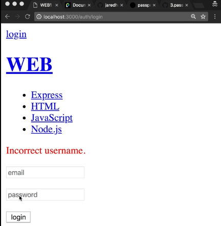
- 리로드하면 메세지가 사라짐.
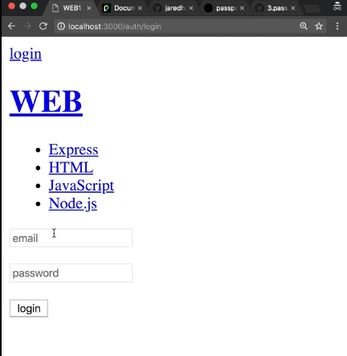
http://www.passportjs.org/docs/

### 9.4 multer 패키지로 이미지 업로드 구현하기
##### enctype이 form data인 경우 해석을 위해 multer를 사용함
- 게시글 업로드 
- 이미지 업로드 

게시글 이미지를 따로 받는 이유, 이미지의 요량이 너무 클 수 있기 때문에
이미지를 압축하는 시간이 소요된다. 따로 업로드하면 사용자가 느끼는 딜레이 시간을 줄여줄 수 있음
이때 게시글과 이미지 경로는 묶어준다. 그래서 프론트로 이미지 경로를 보내줌

- 멀터로 이미지 올린 사진 
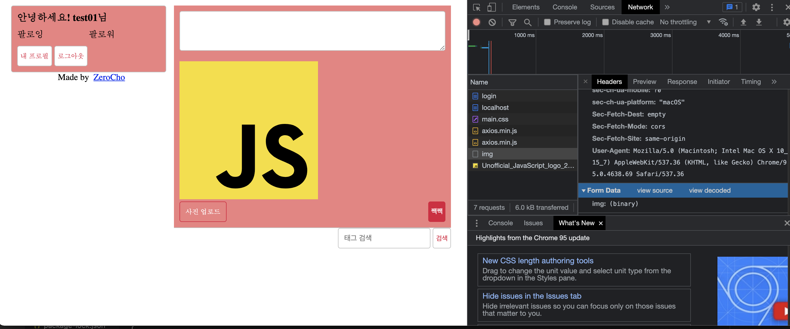
- 터미널에 뜬 내용 사진
- 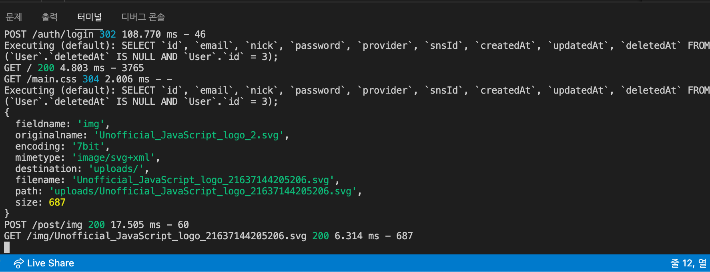

### 9.5 프로젝트 마무리하기
### 팔로잉 기능 구현

- 팔로잉
 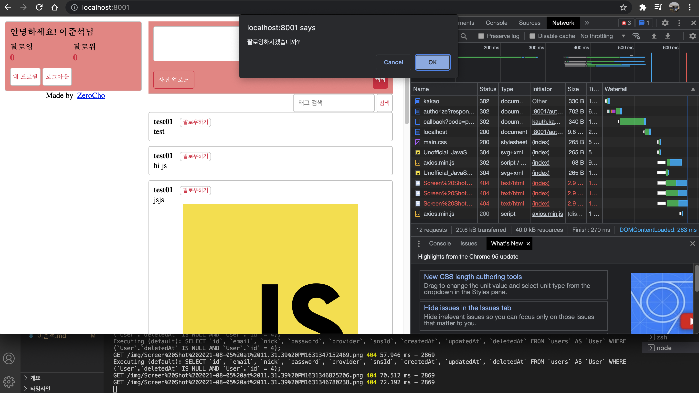
- 팔로잉 된 상태
 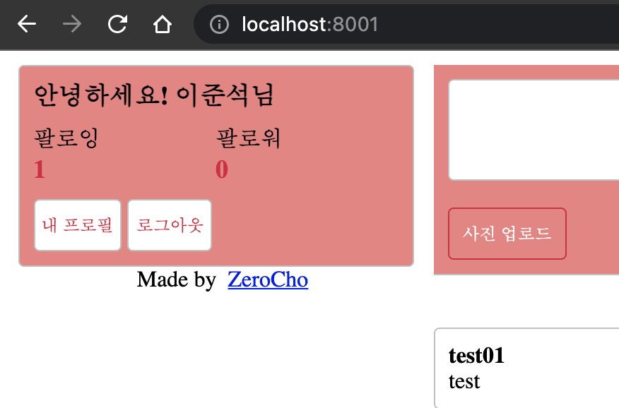
- 팔로잉 목록
 

### 해시태그

```javascript
const hashtags = req.body.content.match(/#[^\s#]*/g);
```

#### 정규표현식
##### ex) (/#[^\s#]*/g)
- #으로 시작
- [] 여러개중 하나
- ^ 부정
- \s 띄어쓰기
- '#'샵
- g 모두

##### 해시태그 입력 이미지 
 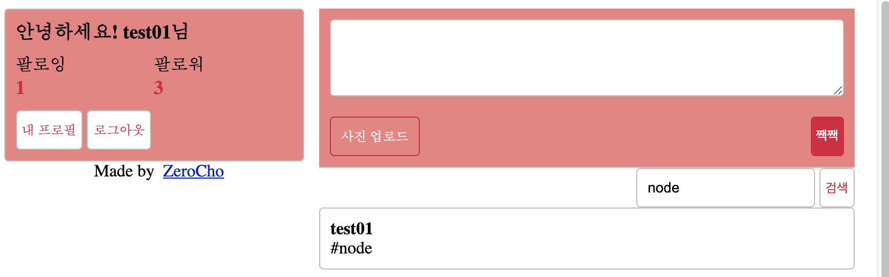

#### 해시태그 검색

해시태그를 검색하면 해시태그에 해당하는 게시물만 나타남.
 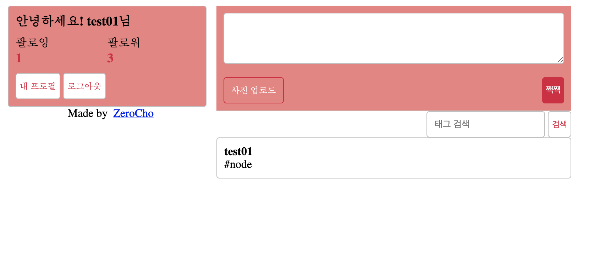
---
