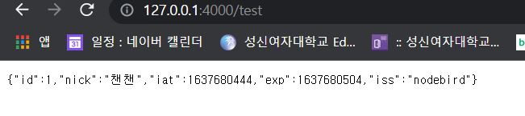

# 8주차 JS 스터디 정리

| 장   | 제목               |
| ---- | ------------------ |
| 10장 | 웹 API 서버 만들기 |

## 10장

### **10.1 API 서버 이해하기**

**API (Application Programming Interface)**

- 다른 애플리케이션에서 현재 프로그램의 기능을 사용할 수 있게 한다.
    - 다른 사람에게 제공하고 싶은 부분만 API를 열고, 제공하고 싶지 않은 부분은 API를 만들지 않으면 된다.
    - API에 제한을 걸어서 인증된 사람만 일정 횟수 내에서만 가져가게 할 수도 있다.
- 노드를 모바일 서버로 사용하려면 서버를 REST API 구조로 구성하면 된다.
- 웹 API 서버 : 서버에 API를 올려서 URL을 통해 접근할 수 있게 만든 것

### **10.2 프로젝트 구조 갖추기**

**NodeBird 서비스의 웹 API 서버 만들기**

   NodeBird 앱 - localhost:8001 

   NodeBird API - localhost:800

   다른 서비스 - localhost:4000

→ 서버를 나눈 이유 : API 서버가 터져도 메인인 서버엔 영향이 없게

- nodebird-api 폴더 생성 후, dependencies 설치

`$ npm init`

`$ npm i bcrypt cookie-parser dotenv express express-session morgan mysql2 nunjucks passport passport-local passport-kakao`

`$ npm i sequelize uuid`  : 새로 추가된 패키지는 uuid는 랜덤 문자열을 만들어내는 데 사용

`$ npm i -D nodemon`

- **app.js**

```jsx
...
const app = express();
passportConfig();
app.set('port', process.env.PORT || 8002); //api서버 8002번
app.set('view engine', 'html');
nunjucks.configure('views', {
  express: app,
  watch: true,
});
...
```

- 9장 Nodebird 실습 때 사용한 config, models, passport 폴더 재사용
- routes, views 폴더 생성
- 9장 routes 폴더의 auth.js, middlewares.js 재사용
- 9장의 .env, views의 error.html 재사용

- **models/domain.js**

도메인을 등록하는 기능이 새로 생겼으므로 도메인 모델을 추가한다.

-host: 인터넷주소

-type: 도메인 종류

- ENUM : free나 premium 중에서 하나의 종류만 선택하도록 제한하는 데이터 형식

-clientSecret: 클라이언트 비밀 키

- 다른 개발자들이 NodeBird API를 사용할 때 필요한 비밀 키
- UUID : 충돌 가능성이 매우 적은 랜덤한 문자열

```jsx
const Sequelize = require('sequelize');

module.exports = class Domain extends Sequelize.Model {
  static init(sequelize) {
    return super.init({
      host: {
        type: Sequelize.STRING(80)
        allowNull: false,
      },
      type: {
        type: Sequelize.ENUM('free', 'premium'), //조금 더 상세한 타입을 정
        allowNull: false,
      },
      clientSecret: { //key를 발급해준다.
        type: Sequelize.UUID
        allowNull: false,
      },
    }, {
      sequelize,
      timestamps: true,
      paranoid: true,
      modelName: 'Domain',
      tableName: 'domains',
    });
  }

  static associate(db) {
    db.Domain.belongsTo(db.User);
  }
};
```

- 새로 생성한 도메인 모델을 시퀄라이즈와 연결

사용자 한 명이 여러 도메인을 소유할 수도 있다. → 일대다 관계 

**models/user.js** 에 추가

```jsx
static associate(db) {
        db.User.hasMany(db.Post);
        db.User.hasMany(db.Domain); //추가
        db.User.belongsToMany(db.User, {
            foreignKey: 'followingId',
            as: 'Followers',
            through: 'Follow',
        });
        ...
    }
```

**models/ index.js** 에 추가

```jsx
...
const Domain = require('./domain');
...
db.Domain = Domain;
...
db.Domain = Domain;
...
Domain.associate(db);
...
```

- Domain 등록 페이지 생성 → **views/login.html**

- **routes/index.js**

```jsx
...
router.get('/', async(req, res, next) => { //localhost:8002로 접속하면 login하게 실행시키는 부분
    try {
        const user = await User.findOne({
            where: { id: req.user && req.user.id || null },
            include: { model: Domain },
        });
        res.render('login', {
            user,
            domains: user && user.Domains,
        });
    } catch (err) {
        console.error(err);
        next(err);
    }
});
//도메인 등록 라우터 - 폼으로부터 온 데이터를 도메인 모델에 저장
router.post('/domain', isLoggedIn, async(req, res, next) => {
    try {
        await Domain.create({
            UserId: req.user.id,
            host: req.body.host,
            type: req.body.type,
            clientSecret: uuidv4(), //uuid 4버전으로 생성
        });
        res.redirect('/');
    } catch (err) {
        console.error(err);
        next(err);
    }
});
...
```

- 서버 실행

nodebird와 nodebird-api 서버 실행 후  [localhost:8002](http://localhost:8002) 에 접속


### **10.3 JWT 토큰으로 인증하기**

Nodebird가 아닌 다른 클라이언트가 데이터를 가져갈 수 있게 하려면 인증 과정이 필요하다. 

- **JWT(JSON Web Token)**
    - JSON 형식의 데이터를 저장하는 토큰
    - 헤더, 페이로드, 시그니처로 구성
    - **헤더** : 토큰 종류와 해시 알고리즘 정보가 들어있다.
    - **페이로드**: 토큰의 내용물이 인코딩된 부분이다.
        - 페이로드 부분에 내용을 넣어줄 수 있다.(데이터가 노출되는 부분)
    - **시그니처**: 일련의 문자열로, 시그니처를 통해 토큰이 변조되었는지 여부 확인한다.
        - 시그니처는 JWT 비밀키로 만들어지고, 비밀키가 노출되면 JWT 토큰 위조가 가능하므로 숨겨야한다.
        

비밀키를 알지 않는 이상 토큰 변조가 불가능하고, 토큰 자체에 데이터가 들어있어서 데이터베이스 요청을 줄일 수 있다. 

하지만, 노출되어도 괜찮은 정보만 넣어야하고,  JWT토큰은 용량이 크다는 단점이 존재한다.

- JWT 모듈 설치

`$ npm i jsonwebtoken`

- .env에 JWT 비밀키 저장

JWT_SECRET=jwtSecretkey

- JWT 토큰을 검사하는 verifyToken 미들웨어 작성
    - req.headers.authorization에 JWT 토큰이 들어 있다.
    - 인증 성공 → 토큰의 내용이 반환되어 req.decoded에 저장된다.
    - 만료된 토큰이나 유효하지 않은 토큰 → catch문

**routes/middlewares.js**

```jsx
exports.verifyToken = (req, res, next) => {
    try {      
        req.decoded = jwt.verify(req.headers.authorization, process.env.JWT_SECRET);
        return next();
    } catch (error) {
        if (error.name === 'TokenExpiredError') { // 유효기간 초과
            return res.status(419).json({
                code: 419,
                message: '토큰이 만료되었습니다',
            });
        }
        return res.status(401).json({
            code: 401,
            message: '유효하지 않은 토큰입니다',
        });
    }
};
```

- **routes/v1.js**

토큰을 발급하는 라우터(POST /v1/token), 토큰을 테스트해볼 수 있는 라우터(GET /v1/test)

```jsx
...
//- 토큰 발급 라우터
router.post('/token', async(req, res) => {
    const { clientSecret } = req.body;
    try {
        const domain = await Domain.findOne({
            where: { clientSecret },
            include: {
                model: User,
                attribute: ['nick', 'id'], //도메인에 클라이언트 시크릿이 등록되어있는지 확인
            },
        }); // -> 1.도메인 등록 검사

        if (!domain) {
            return res.status(401).json({ // 등록되어있지 않으면 실행
                code: 401,
                message: '등록되지 않은 도메인입니다. 먼저 도메인을 등록하세요',
            });
        }
        //2. 도메인 등록이랑 clientsecret이 확인되면 토큰 발급
        const token = jwt.sign({ // -> 토큰 발급해주는 sign
            id: domain.User.id, // 넣어주고싶은 데이터를 넣는다.
            nick: domain.User.nick,
        }, process.env.JWT_SECRET, { //SECRET을 넣어서 시그니처 만들고, 위조검사
            expiresIn: '1m', // 토큰 옵션을 두고
            issuer: 'nodebird', //issuer은 누가 발급해줬는지.
        });

        return res.json({
            code: 200,
            message: '토큰이 발급되었습니다',
            token,
        });
    } catch (error) {
        console.error(error);
        return res.status(500).json({
            code: 500,
            message: '서버 에러',
        });
    }
});

//- 토큰이 제대로 발급됐는지 테스트하는 라우터
router.get('/test', verifyToken, (req, res) => {
    res.json(req.decoded);
});

module.exports = router;
```

- 라우터의 응답
    - JSON 형태에 code, message, token 속성 존재한다.
    - 일정한 형식을 갖춰야 응답받는 쪽에서 처리하기 좋다.
    - **code**는 HTTP 상태 코드를 사용해도 되고, 일관성있는 규칙만 있다면 임의로 숫자를 부여해도 된다.
        - code를 이해하지 못할 경우를 대비하여 message도 같이 보낸다.
        
       
        

- 라우터 서버에 연결

**app.js**

```jsx
...
const v1 = require('./routes/v1');
...
app.use('/v1', v1);
...
```

### **10.4 다른 서비스에서 호출하기**

- nodecat 폴더 생성 후

`npm init`

`npm i axios cookie-parser dotenv express express-session morgan mysql2 nunjucks`

`npm i`

`npm i -D nodemon`

- app.js 작성
- nodebird-api에서 views의 error.html 재사용
- .env 파일 생성 후 API서버에서 도메인을 등록해서 발급받은 clientSecret을 넣는다.

CLIENT_SECRET=클라이언트 비밀키

- **nodecat/routes/index.js**

```jsx
const express = require('express');
const axios = require('axios');

const router = express.Router();

router.get('/test', async(req, res, next) => { // 토큰 테스트 라우터
    try {
        if (!req.session.jwt) { // 세션에 토큰이 없으면 토큰 발급 시도 
            //토큰을 발급받을 때는 api서버의 v1/token 라우터에 요청을 보낸다.
            //토큰 발급받으면 tokenResult
            const tokenResult = await axios.post('http://localhost:8002/v1/token', {
                clientSecret: process.env.CLIENT_SECRET, //클라이언트 비밀키를 같이 넣어서 보낸다.
            });
            if (tokenResult.data && tokenResult.data.code === 200) {
                //토큰 발급 성공 시
                req.session.jwt = tokenResult.data.token; // 세션에 토큰 저장- tokenResult.data.token에 보낸 토큰이 들어있다.
            } else { // 토큰 발급 실패 시
                return res.json(tokenResult.data); // 발급 실패 사유 응답
            }
        }
        // 발급받은 토큰 테스트- v1/test에 접근하여 토큰이 유효한지 테스트
        const result = await axios.get('http://localhost:8002/v1/test', {
            headers: { authorization: req.session.jwt }, //authorization 토큰을 넣어 전송
        });
        return res.json(result.data);
    } catch (error) {
        console.error(error);
        if (error.response.status === 419) { // 토큰 만료 시
            return res.json(error.response.data);
        }
        return next(error);
    }
});

module.exports = router;
```

- nodecat에서 발급받은 토큰 테스트
    - [http://127.0.0.1:4000/test](http://127.0.0.1:4000/test) 접속



- 토큰 만료 화면
    - 1분 후 [http://127.0.0.1:4000/test](http://127.0.0.1:4000/test) 재접속
    
   
   
