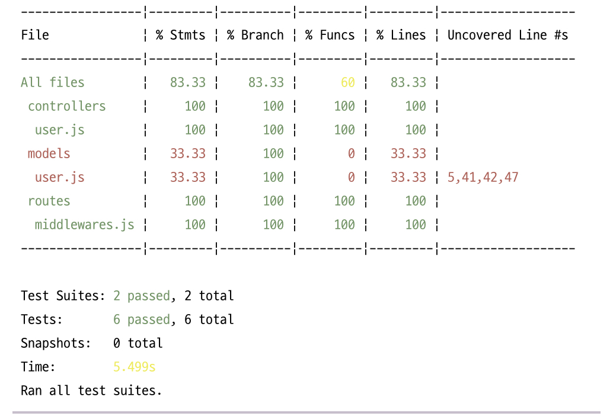
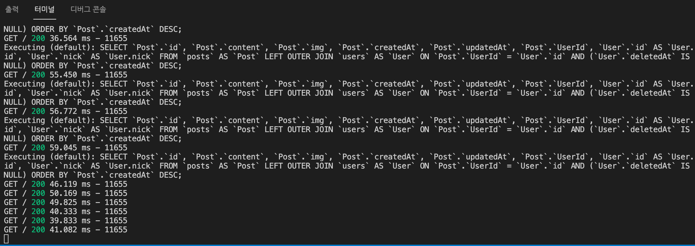
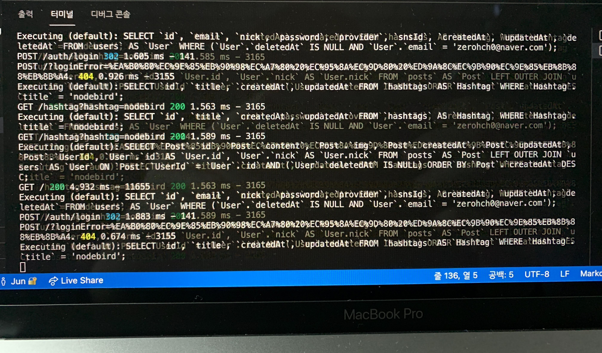
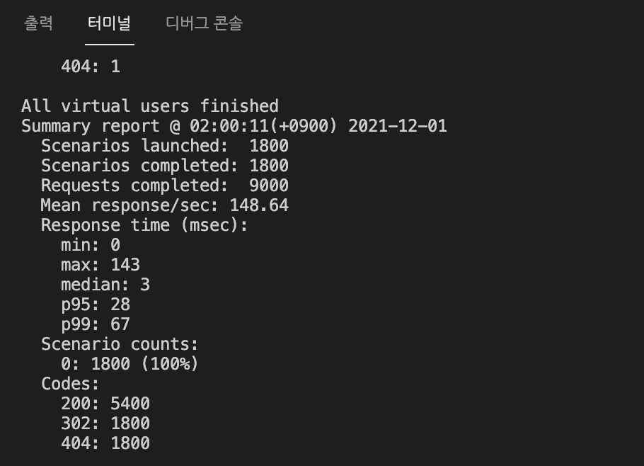

# 9주차 JS 스터디 정리

| 장   | 제목               |
| ---- | ------------------ |
| 11장 | 노드 서비스 테스트하기 |

# 9주차 정리
# **9주차 JS 스터디 정리**
## **11장**
노드 서비스 테스트하기
- 실제 서비스를 개발 완료한 후, 자신이 만든 서비스가 제대로 작동되는지 테스트 해보아야 함
- 테스트를 자동화하여 프로그램이 프로그램을 테스트하도록 만들기도 함
### **11.1 테스트 준비하기**
- 테스트에 사용할 패키지 : jest(페이스북에서 만든 오픈소스로, 테스팅에 필요한 툴들을 대부분 갖추고 있음)
1. jest 패키지 설치
```jsx
$ npm i -D jest
```
1. package.json에 test라는 명령어 등록해둠. 명령어를 실행할 때 jest가 실행된다. 
```jsx
{
  "name": "nodebird",
  "version": "0.0.1",
  "description": "익스프레스로 만드는 SNS 서비스",
  "main": "app.js",
  "scripts": {
    "start": "nodemon app",
    "test": "jest"
  },
  ...
}
```
1. 테스트 코드 작성 후 npm test 로 테스트 코드 실행
- 테스트를 작성하지 않은 상태로는 에러가 발생함
- 다음과 같이 expect 의 함수로 실제 코드를, toEqual 함수의 인수로는 예상되는 결과값을 넣으면 됨
```jsx
test('1+1은 2입니다.', () => {
	expect(1+1).toEqual(2);
});
```
```jsx
$ npm test
> nodebird@0.0.1 test C:\Users\zerocho\nodebird
> jest
  PASS routes/middlewares.test.js
    √ 1 + 1은 2입니다. (3ms)
 
Test Suites: 1 passed, 1 total
Tests:       1 passed, 1 total
Snapshots:   0 total
Time:        2.583s
Ran all test suites.
```
- expect에 넣은 값과 toEqual에 넣은 값이 일치하면 테스트를 통과한다.
- 여기서 Equal의 값을 3으로 바꾸면 에러가 난다. 1+1과 3이 일치하지 않기 때문
### **11.2 유닛 테스트**
1. NodeBird 코드 테스트해보기 
- middlewares.js에 있는  isLoggedIn, isNotLoggedIn 함수 테스트
- describe는 테스트를 그룹화해주는 것
```jsx
const { isLoggedIn, isNotLoggedIn } = require('./middlewares');
describe('isLoggedIn', () => {
  test('로그인되어 있으면 isLoggedIn이 next를 호출해야 함', () => {
  });
  test('로그인되어 있지 않으면 isLoggedIn이 에러를 응답해야 함', () => {
  });
});
describe('isNotLoggedIn', () => {
  test('로그인되어 있으면 isNotLoggedIn이 에러를 응답해야 함', () => {
  });
  test('로그인되어 있지 않으면 isNotLoggedIn이 next를 호출해야 함', () => {
		});
	});
```
- 실제 코드에서와의 차이가 있기 때문에 테스트 할 때는 가짜 객체와 함수를 만들어서 넣어주어야 한다.
- 모킹(mocking) : 가짜 객체, 가짜 함수를 넣어주는 행위
```jsx
const { isLoggedIn, isNotLoggedIn } = require('./middlewares');
	describe('isLoggedIn', () => {
	  const res = {
	    status: jest.fn(() => res),
	    send: jest.fn(),
	  };
	  const next = jest.fn();
	
	test('로그인되어 있으면 isLoggedIn이 next를 호출해야 함', () => {
	    const req = {
	      isAuthenticated: jest.fn(() => true),
	    };
	    isLoggedIn(req, res, next);
	    expect(next).toBeCalledTimes(1);
	  });
	
	test('로그인되어 있지 않으면 isLoggedIn이 에러를 응답해야 함', () => {
	    const req = {
	      isAuthenticated: jest.fn(() => false),
	    };
	    isLoggedIn(req, res, next);
	    expect(res.status).toBeCalledWith(403);
	    expect(res.send).toBeCalledWith('로그인 필요');
	  });
	});
	
	describe('isNotLoggedIn', () => {
	  const res = {
	    redirect: jest.fn(),
	  };
	  const next = jest.fn();
  test('로그인되어 있으면 isNotLoggedIn이 에러를 응답해야 함', () => {
    const req = {
			isAuthenticated: jest.fn(() => true),
    };
    isNotLoggedIn(req, res, next);
    const message = encodeURIComponent('로그인한 상태입니다.');
    expect(res.redirect).toBeCalledWith(`/?error=${message}`);
  });
	test('로그인되어 있지 않으면 isNotLoggedIn이 next를 호출해야 함', () => {
	    const req = {
	      isAuthenticated: jest.fn(() => false),
	    };
	    isNotLoggedIn(req, res, next);
	    expect(next).toBeCalledTimes(1);
	  });
	});
```
→ isLoggedIn : req, res, next를 모킹하였음. 함수 모킹할 때는 jest.fn 함수를 사용
jest.fn(() ⇒ 반환값) 을 사용하여 함수의 반환값을 지정할 수 있음
→ isNotLoggedIn : 마찬가지로 작성해 준다. 
- 이렇듯, 작은 단위의 함수나 모듈이 의도된 대로 정확히 작동하는지 테스트하는 것을 유닛 테스트라고 한다.
### **11.3 테스트 커버리지**
- 유닛 테스트를 작성하다보면, 전체 코드 중에서 어떤 부분이 테스트되고 어떤 부분이 되지 않는지 궁금할 수 있다.
- coverage 기능 : 전체 코드 중에서 테스트되고 있는 부분의 비율과 테스트되고 있지 않은 코드의 위 위치를 알려주는 기능
1. 커버리지 기능을 사용하기 위해 package.json에 jest 설정을 입력한다. 
```jsx
{
  "name": "nodebird",
  "version": "0.0.1",
  "description": "익스프레스로 만드는 SNS 서비스",
  "main": "app.js",
  "scripts": {
    "start": "nodemon app",
    "test": "jest",
    "coverage": "jest --coverage"
  },
```
1. jest 명령어 뒤에 —coverage 옵션을 붙여 jest가 테스트 커버리지를 분석하도록 함
```jsx
$ npm run coverage
> nodebird@0.0.1 coverage C:\Users\zerocho\nodebird
> jest --coverage
  PASS routes/middlewares.test.js
  PASS controllers/user.test.js
    ● Console
      console.error controllers/user.js:13
        사용자 못 찾음
```



- 표의 열을 살펴보면, 각각 File(파일과 폴더 이름), % Stmts(구문 비율), % Branch(if문 등의 분기점 비율), % Funcs(함수 비율), % Lines(코드 줄 수 비율), Uncovered Line #s(커버되지 않은 줄 위치)
- 퍼센티지가 높을수록 많은 코드가 테스트되었다는 의미
- models와 user.js 에서는 5, 41, 42, 47 번째 줄은 테스트되지 않았음을 알 수 있음.
- 이 부분은 테스트를 하나도 작성하지 않아 %Funcs 가 0이 나오는 것으로, 테스트 커버리지를 올리기 위해 테스트를 작성하여 수행하면 정상적으로 성공하게 된다.

### 11.4 통합 테스트
 #####  ```단위테스트한 여러개를 합쳐서 테스트 하는 것```
 ```supertest로 auth 라우터를 통합테스트```
 - 라우터의 배치에 따라 다양한 시나리오를 테스트 해볼 수 있다.
 - 예를 들어 로그인 먼저하고 회원가입, 혹은 로그인 후 다시 로그인 등
 
 ##### supertest
```shell
npm i -D supertest
```
 - 요청을 모킹함
 - 가짜 요청을 보내고, 가짜 응답을 검사해서 시뮬레이션 했을 때 잘 응답하는지 테스트하기 위해

```javascript
// app.listen(app.get('port'), () => {
//   console.log(app.get('port'), '번 포트에서 대기중');
// });
```
 - app에서 listen 부분만 따로 분리하고 테스트 진행 (테스트 시 서버 실행되는 것을 막기 위해)

 ```shell
 npx sequelize db:create --env test
 ```
 - 테스트용 데이터 베이스 설정 (통합테스트에서는 데이터를 모킹하지 않음)
 
 ##### beforeAll
 ```javascript
 beforeAll(async () => {
  await sequelize.sync(); // DB에 테이블을 생성
 });
 ```
 - 테스트를 실행하기 전에 수행

 ##### beforeEach
 ```javascript
 describe('POST /login', () => {
  const agent = request.agent(app);
  beforeEach((done) => { // 로그인 수행
    agent
      .post('/auth/login')
      .send({
        email: 'zerohch0@gmail.com',
        password: 'nodejsbook',
      })
      .end(done);
  });
 ```
 - 테스트 하기 직전에 수행됨
 - 테스트가 여러개 있는 경우, 테스트 실행 전 마다 수행된다.
 - beforeEach 영향을 받기 싫은 테스트가 있는 경우, beforeEach가 포함된 describe 외부에 따로 만들어줌.
 
 ##### afterAll
 ```javascript
 afterAll(async () => {
      await sequelize.sync({ force: true}); // 데이터 지워지고 테이블 재생성
 });
 ```
 - 테스트 후 데이터베이스에 데이터가 남아 있으면 다음 테스트에 영향을 줄 수 있기 때문
 - 처음 성공하고 두번째 테스트에서 실패할 수 있음

 ##### agent
 ```javascript
test('이미 로그인했으면 redirect /', (done) => {
    const message = encodeURIComponent('로그인한 상태입니다.');
    agent // 위에서 로그인 한 agent
      .post('/auth/join')
      .send({
        email: 'zerohch0@gmail.com',
        nick: 'zerocho',
        password: 'nodejsbook',
      })
      .expect('Location', `/?error=${message}`) // 이미 로그인 된 agent기 때문에 error
      .expect(302, done);
  }
 ```
 - 로그인 상태가 유지되도록 해줌
 - 여러 테스트에 거쳐서 해당 상태가 유지된다.


### 11.5 부하 테스트
```내 서버가 얼마나 버틸 수 있는가?```

##### artillery
 ```shell
 $ npm i -D artillery
 $ npx artillery quick --count 100 -n 50 http://localhost:8001 
 ```
 - 100 명의 사용자가 50번씩 요청

 
 
 - 최종 보고서
     - 100명 수행
     - 100명 성공
     - 총 5000 개의 요청
     - 요청 처리에 276 ms 걸림
     - p95: 뒤에서 5번째 느린 경우
     - p99: 하위 1%의 경우

 
 
 - 서버에 5000개의 요청이 들어간 모습

 ##### loadtest
 - 시나리오를 세워볼 수 있음
 - json 형식의 파일을 작성해야함 혹은 YAML
 - 예상되는 사용자들의 흐름 flow를 작성해줌
 
 ```YAML 문법에 관련된 공식 문서```
 
 https://www.artillery.io/docs/guides/guides/test-script-reference
 
 ```shell
 npx artillery run loadtest.json
 ```
 
 

 - 요청 후반부가 될 수록 응답 시간이 길어짐
 

### 11.6 프로젝트 마무리하기
 - 테스트를 한다고 해서 무조건 안전한 것은 아니다
 - 자신이 짠 코드는 최대한 많이 테스트
 - 테스트하기 어려운 패키지는 모킹한다
 - 모킹에서의 통과가 실제에서의 통과를 100% 장담하지 않음
 - 그럼에도 테스트를 수행하는 것이 더 좋음
---
